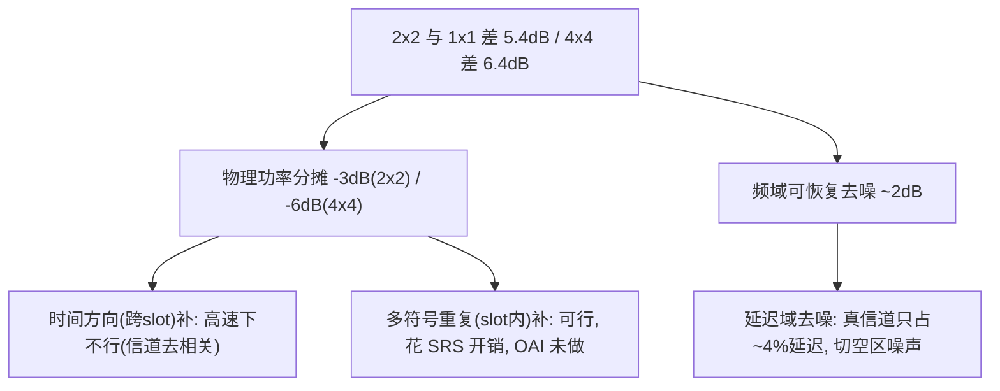

# MIMO 增强分析日志 —— 多符号重复 vs 频域去噪(完整分析链 + 代码)

| 字段 | 值 |
|------|----|
| 日期 | 2026-06-07 |
| 背景 | 真 1×1/2×2/4×4 上行 SRS MIMO 已跑通(见 `0607_真MIMO_Phase1_上行SRS_MIMO日志.md`)。本日志回答:**与 1×1 的差距能不能去掉、怎么去、各方案增益与代价**,全部对照代码 + 离线实测。 |
| 测试床 | native rfsimulator + channelmod;CDL-C 60km/h;`eval_nmse_sto.py`(自适应STO)+ `diag_mimo_delay.py` |
| 实测基线 | 1×1 −21.7dB(coh0.996) / 2×2 −16.3dB(0.984) / 4×4 −15.3dB(0.981) |
| 一句话结论 | 差距 = **物理功率分摊(3/6dB)+ 频域可恢复去噪(~2dB)**。高速下时间方向补不了(物理);**多符号重复**能补功率分摊(花 SRS 开销,OAI 当前未做);**频域去噪**免费补 ~2dB(但会被多符号吃掉)。 |

---

## 0. 差距分解(总览)



| 分量 | 大小 | 能否去掉 | 手段 |
|---|---|---|---|
| 物理功率分摊 | 2×2 −3dB / 4×4 −6dB | 单符号纯处理**不能** | 多符号重复(slot内相干合并)或更大功率 |
| 频域去噪余量 | ~2dB(2×2 +2.9 / 4×4 +2.7) | **能(免费)** | 延迟域/EMA-PDP 去噪 |
| 时间方向(跨slot) | — | 60km/h **不能**(物理) | 低速才行 |

---

## 1. 物理功率分摊:是什么、为什么、对照代码

### 1.1 代码:UE 每端口功率 = 总功率 / N_ap
`openair1/PHY/NR_UE_TRANSPORT/srs_modulation_nr.c`,`generate_srs_nr()`。`sqrt_N_ap` 在端口循环外算一次,然后**对每个端口、每个 OFDM 符号、每个 RE** 都用它把幅度缩小:
```c
283:  double sqrt_N_ap = sqrt(N_ap);                       // N_ap = SRS 天线端口数
...
293:  for (int p_index = 0; p_index < N_ap; p_index++) {   // 逐端口
307:    for (int l_line = 0; l_line < N_symb_SRS; l_line++) {  // 逐 OFDM 符号(多符号时>1)
...
383:      for (int k = 0; k < M_sc_b_SRS; k++) {           // 逐 SRS 子载波
384:        cd_t shift = {cos(alpha_i * k), sin(alpha_i * k)};   // CS 相位(端口间正交)
385:        const c16_t tmp = rv_ul_ref_sig[u][v][M_sc_b_SRS_index][k];
389:        cd_t r = cdMul(shift, r_overbar);              // 基序列 × CS
391:        c16_t r_amp = {(((int32_t)round((double)amp * r.r / sqrt_N_ap)) >> 15),  // ÷ sqrt(N_ap)
392:                       (((int32_t)round((double)amp * r.i / sqrt_N_ap)) >> 15)};
...
```
**机理**:UE 功放**总**功率固定(`amp`)。N 个端口同时发 SRS,要在 N 个端口间分这份总功率 → 每端口幅度 ÷ √N → **每端口功率 ÷ N**(1端口 0dB / 2端口 −3dB / 4端口 −6dB)。这是 3GPP TS 38.211 §6.4.1.4 的总功率守恒,不是实现 bug。
- 端口间用 cyclic-shift(CS,`alpha_i`,L299-300)正交复用同一份 RE,所以 N 端口挤在**同一 SNR 预算**里 → 每端口净得更少。
- `>> 15` + `round` 是 Q15 定点;`r_amp` 直接写进 `txdataF`。
- **关键**:这一步发生在 **UE 发射端**,gNB 收到的物理信号就已经弱了 3/6dB —— 接收侧任何处理都无法"造回"未发射的功率。

### 1.2 信道侧无额外归一,噪声固定
`radio/rfsimulator/apply_channelmod.c`,`rxAddInput()` 每 rx 天线的样本卷积:
```c
422:    for (int txAnt=0; txAnt < nbTx; txAnt++) {                         // 跨发射端口求和
423:      const struct complexd *channelModel= channelDesc->ch[rxAnt+(txAnt*channelDesc->nb_rx)];
426:      for (int l = 0; l<(int)channelDesc->channel_length; l++) {        // 卷积 CIR
434:        const int idx = ((TS + i - l - dd) * nbTx + txAnt + CirSize) % CirSize;
435:        const struct complex16 tx16 = input_sig[idx];
436:        rx_tmp.r += tx16.r * channelModel[l].r - tx16.i * channelModel[l].i;  // 累加,无 1/nbTx
437:        rx_tmp.i += tx16.i * channelModel[l].r + tx16.r * channelModel[l].i;
438:      } //l
439:    }
...
453:    out_ptr->r += rx_tmp.r * pathLossLinear + noise_per_sample * gaussZiggurat(0.0, 1.0);  // 噪声固定
454:    out_ptr->i += rx_tmp.i * pathLossLinear + noise_per_sample * gaussZiggurat(0.0, 1.0);
```
**机理**:接收样本 = Σ_tx (tx信号 ⊛ 信道) + 噪声。这里:
1. 对 `txAnt` 求和**没有 1/nbTx 归一**(信道侧不补偿端口分摊);
2. `noise_per_sample`(由 `noise_power_dBFS`/`-nd` 定)**与端口数无关、固定**。

所以每端口 SNR = (÷N 的信号)/(固定噪声) = **比 1×1 低 10log₁₀N dB**(−3/−6dB),与 §1.1 的发射端分摊叠加,共同构成"物理功率分摊"地板。这是 over-the-air 的真实情形(真 MIMO 就是这样),不是 rfsim 失真。

### 1.3 为什么纯处理去不掉
估计误差 ∝ 噪声/信号 = 1/SNR(Cramér-Rao 下界)。SNR 是接收到的物理量,后处理造不出未接收的信息。**单符号、单快照下这是硬地板。**

---

## 2. 频域可恢复去噪(~2dB):完整分析链 + 实测

### 2.1 残差是白噪声,不是结构性失真(证伪三个 bug 假设)
`diag_mimo_delay.py` 对 2×2/4×4 残差延迟域分解:
| 假设 | 检验 | 结果 |
|---|---|---|
| 周期-2 阶梯混叠 | 残差 Nyquist(\|n−1024\|≤8)占比 | **0.0%** → 无 |
| 跨端口泄漏 | 残差 vs 另一端口 GT 复相干 | 2×2: 0.005;4×4: 0.02~0.05 → 可忽略 |
| dump 定点标度 | mean\|H\| 1×1 vs 2×2 | 506 vs 524 → 相同 |

残差平坦度(std/mean of 延迟功率谱):1×1=3.05 / 2×2=2.58 / 4×4=2.50 → **都接近白**,无尖峰。

### 2.2 真信道只占延迟范围 ~4%,其余是纯噪声
| 配置 | 真信道99%能量支撑 | 占延迟范围 |
|---|---|---|
| 1×1 | \|n\|≤39 | 3.9% |
| 2×2 | \|n\|≤37 | 3.7% |
| 4×4 | \|n\|≤40 | 4.0% |

→ 96% 的延迟抽头里只有噪声。现有滤波没切这部分。

### 2.3 全局延迟域去噪增益(硬窗 W 扫描,实测)
| 配置 | 原生 | 最优硬窗 | 增益 |
|---|---|---|---|
| 1×1 | −21.66 | −22.51 (L=64) | +0.85 |
| 2×2 | −16.24 | −19.17 (L=48) | **+2.93** |
| 4×4 | −15.31 | −18.00 (L=48) | **+2.69** |

1×1 增益小(本就高 SNR、空区噪声少);多端口低 SNR → 空区噪声多 → 去噪收益大。

### 2.4 dump 的是滤波后估计,不是 LS → 是滤波"去噪不足"
**(a) dump 源 = 滤波后最终估计**(`nr_ul_channel_estimation.c`,GT/SRS 落盘):
```c
1555:  memcpy(ctx->srs_buffer[w_idx][ctx->dump_count][rx][tx],
1556:         srs_estimated_channel_freq[rx][tx],     // ← true2d 三级滤波后的最终估计
1557:         num_elements * sizeof(c16_t));
```
即 `eval_nmse_sto.py` 评的是 `srs_estimated_channel_freq`,**不是裸 LS**(裸 LS 是 `srs_ls_estimated_channel`,只在内部用)。所以 MIMO 差距不是"没滤波",而是"滤波去噪不够狠"。

**(b) 每端口都跑了 freq-Wiener Stage1**(`nr_ul_channel_estimation.c`,`p_index` 循环内,true2d 分支):
```c
1080:        memset(srs_estimated_channel_freq[ant][p_index], 0, ...);
1084:        nr_srs_mmse_freq_filter(srs_ls_estimated_channel, frame_parms->ofdm_symbol_size,
...                               ant, p_index, ...);   // ant,p_index>=0 → true2d 模式(EMA PDP)
1093:        nr_srs_pkf_update(ant, p_index, ...);        // Stage2 时间级
```
覆盖没问题(每 rx×tx 链路都滤),问题在**去噪质量**。

**(c) 为什么"去噪不够":Stage1 是局部 16-导频窗 Toeplitz LMMSE,不是全局延迟切窗**
窗大小默认 16 导频(`nr_srs_mmse.c`):
```c
86:  #define SRS_MMSE_DEFAULT_WINDOW 16              // 局部窗 = 16 个导频
349:  cached_window = SRS_MMSE_DEFAULT_WINDOW;       // env SRS_MMSE_WINDOW 可覆盖
```
它对每个子载波,用邻近 ±窗 个导频解一个 Toeplitz LMMSE。R 由跨帧 EMA 平滑的 PDP 算出:
```c
723:  static double (*g_true2d_pdp_ema)[...][SRS_MMSE_PDP_IFFT_SIZE] = NULL;  // EMA PDP 状态
726:  static float g_true2d_pdp_alpha = 0.95f;                                // EMA 系数
...
948:      const double a = (double)g_true2d_pdp_alpha;
950:        ema[n] = a * ema[n] + (1.0 - a) * (double)c16_power(h_time[n]); // 逐帧 EMA |h_time|²
954:  noise_floor = nr_srs_robust_noise_floor_arr(ema, Npdp);               // 噪底估计
```
**关键差异**:Stage1 的去噪是"频域局部平滑"(16 导频窗),它**没有把整段延迟谱里 96% 的纯噪声空区直接置零**(见 §2.2)。低 SNR(多端口)时,空区噪声多,局部窗平滑不掉全局结构性噪声底 → 这就是 §2.3 那 +2.9/+2.7dB 全局延迟切窗能多榨到的余量。注意 EMA PDP 状态(`g_true2d_pdp_ema`,alpha 0.95)**已经在 Stage1 内部**,这是后面 §2.5 "安全版必须做进 Stage1"的依据。

### 2.5 怎么安全做(实测调参,避免伤 1×1)
- **阈值几乎没用,硬窗 W 主导**:thr=4→16 结果不变;W=64 给 +2.7/+2.2,W=128 只 +1.4/+0.5。
- **固定 W=64 不普适安全**:更长时延扩展会被切;1×1 在 L=32 会掉到 −13dB(切掉真信道尾巴)。
- **逐帧自适应 W 失败**:逐帧 PDP 太吵,阈值找支撑边缘饱和到 256 → 无增益。
- **结论**:稳健找支撑必须**跨帧平均 PDP(EMA)**,而 EMA PDP 状态只在 freq-Wiener 内部(`nr_srs_mmse.c:723 g_true2d_pdp_ema`,alpha 0.95)。所以安全有效版**必须做进 freq-Wiener 内部、复用 EMA PDP**,不能用独立后处理。
- 安全可做的保守版(切在 CP=128):仅 +1.4/+0.5dB。

---

## 3. 时间方向(跨 slot)能不能补功率分摊:不能(60km/h,已证)

### 3.1 PKF 时间级是相位预测卡尔曼(已近最优,非朴素)
`nr_srs_2d_filter.c::update_pkf_core`。它不是朴素时间平均,而是"先去旋转再卡尔曼":

**(a) 估相位率 ω(全局/分带)**:
```c
1277:    pst->omega += g_pkf_kw * (dphi - pst->omega);     // dphi=帧间聚合旋转角,EMA
```
**(b) 估线性相位斜率 slope(STO/per-SC ramp,E1 mode2,double 精度)**:
```c
1306:    const float slope_meas = slope_have ? (float)atan2(slope_ri, slope_rr) : 0.0f;
1307:    pst->slope += g_pkf_kw * (slope_meas - pst->slope);
```
**(c) IAE-Riccati 自适应卡尔曼增益**:
```c
1383:  const float P_pred = pst->P + pst->Q;              // 预测协方差(Q=过程噪声/信道变化)
1384:  float K = P_pred / (P_pred + R + 1e-30f);          // R=g_freq_rmeas(频率级传入的测量噪声)
```
预测时把历史状态按 `e^{j(ω+slope·k)}` 去旋转到当前帧,再以增益 K 融合当前测量。**即它已经会跨帧相干平均、且增益按"信道变化 vs 噪声"自适应** —— 不是改成 EMA/朴素 Kalman 就能更好。

> **承 0531 日志 §12.21 的结论**:`Q`(过程噪声)由帧间创新自适应估计;60km/h 下相邻 SRS 已去相关一大半 → `Q≫R` → `K→kmax(0.95)` 饱和(Riccati 物理最优)。这正是下面 §3.2 oracle 上限只比当前多 <1dB 的原因 —— **时间维在高速下没有冗余可榨**,与 MIMO 功率分摊是两码事,补不上。

### 3.2 决定性 oracle 上限(用 GT 最优融合 + 完美STO对齐 = 任何时间级上限)
| 配置 | 当前(PKF后) | 天才W=0 | 天才W=1 | 天才W=2 |
|---|---|---|---|---|
| 2×2 | −16.24 | −16.41 | −16.80 | −17.15 |
| 4×4 | −15.31 | −15.47 | −15.75 | −16.01 |

→ oracle 用 ±2 帧也只多挤 **+0.7dB(2×2)/+0.5dB(4×4)** → **PKF 已近最优(距上限<1dB),改 EMA/Kalman 时间级在高速下补不回功率分摊。**

### 3.3 根因:帧间相干太低
相邻 SRS 帧 GT 复相干仅 **~0.6**(60km/h,两次 SRS 间信道变一大半)→ 无时间冗余。naive 时间平均把 1×1 从 −21.7 砸到 −9.5dB。
- **caveat:地板随速度移动**。低速(帧间相干→0.9+)时时间级能补功率分摊,那时改 EMA Wiener 才有价值(未验证,可用 `data_out/cdl_c_30kmh` 重跑)。

---

## 4. 多符号重复(slot 内补功率分摊):增益、代码路径、代价

### 4.1 增益(相干合并)
UE 在 N 个相邻符号重复发同一 SRS(同 RB),gNB 相干平均 N 个符号的 LS:信号 ×N²、噪声 ×N → **SNR +10·log₁₀(N) dB**(N=2→+3dB,N=4→+6dB),正好抵消功率分摊。
- **slot 内符号相隔 ~36µs ≪ 相干时间 2.6ms(60km/h)→ 相干≈1.0 → 高速也拿满**(与跨 slot 不同)。
- 预期:2×2+2符号 ≈ 1×1(−21dB,提~5dB);4×4+4符号 ≈ 1×1(提~6dB)。因 SNR 恢复后 §2 那 ~2dB 频域余量也一并消失 → **基本补满整条差距**。

### 4.2 代码路径核查:发得出、抽得到、但不合并、且配置写死

| 环节 | 文件 | 状态 |
|---|---|---|
| UE 生成多符号 SRS | `srs_modulation_nr.c:219,307` `N_symb_SRS=1<<num_symbols`,`for l_line` | ✅ 支持 |
| UE 调度取 nrofSymbols | `openair2/.../NR_MAC_UE/nr_ue_scheduler.c:952` | ✅ 透传 |
| gNB 接收抽取多符号 | `openair1/PHY/NR_TRANSPORT/srs_rx.c:109-123`(按 `l_line*ofdm_symbol_size` 全抽) | ✅ 抽得到 |
| **gNB 估计跨符号合并** | `nr_ul_channel_estimation.c:880-1022` LS 循环只用 `k_0_p[p_index][0]`(符号0),无 l_line 合并 | ❌ **未做** |
| **RRC SRS 资源配置** | `openair2/.../NR_MAC_gNB/nr_radio_config.c:955-956` 硬编码 `nrofSymbols_n1`/`repetitionFactor_n1` | ❌ **写死单符号** |
| conf 值 | `gnb.conf` `num_symbols=1; repetition_factor=1` | 单符号 |
| 调度预留符号 | `gNB_scheduler_srs.c:429-430`(PDU)、`:474 SL_to_bitmap(start,num_symbols)` | ✅ 已按 num_symbols 预留 |

→ **下行链路通(UE 能发、gNB 能抽),缺两处:配置写死 n1 + 估计不合并。**

**核查代码 1 — gNB 接收侧确实把每个符号都抽出来了**(`srs_rx.c`,按 `l_line` 全抽到带符号偏移的缓冲):
```c
109:      for (int l_line = 0; l_line < N_symb_SRS; l_line++) {        // 逐符号
115:        uint16_t subcarrier = subcarrier_offset + nr_srs_info->k_0_p[p_index][l_line];
119:        uint16_t l_line_offset = l_line*frame_parms->ofdm_symbol_size;  // 符号在缓冲里的偏移
121:        for (int k = 0; k < M_sc_b_SRS; k++) {
123:          srs_received_signal[ant][l_line_offset+subcarrier] = rx_signal[l_line_offset+subcarrier];
```
所以多符号的接收数据**存在**(`srs_received_signal` 里按 `l_line_offset` 分段)。

**核查代码 2 — 但 LS/估计只读符号 0,从不跨符号合并**(`nr_ul_channel_estimation.c`,估计主循环):
```c
888:      uint16_t subcarrier = subcarrier_offset + nr_srs_info->k_0_p[p_index][0];  // 永远 [0]=符号0
...
898:      for (int k = 0; k < M_sc_b_SRS; k++) {        // 只在符号0的子载波上做 LS
903:        for (int cdm_idx = 0; cdm_idx < fd_cdm; cdm_idx++) { ... }  // 只 CDM(同符号内)解扩
926:        srs_ls_estimated_channel[subcarrier] = ls_estimated;
```
**没有 `for l_line` 这一层** → 第 1~N−1 个符号的能量被丢弃,白白浪费了已经收到的 +3/+6dB。这就是"抽得到、不合并"的 ❌。

**核查代码 3 — RRC SRS 资源把符号数/重复写死 n1**(`nr_radio_config.c`,`config_srs()`):
```c
954:  srs_res->resourceMapping.startPosition = 1;
955:  srs_res->resourceMapping.nrofSymbols    = NR_SRS_Resource__resourceMapping__nrofSymbols_n1;     // 写死 1 符号
956:  srs_res->resourceMapping.repetitionFactor = NR_SRS_Resource__resourceMapping__repetitionFactor_n1; // 写死重复1
```
即便估计侧改成会合并,UE 也收不到"发多符号"的配置 → 必须把这两行改成 n2/n4(理想:读 conf 的 `num_symbols`/`repetition_factor`)。

### 4.3 要改的三处
1. `nr_radio_config.c:955-956`:`nrofSymbols`/`repetitionFactor` 改 n2/n4(理想:接 conf `num_symbols`/`repetition_factor`,不写死)。
2. `nr_ul_channel_estimation.c` LS 循环:**加跨符号相干合并**(核心)。必须**只合同 RB 的符号**(纯重复 `repetitionFactor==nrofSymbols`,非跳频,否则混不同 RB = 垃圾);最好合并前按符号相位对齐(残留 CFO)。骨架(在现有 LS 内层 `for k` 外包一层符号循环、对同一 `subcarrier` 累加):
```c
const int Nsym = 1 << srs_pdu->num_symbols;
const bool pure_rep = (repetitionFactor == nrofSymbols);   // 仅纯重复才可合并
for (int k = 0; k < M_sc_b_SRS; k++) {
  c16_t acc = {0,0};
  const int nmerge = pure_rep ? Nsym : 1;
  for (int l = 0; l < nmerge; l++) {
    const int off = l * frame_parms->ofdm_symbol_size;     // 该符号在缓冲里的段
    // (可选)对 l>0 做相位对齐: 用与 l=0 的内积估残留 CFO 再旋转,避免相位失配抵消
    c16_t ls_l = ls_at(srs_received_signal[ant], srs_generated_signal[p_index], off+subcarrier_cdm, ...);
    acc.r += ls_l.r; acc.i += ls_l.i;                       // 相干累加: 信号∝N, 噪声∝√N
  }
  srs_ls_estimated_channel[subcarrier] = (c16_t){acc.r/nmerge, acc.i/nmerge}; // 或保留 ×N 标度后统一归一
  ...
}
```
要点:**相干累加 N 份 → SNR +10log₁₀N**;相位对齐防残留 CFO 在符号间抵消;非纯重复(跳频)时退回 `nmerge=1`。
3. 验证:dump/capture 缓冲已按 `(1<<num_symbols)` 分配(`nr_ul_channel_estimation.c:868` `nsym_tot = ofdm_symbol_size*(1<<num_symbols)`),内存跟得上;合并后只需写 `srs_estimated_channel_freq[ant][p_index]` 的符号0段(下游 L1 只读单符号信道)。

### 4.4 代价与负面影响
- **上行开销(本质代价)**:SRS 占 N 个符号(原 1),周期 SRS 每 10 slot 多占 N−1 符号 → PUSCH 可用符号减少。等价"积分更久 / 花 N× 能量"。
- 调度:确认 `start_position + num_symbols ≤ 14` 且不撞 PUSCH(调度已用 bitmap 预留)。
- 实现风险:合并必须判重复/非跳频 + 相位对齐,否则反而变差。
- 与 PKF:合并后 SNR 更高 → freq-Wiener/PKF 表现更好,无冲突。
- **caveat**:+3/+6dB 是教科书相干合并增益,理论扎实但**未在本 rig 实测**(当前 config 1 符号,无法离线造多符号 capture)→ 需改完重跑验证。

---

## 5. 两条路对比 + 建议

| 方案 | 增益 | 代价 | 性质 | 风险 |
|---|---|---|---|---|
| **多符号重复** | ~5-6dB(补满到 1×1) | N× SRS 符号开销 | 花资源换 SNR,根本 | 中(改配置+估计合并,需重跑验证) |
| **频域去噪** | ~2dB | 免费(纯处理) | 会被多符号吃掉 | 中(须做进 freq-Wiener 内复用 EMA PDP,自适应防伤 1×1) |
| 时间级(跨slot) | <1dB@60km/h | — | 高速无余量(物理) | 不建议(已证 PKF 近最优) |

**建议优先级**:多符号重复(更根本、增益大、高速有效)> 频域去噪(免费但被前者吃掉)> 时间级(高速没用)。
- 若不愿增 SRS 开销 → 只做频域去噪 ~2dB。
- 若要逼近 1×1 → 多符号重复是唯一能补物理分摊的路。

---

## 6. 复现/工具索引
- 评估:`eval_nmse_sto.py --run-dir <run>`(自适应 STO)
- 延迟域+泄漏诊断:`diag_mimo_delay.py <run...>`
- 三发对照 run:1×1 `native_true2d_20260607_165202` / 2×2 `..._181051` / 4×4 `..._183922`
- 本日志的扫窗/oracle/帧间相干分析为临时脚本(逻辑见正文表格),核心可复用上面两个工具。

## 7. 关键代码位置速查(行号已对当前源码核对)
- 功率分摊(发射端 ÷√N_ap):`srs_modulation_nr.c:283`(sqrt_N_ap)、`293/307/383`(端口/符号/RE 三重循环)、`391-392`(r_amp 缩放)
- 信道求和/噪声(接收端):`apply_channelmod.c:422-439`(跨 tx 求和,无 1/nbTx)、`453-454`(noise_per_sample 固定)
- LS 估计(只用符号0):`nr_ul_channel_estimation.c:888`(k_0_p[p_index][0])、`898-1022`(LS+CDM+插值,无 l_line 合并)
- freq-Wiener Stage1 调用:`nr_ul_channel_estimation.c:1084`(true2d)/`1044`(mmse1d);PKF:`1093`
- dump 源(=滤波后估计):`nr_ul_channel_estimation.c:1555-1557`(常规)/`1539`(Direction-A 预测)
- freq-Wiener 内部:`nr_srs_mmse.c:86`(窗默认16)/`349`(SRS_MMSE_WINDOW 覆盖)/`723,726`(EMA PDP+alpha0.95)/`948-950`(EMA 更新)/`559,954`(噪底)
- PKF 时间级:`nr_srs_2d_filter.c:1277`(ω EMA)/`1306-1307`(slope)/`1383-1384`(K=P_pred/(P_pred+R))
- 多符号抽取(收到但不合并):`srs_rx.c:109-123`
- SRS 资源写死 n1:`nr_radio_config.c:954-956`;PDU/调度预留:`gNB_scheduler_srs.c:429-430,474`;UE 透传:`nr_ue_scheduler.c:952`
- 缓冲按多符号分配:`nr_ul_channel_estimation.c:868`(nsym_tot)、`876-882`
