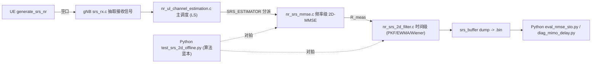

# 2D-MMSE 代码地图(SRS 信道估计)

| 字段 | 值 |
|------|----|
| 日期 | 2026-06-08 |
| 用途 | 一张图说清 2D-MMSE 相关代码分布:C 端(gNB 实时估计器)+ Python 端(离线开发/验证)+ 配置/调用链 + env 旋钮 + C↔Python 对应。 |
| 根目录 | C: `DevChannelProxyJIN/openairinterface5g_whan/openair1/PHY/NR_ESTIMATION/`;Python: `DevChannelProxyJIN/vRAN_Socket/G1C_MultiUE_MIMO_Channel_Proxy/` |

---

## 0. 总体数据流

---

## 1. C 端 —— 生产估计器(全在 `openair1/PHY/NR_ESTIMATION/`)

### 1.1 核心源码(活代码)
| 文件 | 角色 | 关键内容 |
|---|---|---|
| **`nr_ul_channel_estimation.c`** | **主入口/总调度** | `nr_srs_channel_estimation()`;LS 估计(L880-1022,FD-CDM 解扩);按 `SRS_ESTIMATOR` 分派到各模式(legacy/mmse1d/true2d/mmse2d/passthru/oracle/freqsmooth,L1025-1212);noise 计算;digital-twin dump 注入(L1490+,`srs_buffer`←`srs_estimated_channel_freq`) |
| **`nr_srs_mmse.c` / `.h`** | **频率级 2D-MMSE 核心** | PDP→R 两级 MMSE;windowed-LMMSE(Wiener-Hopf,`solve/invert_complex_system`);PDP via IFFT(`nr_srs_pdp_ifft`)+ 噪声底(`nr_srs_estimate_ifft_noise_floor`)+ R=FT(PDP)(`nr_srs_pdp_to_R_dft`);**EMA-PDP** `g_true2d_pdp_ema`(alpha0.95);legacy-gate;Option B 跨RX的R复用(`_build`/`_reuse`);estimator-mode 解析 |
| **`nr_srs_2d_filter.c` / `.h`** | **时间级 2D** | 跨 SRS slot 滤波:EWMA(固定alpha)/ 自适应alpha / 标量Kalman / IBVSS / **PKF 相位预测卡尔曼**(`update_pkf_core` L1150)/ 时间Wiener预测器(`wiener_*_core`);`nr_srs_2d_set_rmeas` 收频率级 R |
| **`nr_srs_freq_smooth.c` / `.h`** | 频域滑动平均(辅助) | `nr_srs_freq_smooth()` 自适应窗滑动平均 |
| `nr_srs_mmse_changelog.md` | 改动历史文档 | — |
| `nr_ul_estimation.h` | 公共声明 | — |

### 1.2 模式枚举(`nr_srs_mmse.h`)
`NR_SRS_EST_LEGACY=0 / MMSE1D=1 / MMSE2D=2 / MMSE1D_ADAPT=3 / PASSTHRU=5 / ORACLE=6 / FREQSMOOTH=7 / TRUE2D=8`
- 生产主用 **TRUE2D**(Stage1 频率 windowed-LMMSE + Stage2 PKF 时间级)。

### 1.3 env 旋钮(运行时配置,不重编)
| 前缀 | 文件 | 例 |
|---|---|---|
| `SRS_ESTIMATOR` | nr_srs_mmse.c | `legacy`/`mmse1d`/`true2d`/`2d`… |
| `SRS_MMSE_*` | nr_srs_mmse.c | `SRS_MMSE_WINDOW`(默认16)、`SRS_MMSE_FILTER_DUMP`、sigma2 系列、`SRS_MMSE_DEBUG` |
| `SRS_2D_LEGACY_GATE*` | nr_srs_mmse.c | 高SNR回退混合门 |
| `SRS_2D_*` / `SRS_PKF_*` / `SRS_WIENER_*` | nr_srs_2d_filter.c | alpha、PKF 相位模式/预测、Wiener 预测阶数 |
| `SRS_DELAY_DENOISE*` | (本轮新增,见 `0608_频域去噪进C_延迟域门控日志.md`) | 延迟域门控去噪 |

### 1.4 C 单元测试(golden 对拍)—— `NR_ESTIMATION/c_unit_tests/`
- `golden_freq.py` ↔ `test_freq_main.c`(频率级)
- `golden_pkf.py` / `golden_pkf_predict.py` ↔ `test_pkf_main.c` / `test_pkf_predict_main.c`(PKF)
- `golden_wiener_predict.py` ↔ `test_wiener_predict_main.c`(Wiener 预测)
- `test_denoise_main.c` + `eval_denoise_c.py`(延迟域去噪)
- `run_all.sh` 一键跑全部;验证 C 与 Python 黄金参考 bit 级一致。

### 1.5 配置/调用链(相关但非估计器本体)
| 文件 | 角色 |
|---|---|
| `openair1/SCHED_NR/phy_procedures_nr_gNB.c` | gNB 调 `generate_srs_nr` + `nr_srs_channel_estimation`(L948-977) |
| `openair1/PHY/NR_TRANSPORT/srs_rx.c` | `nr_get_srs_signal` 抽接收信号(多符号 L109-123) |
| `openair1/PHY/NR_UE_TRANSPORT/srs_modulation_nr.c` | UE 生成 SRS(功率分摊 `amp/sqrt(N_ap)` L283/391) |
| `openair2/LAYER2/NR_MAC_gNB/nr_radio_config.c` | SRS 资源配置(`nrofSymbols`/`repetitionFactor` 写死 n1,L955-956) |
| `openair2/LAYER2/NR_MAC_gNB/gNB_scheduler_srs.c` | SRS PDU 填充/调度预留(L429-430,474) |

> ⚠️ 目录里的 `*.bak.20260510 / .20260511 / after_cleanupC_snapshot` 是历史快照,非活代码。

---

## 2. Python 端 —— 离线开发/验证(`vRAN_Socket/G1C_MultiUE_MIMO_Channel_Proxy/`)

| 文件 | 角色 |
|---|---|
| **`test_srs_2d_offline.py`** | **算法蓝本**:windowed_lmmse + time_pkf_riccati + 时间 Wiener 预测;扫频/预测对比。C 端就是照它实现 |
| `replay_true2d.py` | 回放抓包,true2d 性能 + 预测对比 |
| `eval_nmse_sto.py` | NMSE 评估(自适应 STO 对齐);主力评估工具 |
| `eval_nmse_clean.py` | NMSE 基线(标量对齐)+ SRS/GT 加载器(`load_srs`/`index_gt_slots`/`load_gt_by_refs`) |
| `diag_mimo_delay.py` | 延迟域残差/跨端口泄漏诊断(MIMO 分析新加) |
| `digital_twin_stats.py` / `native_gt_to_npz.py` | GT 处理/转换 |
| `cdl_to_cir.py` | CDL→CIR(支持多 TX×RX) |
| `launch_native.sh` | 一键拉 gNB+UE 抓 SRS |
| `eval_pdpR_nmse.py` 等 | 其它评估/扫描脚本 |

---

## 3. C ↔ Python 对应(对拍关系)
| 算法 | Python 蓝本 | C 实现 | golden 测试 |
|---|---|---|---|
| 频率级 windowed-LMMSE | `test_srs_2d_offline.py::windowed_lmmse` | `nr_srs_mmse.c::nr_srs_mmse_freq_filter` | `golden_freq.py` |
| 时间级 PKF | `test_srs_2d_offline.py::time_pkf_riccati` | `nr_srs_2d_filter.c::update_pkf_core` | `golden_pkf.py` |
| 时间 Wiener 预测 | `test_srs_2d_offline.py::time_wiener_predict` | `nr_srs_2d_filter.c::wiener_*_core` | `golden_wiener_predict.py` |

---

## 4. 相关历史日志(背景/演进)
- `2D_MMSE_项目报告.md` — 总报告
- `0531_True2D_端到端诊断与修复日志.md` — true2d 打通
- `0605_SRS信道预测_方向A_日志.md` — Wiener 预测方向
- `0607_降低时延_freq_wiener实时化优化日志.md` — 频率级实时化(5042µs→~190µs)
- `0607_真MIMO_Phase1_上行SRS_MIMO日志.md` — 真 MIMO 上行
- `0607_MIMO增强_多符号与频域去噪分析日志.md` — 增强方案分析
- `0608_频域去噪进C_延迟域门控日志.md` — 延迟域去噪进 C
- `nr_srs_mmse_changelog.md` — 频率级改动史

---

## 5. 速记
- 想改**频率级**(PDP/R/窗/去噪)→ `nr_srs_mmse.c`
- 想改**时间级**(EWMA/Kalman/PKF/预测)→ `nr_srs_2d_filter.c`
- 想改**主流程/LS/分派/dump**→ `nr_ul_channel_estimation.c`
- 想改**算法再验证**→ 先动 `test_srs_2d_offline.py`,再同步 C + `c_unit_tests/golden_*` 对拍
- 想看**端到端 NMSE**→ `eval_nmse_sto.py`;**误差结构**→ `diag_mimo_delay.py`
