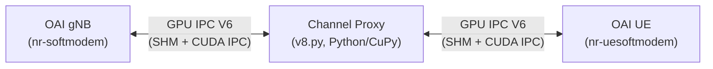
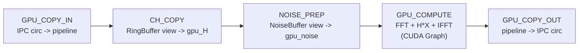
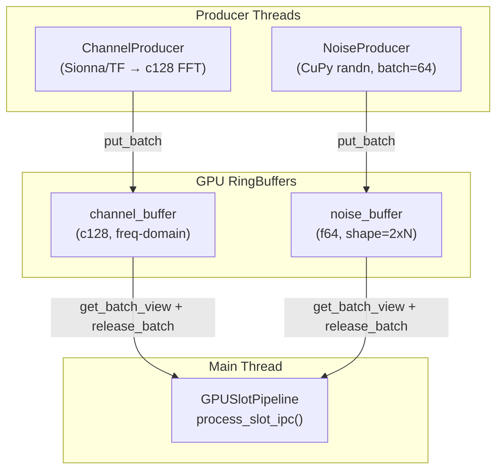

# G1B: Single-UE MIMO Channel Proxy

G0 v12 기반 1 gNB - 1 UE **MIMO** 채널 프록시.
G0(SISO Single-UE)에서 MIMO로 확장 + CUDA Graph 최적화 + 절대 noise 모델 검증까지 완료한 버전.
Multi-UE 확장은 G1C에서 다룰 예정.

## G0 → G1A → G1B → G1C 진화 경로

| 세대 | 구성 | 안테나 | 핵심 특징 |
|------|------|--------|----------|
| **G0** | 1 gNB + 1 UE | SISO (1×1) | 단일 UE, GPU IPC V1, CUDA Graph |
| **G1A** | 1 gNB + N UE | SISO (1×1) | Multi-UE, GPU IPC V2~V4, 배치 FFT |
| **G1B** | 1 gNB + 1 UE | **MIMO (N_t×N_r)** | **Single-UE MIMO**, G0 기반 확장, CUDA Graph 통합 |
| **G1C** | 1 gNB + N UE | MIMO (N_t×N_r) | Multi-UE MIMO (G1B 기반 확장, 예정) |

## 원래 계획 (A/B/C/D 세트)

| 세트 | 내용 | 상태 | 해결 버전 |
|------|------|------|-----------|
| **B** | 초기 싱크 (timestamp 기반 circular buffer, SHM, CUDA IPC) | **완료** | v1 (IPC V5) |
| **C** | 연속 싱크/안전 (range-based copy, gap zero-fill, 안정적 동작) | **완료** | v1 (IPC V5) |
| **A** | MIMO (다중 안테나, Single UE) — bypass 모드 | **완료** | v2→v3 (IPC V6) |
| **A** | MIMO 채널 적용 (Sionna MIMO channel modeling) + CSI CQI 리포팅 수정 | **구현+OAI수정** | v4 (IPC V6 + einsum + OAI CSI fix) |
| **A** | CUDA Graph 통합 (einsum→broadcast*sum, GPU index array, pre-alloc) | **완료** | v5 |
| **추가** | 절대 noise 모드 (dBFS) + PL 효과 검증 + 자동 종료 옵션 | **완료** | v6 |
| **추가** | NOISE_PREP 사전 생성 (NoiseProducer 비동기 batch) | **완료** | v8 |
| **D** | Multi-UE | → **G1C로 이관** | - |

### B+C 세트 상세 (v1에서 해결)

- GPU circular buffer + timestamp 인덱싱
- SHM으로 CUDA IPC handle 교환
- range-based copy (proxy가 delta 전체를 처리)
- 초기 head 설정 (`max(0, head - cir_time)`)
- gap zero-fill (C측 writer)
- read availability 강화 (`last < target_ts + nsamps - 1`)
- DL/UL 대칭 bypass (`-b` 시 DL+UL 모두 패스스루)

### A 세트 상세 (v2→v3에서 해결, bypass 한정)

- GPU IPC V6: per-buffer nbAnt/cir_size
- 비대칭 안테나 지원 (gNB != UE antenna count)
- bypass_copy: truncate/zero-pad (비대칭), gpu_circ_copy (대칭)
- launch_all.sh: `-ga Nx Ny`, `-ua Nx Ny` 옵션
- OAI 안테나 포트 오버라이드 (`pdsch_AntennaPorts_XP`, `N1`, `pusch_AntennaPorts`)
- **채널 적용(non-bypass)은 미구현**: `-b` 없이 MIMO에서 Sionna 채널을 적용하는 로직 필요

## 추가로 해결한 항목 (원래 세트 외)

| 항목 | 내용 | 해결 버전 |
|------|------|-----------|
| DL/UL 대칭 bypass | `-b` 시 DL+UL 모두 패스스루 (v0는 DL만) | v1 |
| warmup AttributeError | bypass 모드에서 channel_buffer 미초기화 크래시 | v1 |
| IPC 명명 통일 | `gpu_circ` → `gpu_ipc_v5` 네이밍 정리 | v1 |
| Proxy 누락 write 버그 | timestamp 변화만 감지 → range-based 전환 | v1 |
| 초기 head overflow 버그 | `cir_size` → `cir_time` (nbAnt>1 시 GPU 버퍼 초과) | v3 |
| gNB 4안테나 Segfault | OAI antenna port CLI 오버라이드 누락 | v3 |
| CSI CQI 리포팅 미전달 | UE MAC `cri_RI_LI_PMI_CQI` 인코더 미구현 → `get_csirs_RI_PMI_CQI_payload` 호출 | v4 (OAI) |
| SISO CQI 리포트 미설정 | gNB RRC가 1-port에서 CQI 리포트 미생성 → `config_csi_meas_report` 1-port 확장 | v4 (OAI) |
| gNB 디코더 r_index OOB | `ri_bitlen=0`일 때 `r_index=-1` → `r_index=0` 기본값 | v4 (OAI) |
| bitmap 디버그 핵 제거 | `meas_bitmap==1→0x1e` 강제 설정 → proper config으로 불필요, 주석 처리 | v4 (OAI) |
| MIMO 채널 정규화 | FFT축 정규화 → TX 안테나축 정규화 (`axis=2`) | v4 (Proxy) |

## 현재 상태 요약

- **v8 완료**: NOISE_PREP 사전 생성 최적화 (NoiseProducer 스레드 + RingBuffer batch 생성)
- **v7 완료**: CH_COPY 파이프라인 최적화 (dtype c128 통일, .copy() 제거, 조건부 제로화, 채널 FFT 사전 수행)
- **v6 완료**: 절대 noise 모드 (`--noise-dBFS`) + 자동 종료 (`-d SEC`) + 테스트 검증 완료
- **v5 완료**: Single-UE MIMO + CUDA Graph 통합
- **핵심 성과**: v4 대비 **4.7배 속도 향상** (CUDA Graph, v5) + CH_COPY **~55% 절감** (v7) + NOISE_PREP **0.388ms→0.153ms** (v8, -61%)
- **noise 모델**: dual mode — 상대 SNR (`--snr-dB`) + 절대 dBFS (`--noise-dBFS`)
- **다음 단계**: 연결 후 noise 동적 적용, 이후 G1C에서 Multi-UE

---

## 시스템 아키텍처



- OAI `rfsimulator` 내부에 `gpu_ipc_v6.c`를 통합하여 IQ 샘플을 **GPU circular buffer**로 교환
- **SHM (4KB)**: CUDA IPC handle + 메타데이터 (head/tail timestamp, cir_time, nbAnt per buffer)
- Proxy는 gNB/UE 양쪽 GPU 버퍼를 읽고/쓰는 **중간자** 역할 — Sionna 채널, PL, noise를 적용
- 환경변수 `RFSIM_GPU_IPC_V6=1`로 활성화. 미설정 시 기존 cascade (V5→V4→...→V1) 동작

### OAI rfsimulator 수정 개요

OAI `rfsimulator`는 gNB/UE 간 IQ 샘플을 TCP 소켓 또는 GPU IPC로 교환하는 시뮬레이터이다.

- **V5** (v1에서 추가): GPU circular buffer + timestamp polling. `gpu_ipc_v5.{h,c}`, `simulator.c`에 `#ifdef USE_GPU_IPC_V5` 블록 7곳
- **V6** (v2에서 추가): per-buffer nbAnt/cir_size로 비대칭 안테나 지원. `gpu_ipc_v6.{h,c}`, V6가 cascade 최우선
- **CSI CQI 수정** (v4): UE MAC → gNB MAC 경로에서 OAI 4개 파일 수정하여 MIMO CQI 리포팅 정상화
- Proxy는 `custom_channel` 훅 포인트를 통해 IQ에 채널/PL/noise를 적용

---

## GPU 파이프라인 (v8 기준)

매 슬롯(0.5ms @ 30kHz SCS)마다 아래 5단계를 실행한다:



| 단계 | 내용 | v5 (2x2) | v8 (2x2, noise ON) | 최적화 |
|------|------|----------|---------------------|--------|
| GPU_COPY_IN | IPC circular buffer → pipeline 데이터 읽기 | 0.144ms | ~0.10ms | - |
| CH_COPY | RingBuffer → gpu_H 채널 계수 전달 | 0.319ms (46%) | ~0.09ms | v7: c128 통일, view+release, FFT 사전 수행 |
| NOISE_PREP | noise 계수 준비 | 0.021ms | 0.153ms | v8: NoiseProducer batch 사전 생성 |
| GPU_COMPUTE | FFT + broadcast\*sum + IFFT (CUDA Graph) | 0.103ms | ~0.10ms | v5: CUDA Graph 캡처/리플레이 |
| GPU_COPY_OUT | pipeline → IPC circular buffer 쓰기 | 0.105ms | ~0.10ms | - |
| **TOTAL** | | **0.693ms** | **0.561ms** | |

---

## CUDA Graph 통합 원리

### CUDA Graph란

GPU 커널 시퀀스를 1회 **캡처**(record) → 이후 매 슬롯은 **리플레이**(replay)만 수행한다. 개별 커널 런치 오버헤드(~10us x N)를 제거하여, v4 대비 **4.7배** throughput 향상을 달성했다 (MIMO 2x2 channel).

### 고정 메모리 주소 요구

CUDA Graph는 캡처 시점의 GPU 포인터가 리플레이 시에도 **동일**해야 한다. 이 제약이 아래 설계 결정을 강제한다:

| 제약 | 원래 코드 (v4) | Graph-safe 변환 (v5) |
|------|---------------|---------------------|
| cuBLAS 동적 할당 비호환 | `cp.einsum('srtf,stf->srf')` | `broadcast * sum` (수학적 동치) |
| Python for-loop 비호환 | OFDM 추출/재구성 루프 | GPU 인덱스 배열 (`gpu_ext_idx`, `gpu_data_dst`, `gpu_cp_dst/src`) |
| 동적 버퍼 할당 비호환 | `cp.zeros()` 매 슬롯 | `__init__` 사전 할당 (`_buf_HX`, `_buf_Yf`, `_buf_out_2d` 등) |

### Zero-copy 비호환 (트레이드오프)

RingBuffer view의 GPU 주소는 매 슬롯마다 변동한다(circular buffer 내 위치가 다름). 따라서 view를 직접 CUDA Graph에 넣을 수 없다.

- **해결**: `gpu_H`, `gpu_noise_r/i`를 **고정 버퍼**로 유지하고, RingBuffer view → 고정 버퍼로 **memcpy** 후 Graph 리플레이
- **비용**: memcpy 잔존 (~960KB for noise, ~1.75MB for channel). 이것이 v8 NOISE_PREP 0.153ms의 주 원인
- CUDA Graph의 성능 이득(4.7x)이 memcpy 비용보다 압도적이므로, 현재 설계가 최적

---

## Producer-Consumer 스레딩 모델

채널 계수와 noise를 **백그라운드 스레드**에서 사전 생성하여 파이프라인 지연을 최소화한다:



- **ChannelProducer** (v4~): Sionna 채널 생성 → c128 변환 → FFT 수행(v7~) → RingBuffer 적재
- **NoiseProducer** (v8~): `cp.random.randn(batch=64, 2, noise_len)` → RingBuffer 적재
- **Pipeline** (Main Thread): view로 즉시 참조 → 고정 버퍼에 memcpy → CUDA Graph 리플레이

### RingBuffer view+release 메커니즘

v7에서 `.copy()` 제거를 위해 도입한 동시성 보호 패턴:

- **`get_batch_view(N)`**: 내부 배열의 슬라이스를 **view**(zero-copy)로 반환. `count`는 감소하지 않음 → Producer가 이 영역에 덮어쓰지 못하도록 보호
- **`release_batch(N)`**: 소비 완료 후 호출. `count -= N`으로 해당 영역을 Producer에 반환
- **효과**: CH_COPY에서 ~1.75MB GPU memcpy 제거 (`.copy()` 호출 제거)
- **Thread-safe**: Python GIL + count 보호로 Producer/Consumer 간 동일 메모리 접근 방지

---

## 아직 해야 할 것 (G1B 범위)

| 항목 | 설명 | 난이도 |
|------|------|--------|
| ~~CH_COPY 병목 최적화~~ | **v7에서 해결**: c128 통일, .copy() 제거, 조건부 제로화, FFT 사전 수행 | ~~높음~~ |
| **SISO CQI 리포팅** | 1-port에서 CQI=0 문제 잔존 (CSI-RS 보간 잔차, MIMO에서는 정상) | 중간 |
| **연결 후 noise 동적 적용** | RRC 연결 후 noise를 켜는 방식으로 PSS/RA 보호 | 중간 |
| ~~절대 SNR/noise 모드~~ | **v6에서 해결**: `--noise-dBFS` 추가, 수식 정확성 검증 완료 | ~~중간~~ |
| **MCS 적응 관찰** | CQI 정상에도 MCS 0 유지 — 연결 후 noise 적용과 함께 장시간 테스트 필요 | 낮음 |

### G1C로 이관한 항목

| 항목 | 설명 |
|------|------|
| **D 세트: Multi-UE** | UE별 별도 버퍼/채널, SHM 확장, 독립 동기화. IPC V6 구조 확장 필요 |

## 버전 이력

| 버전 | 파일 | IPC | 핵심 변경 |
|------|------|-----|----------|
| **v0** | `v0.py` | V1 | G0 v12 복사 (SISO 1UE 기준선) |
| **v1** | `v1.py` | V5 | circular buffer, DL/UL 대칭, timestamp polling, range-based copy |
| **v2** | `v2.py` | V6 | per-buffer antenna, MIMO bypass, 비대칭 안테나 지원 |
| **v3** | `v3.py` | V6 | cir_time head 버그 수정, OAI antenna port 오버라이드 |
| **v4** | `v4.py` | V6 | MIMO 채널 적용 (einsum), DL/UL pipeline, PanelArray(Nx,Ny), CSI CQI fix (OAI 4파일), TX축 정규화 |
| **v5** | `v5.py` | V6 | CUDA Graph 통합: einsum→broadcast*sum, GPU index array, pre-alloc buffers |
| **v6** | `v6.py` | V6 | dual noise model (absolute dBFS / relative SNR), `--duration`, 검증 완료 |
| **v7** | `v7.py` | V6 | CH_COPY 최적화: c128 통일, .copy()→view+release, 조건부 제로화, 채널 FFT 사전 수행 |
| **v8** | `v8.py` | V6 | NOISE_PREP 최적화: NoiseProducer batch 사전 생성 (RingBuffer=256), pipeline은 memcpy만 |

## v7 → v8 핵심 변경

| 항목 | v7 | v8 |
|------|-----|-----|
| NOISE_PREP (noise ON) | `cp.random.randn()` x2 매 슬롯 (0.388ms) | NoiseProducer 스레드 batch 사전 생성, `get_batch_view` memcpy (0.153ms, -61%) |
| NoiseProducer | 없음 | Thread + RingBuffer(maxlen=256, batch=64) |
| _regenerate_noise | 동기 randn() | noise_buffer view+release (하위 호환: buffer 없으면 기존 randn) |
| noise OFF 시 | 변화 없음 | 변화 없음 (NoiseProducer 미생성) |
| Pipeline TOTAL (noise ON, EVT) | ~0.69ms | 0.561ms (-19%) |

### v7 vs v8 실측 결과 (MIMO 2x2, PL 5dB, noise -50dBFS)

| 지표 (IPC_SLOT_EVT) | v7 avg | v8 avg | v7 p95 | v8 p95 | 변화 |
|---------------------|--------|--------|--------|--------|------|
| NOISE_PREP | 0.388ms | 0.153ms | 0.546ms | 0.217ms | **-61%** |
| TOTAL | 0.691ms | 0.561ms | 1.003ms | 0.906ms | **-19%** |

v8 NOISE_PREP가 0.153ms인 이유: NoiseProducer에서 난수 생성 자체는 비동기로 완료되었으나, RingBuffer view → 고정 버퍼(`gpu_noise_r/i`)로의 **GPU-to-GPU memcpy (~960KB)**가 잔존한다. CUDA Graph의 고정 메모리 주소 요구로 인해 zero-copy 방식을 적용할 수 없는 트레이드오프이다.

### v4 → v8 성능 진화 요약 (MIMO 2x2 channel)

| 버전 | Pipeline TOTAL (EVT avg) | DL/s | 핵심 병목 해결 |
|------|--------------------------|------|--------------|
| v4 | ~9.5ms/slot (20 slots) | 75.7 | (기준선, einsum) |
| v5 | ~0.69ms/slot | 354 | CUDA Graph 통합 (**4.7x**) |
| v7 | ~0.69ms/slot (noise OFF) | - | CH_COPY ~55% 절감 |
| v8 | ~0.56ms/slot (noise ON) | - | NOISE_PREP -61% |

## v6 → v7 핵심 변경

| 항목 | v6 | v7 |
|------|-----|-----|
| RingBuffer dtype | complex64 | complex128 (dtype 통일) |
| RingBuffer get_batch | `.copy()` 매번 수행 | `get_batch_view()` (view) + `release_batch()` |
| ChannelProducer 출력 | complex64 (다운캐스트) | complex128 직접 출력 + FFT 사전 수행 |
| gpu_H 제로화 | `gpu_H[:] = 0` 매 슬롯 | 조건부: `n_ch < N_SYM`일 때만 |
| Pipeline astype | `ch_slice.astype(cp.complex128)` | 제거 (이미 c128) |
| _gpu_compute_core FFT | `fft(gpu_H)` 매 슬롯 | 제거 (Producer에서 사전 수행) |
| CH_COPY 메모리 트래픽 | ~7.9MB/slot | ~3.5MB/slot (**~55% 절감**) |

## v5 → v6 핵심 변경

| 항목 | v5 | v6 |
|------|-----|-----|
| noise 모델 | 상대 SNR 전용 (`--snr-dB`) | dual: 상대 SNR + 절대 dBFS (`--noise-dBFS`) |
| PL + noise 상호작용 | PL이 CQI에 영향 없음 (상대 noise) | 절대 noise 시 PL이 effective SNR 하락 → CQI 변화 |
| PL 효과 검증 | 미검증 | I0 변화 정량 측정 (PL 10dB → I0 12dB 감소 확인) |
| 테스트 시간 | Ctrl+C까지 | `-d SEC` 자동 종료 옵션 |
| launch_all.sh | `-pl`, `-snr` | `-pl`, `-snr`, `-nf`, `-d` |

### v6 검증 시 확인된 OAI 구조적 한계

OAI rfsimulator는 PSS/SSS/PBCH/RACH와 PDSCH/PUSCH가 동일한 IQ 스트림을 공유한다.
따라서 데이터 채널에 영향을 줄 정도의 noise(-30dBFS 이상)를 넣으면 초기 접속 자체가 실패한다.
반대로 초기 접속이 가능한 noise(-50dBFS 이하)에서는 effective SNR이 너무 높아 CQI=15가 유지된다.

이 한계를 극복하려면 RRC 연결 후 noise를 동적으로 활성화하는 방식이 필요하며, 이는 v7 이후 과제로 남긴다.

## v3 → v4 핵심 변경

| 항목 | v3 | v4 |
|------|-----|-----|
| 채널 적용 | bypass만 (미구현) | Sionna MIMO einsum |
| Pipeline | 단일 GPUSlotPipeline | DL/UL 별도 pipeline |
| _gpu_compute_core | SISO 전용 (1D) | MIMO (de-interleave → einsum → re-interleave) |
| ChannelProducer | tf.squeeze (SISO 함정) | 명시적 축 제거, (N_sym, N_r, N_t, FFT) |
| RingBuffer shape | (FFT_SIZE,) | (ue_ant, gnb_ant, FFT_SIZE) |
| _ipc_apply_channel | nbAnt 단일 | src/dst 분리, direction(DL/UL), H^T 자동 |
| Sionna PanelArray | 하드코딩 1x1 | launch_all.sh Nx/Ny 동적 설정 |
| warmup | 단일 pipeline | DL/UL 각각 identity-like channel로 워밍업 |

## v4 → v5 핵심 변경

| 항목 | v4 | v5 |
|------|-----|-----|
| MIMO 채널 적용 | `einsum('srtf,stf->srf')` (cuBLAS) | `broadcast multiply + sum` (CUDA Graph safe) |
| OFDM 심볼 추출 | Python for-loop | GPU 인덱스 배열 (`gpu_ext_idx`) |
| OFDM 재구성 | Python for-loop (scatter+CP) | GPU 인덱스 scatter (`gpu_data_dst`, `gpu_cp_dst/src`) |
| 중간 버퍼 | `cp.zeros()` 동적 할당 | `__init__` 사전 할당 (`_buf_HX`, `_buf_Yf`, `_buf_out_2d`, `_buf_iq_out_3d`) |
| CUDA Graph | capture 실패 (cuBLAS 비호환) | capture 성공 (모든 연산 graph-safe) |
| 수학적 동치 | `Y = einsum(H, X)` | `Y = sum(H * X[newaxis], axis=tx)` — 완전 동치 |

## v3 기능 지원 범위

| 기능 | 지원 |
|------|------|
| GPU IPC V6 (per-buffer antenna) | O |
| SISO bypass (1x1) | O |
| 대칭 MIMO bypass (NxN) | O |
| 비대칭 MIMO bypass (gNB != UE) | O |
| gNB 최대 4안테나 | O |
| UE 최대 2안테나 (검증 완료) | O |
| OAI antenna port 자동 설정 | O (2, 4안테나) |
| DL/UL 대칭 bypass | O |
| 초기 싱크 (B set) | O |
| 연속 싱크 (C set) | O |
| Sionna 채널 적용 (SISO) | 코드 있음, **미검증** |
| Sionna 채널 적용 (MIMO) | **미구현** |
| Multi-UE (D set) | → G1C |

## v4 기능 지원 범위

| 기능 | 지원 |
|------|------|
| v3 전체 기능 (bypass 포함) | O |
| Sionna MIMO 채널 적용 (einsum) | O |
| DL/UL 방향별 Pipeline | O |
| DL: H@X, UL: H^T@X 자동 전환 | O |
| Sionna PanelArray Nx/Ny 동적 설정 | O |
| ChannelProducer MIMO H 정규화 | O |
| identity-like 채널 패딩 (버퍼 언더런) | O |
| SISO(1x1) MIMO 특수 경우 호환 | O |
| Multi-UE (D set) | → G1C |

## v8 기능 지원 범위 (최신)

| 기능 | 지원 |
|------|------|
| v7 전체 기능 | O |
| NoiseProducer batch 사전 생성 | O (Thread + RingBuffer batch=64, maxlen=256) |
| _regenerate_noise view+release | O (noise_buffer 있으면 memcpy, 없으면 기존 randn) |
| DL/UL 독립 noise buffer | O (비대칭 MIMO 대응) |
| noise OFF 하위 호환 | O (NoiseProducer 미생성) |
| Multi-UE | → G1C |

### v8 검증 명령어

```bash
cd /home/dclcom57/DevChannelProxyJIN/vRAN_Socket/G1B_SingleUE_MIMO_Channel_Proxy

# Test 1: v8 SISO bypass (regression — noise 미사용, NoiseProducer 미생성 확인)
sudo bash launch_all.sh -v v8 -m gpu-ipc -b

# Test 2: v8 MIMO 2x2 bypass (regression)
sudo bash launch_all.sh -v v8 -m gpu-ipc -b -ga 2 1 -ua 2 1

# Test 3: v8 MIMO 2x2 채널 (v7 regression — noise OFF, NOISE_PREP ~0.004ms 유지)
sudo bash launch_all.sh -v v8 -m gpu-ipc -ga 2 1 -ua 2 1

# Test 4: v8 MIMO 2x2 채널 + PL5 + noise -50dBFS (핵심 — NOISE_PREP 0.388ms → 0.153ms)
sudo bash launch_all.sh -v v8 -m gpu-ipc -ga 2 1 -ua 2 1 -pl 5 -nf -50

# Test 5: v8 MIMO 2x2 채널 + 상대 SNR 30dB (SNR 모드 regression)
sudo bash launch_all.sh -v v8 -m gpu-ipc -ga 2 1 -ua 2 1 -snr 30

# Test 6: v8 SISO 채널 + noise -50dBFS (SISO + noise regression)
sudo bash launch_all.sh -v v8 -m gpu-ipc -nf -50
```

핵심 측정 결과: Test 4의 `NOISE_PREP` avg가 v7(0.388ms) 대비 **0.153ms**로 61% 감소 확인. 잔존 비용은 GPU-to-GPU memcpy (~960KB).

## v7 기능 지원 범위

| 기능 | 지원 |
|------|------|
| v6 전체 기능 | O |
| RingBuffer c128 통일 | O (astype 제거) |
| RingBuffer view+release | O (.copy() 제거, count 보호) |
| ChannelProducer FFT 사전 수행 | O (Pipeline에서 fft(H) 제거) |
| 조건부 제로화 | O (n_ch == N_SYM이면 생략) |
| Multi-UE | → G1C |

### v7 검증 명령어

```bash
cd /home/dclcom57/DevChannelProxyJIN/vRAN_Socket/G1B_SingleUE_MIMO_Channel_Proxy

# Test 1: v7 SISO bypass (regression)
sudo bash launch_all.sh -v v7 -m gpu-ipc -b

# Test 2: v7 MIMO 2x2 bypass (regression)
sudo bash launch_all.sh -v v7 -m gpu-ipc -b -ga 2 1 -ua 2 1

# Test 3: v7 MIMO 2x2 채널 적용 (CH_COPY 성능 측정 핵심)
sudo bash launch_all.sh -v v7 -m gpu-ipc -ga 2 1 -ua 2 1

# Test 4: v7 MIMO 2x2 채널 + PL 5dB + 절대 noise -50dBFS (v6 기능 regression)
sudo bash launch_all.sh -v v7 -m gpu-ipc -ga 2 1 -ua 2 1 -pl 5 -nf -50

# Test 5: v7 SISO 채널 적용 (SISO regression)
sudo bash launch_all.sh -v v7 -m gpu-ipc
```

## v6 기능 지원 범위 (이전)

| 기능 | 지원 | 검증 상태 |
|------|------|----------|
| v5 전체 기능 | O | regression 통과 |
| 절대 noise (`--noise-dBFS`) | O | 수식 정확성 검증 완료 |
| 상대 SNR (`--snr-dB`) | O | 기존 호환, 상호 배타 |
| 자동 종료 (`-d SEC`) | O | launch_all.sh |
| PL + 절대 noise 조합 | O | I0 변화로 PL 효과 정량 확인 |
| CQI/MCS 변화 관찰 | △ | noise 약하면 CQI 불변, 강하면 RA 실패 (OAI 구조적 한계) |
| Multi-UE | → G1C | - |

### v6 절대 Noise 테스트 결과

#### Regression (bypass, noise off)

| # | 구성 | PL | Noise | RRC | CQI | RI | 비고 |
|---|------|----|-------|-----|-----|----|------|
| 1 | SISO bypass | 0 | off | 성공 | 11 | 1 | v5와 동일 |
| 2 | MIMO 2x2 bypass | 0 | off | 성공 | 15 | 2 | v5와 동일 |

#### 절대 Noise bypass 테스트

| # | 구성 | PL | Noise (dBFS) | noise_rms | RRC | CQI | RI | 비고 |
|---|------|----|-------------|-----------|-----|-----|----|------|
| 3 | MIMO bypass | 0 | -50 | 104 | 성공 | 15 | 2 | noise 미미 |
| 4 | MIMO bypass | 0 | -40 | 328 | 성공 | 15 | 2 | noise 미미 |

#### 절대 Noise 채널 적용 테스트

| # | 구성 | PL | Noise (dBFS) | noise_rms | RRC | CQI | RI | 비고 |
|---|------|----|-------------|-----------|-----|-----|----|------|
| 5 | MIMO 채널 | 0 | -50 | 104 | **실패** | - | - | RA Msg3/Msg4 실패 (transient) |
| 6 | MIMO 채널 | 5dB | -50 | 104 | 성공 | 15 | 2 | PBCH 오류 2회 후 복구 |
| 7 | MIMO 채널 | 5dB | -50 | 104 | 성공 | 15 | 2 | -d 10 사용, BLER 18% |
| 8 | MIMO 채널 | 0 | -30 | 1036 | **실패** | - | - | RA 실패 (noise > PSS) |
| 9 | MIMO 채널 | 10dB | -30 | 1036 | **실패** | - | - | RA 실패 |
| 10 | MIMO 채널 | 10dB | -30 | 1036 | **실패** | - | - | PBCH 디코딩 실패 |
| 11 | MIMO 채널 | 15dB | -20 | 3277 | **실패** | - | - | PBCH 디코딩 실패 |

#### PL 효과 검증 (I0 측정)

| 조건 | avg_I0 (dB) | PRACH_I0 (dB) |
|------|------------|--------------|
| -30dBFS, PL 0 | 60.6 | 34.8 |
| -30dBFS, PL 10dB | 48.5 | 29.7 |
| **차이** | **-12.1 dB** | **-5.1 dB** |

PL 10dB 적용 시 I0가 ~12dB 감소하여 PL이 정확히 반영됨을 확인.

#### v6 검증 결론

1. **절대 noise 수식 정확성 확인**: `noise_rms = 32767 * 10^(dBFS/20)` 로 정확히 적용됨
2. **PL + 절대 noise 독립 동작 확인**: I0 변화로 PL 효과 정량 측정 가능
3. **CUDA Graph 호환**: 절대 noise 모드에서도 graph capture 성공
4. **OAI 구조적 한계**: PSS/SSS/PBCH/RA와 데이터가 동일 채널+noise를 공유하므로, 데이터에 영향 줄 noise(-30dBFS 이상)를 넣으면 초기 접속이 실패. 약한 noise(-50dBFS)에서는 RRC 성공하지만 CQI=15 유지(effective SNR ~34dB)
5. **해결 방향**: RRC 연결 후 noise를 동적으로 활성화하는 방식이 필요 (v7 이후 과제)

## v5 기능 지원 범위

| 기능 | 지원 |
|------|------|
| v4 전체 기능 | O |
| CUDA Graph MIMO 캡처 | O (einsum→broadcast*sum) |
| GPU 인덱스 배열 OFDM | O (for-loop 제거) |
| 사전 할당 버퍼 | O (out= 파라미터) |
| PL/SNR 적용 | O (상대 SNR 방식, CUDA Graph 호환) |
| Multi-UE | → G1C |

### v5 PL/SNR 테스트 결과

| # | 구성 | PL | SNR | CUDA Graph | RRC | CQI | RI | DL/s | 비고 |
|---|------|----|-----|------------|-----|-----|----|------|------|
| 1 | MIMO 2x2 | 3dB | off | 성공 | 성공 | 15 | 2 | 362 | PL만 적용 |
| 2 | MIMO 2x2 | 0 | 30dB | 성공 | 성공 | 15 | 2 | 288 | SNR만 적용 |
| 3 | MIMO 2x2 | 3dB | 30dB | 성공 | 성공 | 15 | 2 | 290 | PL+SNR |
| 4 | MIMO 2x2 | 3dB | 20dB | 성공 | 성공 | 15 | 2 | 291 | 중간 환경 |
| 5 | MIMO 2x2 | 5dB | 15dB | 성공 | 성공 | 15 | 2 | 299 | 열악 환경 |
| 6 | MIMO 2x2 | 5dB | 7dB | 성공 | 성공 | 15 | 2 | 324 | 극한 SNR |
| 7 | SISO | 3dB | 20dB | 성공 | 성공 | 0 | 1 | 274 | SISO CQI=0 잔존 |

모든 MIMO 테스트에서 CQI=15, RI=2 유지. SNR=7dB에서도 rank 유지됨.

### PL/Noise 동작 원리

```
채널 정규화 (H): ChannelProducer에서 TX축 정규화 → H 에너지 보존
Path Loss (PL): 채널 적용 후 별도 단계에서 절대 신호 크기 감쇠
Noise: 두 가지 모드 중 택일
```

#### 모드 A: 상대 SNR (`--snr-dB`)
- `noise_power = signal_power_after_PL / snr_linear`
- PL이 신호를 줄여도 noise가 비례하여 줄기 때문에 UE가 체감하는 SNR 비율은 불변
- CQI/RI에 PL 영향 없음, int16 양자화 한계(PL 20~30dB+)에서만 효과
- 용도: "이 SNR에서 시스템 동작 확인" 테스트

#### 모드 B: 절대 noise (`--noise-dBFS`) — v6 신규
- `noise_rms = 32767 * 10^(dBFS/20)`, noise는 고정
- PL이 신호를 줄이면 effective SNR 하락 → CQI/RI 변화
- OAI 내부 noise 모델(절대 dBFS)과 동일 도메인
- 용도: PL과 결합된 현실적 환경 시뮬레이션

#### dBFS 참고값
| dBFS | noise rms | 신호 5000 기준 effective SNR | v6 테스트 결과 |
|------|-----------|---------------------------|---------------|
| -20 | 3277 | ~3.7 dB | RA 실패 (PBCH 디코딩 실패) |
| -30 | 1036 | ~13.7 dB | RA 실패 (noise > PSS) |
| -40 | 328 | ~23.7 dB | RRC 성공, CQI=15 (bypass) |
| -50 | 104 | ~33.7 dB | RRC 성공, CQI=15 (bypass/채널) |
| -60 | 33 | ~43.7 dB | 미테스트 |

- 두 모드는 **상호 배타적** (`--snr-dB`와 `--noise-dBFS` 동시 사용 불가)

### v6 검증 명령어

```bash
cd /home/dclcom57/DevChannelProxyJIN/vRAN_Socket/G1B_SingleUE_MIMO_Channel_Proxy

# v6 SISO bypass (regression) — CQI=11, RI=1
sudo bash launch_all.sh -v v6 -m gpu-ipc -b

# v6 MIMO bypass (regression) — CQI=15, RI=2
sudo bash launch_all.sh -v v6 -m gpu-ipc -b -ga 2 1 -ua 2 1

# v6 MIMO bypass + 절대 noise -50dBFS — RRC 성공, CQI=15
sudo bash launch_all.sh -v v6 -m gpu-ipc -b -ga 2 1 -ua 2 1 -nf -50

# v6 MIMO bypass + 절대 noise -40dBFS — RRC 성공, CQI=15
sudo bash launch_all.sh -v v6 -m gpu-ipc -b -ga 2 1 -ua 2 1 -nf -40

# v6 MIMO 채널 + 절대 noise -50dBFS + PL 5dB — RRC 성공, CQI=15
sudo bash launch_all.sh -v v6 -m gpu-ipc -ga 2 1 -ua 2 1 -nf -50 -pl 5

# v6 MIMO 채널 + 절대 noise -30dBFS — RA 실패 (noise가 PSS를 덮음)
sudo bash launch_all.sh -v v6 -m gpu-ipc -ga 2 1 -ua 2 1 -nf -30
```

### v5 검증 명령어

```bash
cd /home/dclcom57/DevChannelProxyJIN/vRAN_Socket/G1B_SingleUE_MIMO_Channel_Proxy

# v5 SISO bypass
sudo bash launch_all.sh -v v5 -m gpu-ipc -b

# v5 SISO 채널 적용
sudo bash launch_all.sh -v v5 -m gpu-ipc

# v5 대칭 MIMO bypass (2x2)
sudo bash launch_all.sh -v v5 -m gpu-ipc -b -ga 2 1 -ua 2 1

# v5 대칭 MIMO 채널 적용 (2x2)
sudo bash launch_all.sh -v v5 -m gpu-ipc -ga 2 1 -ua 2 1

# v5 비대칭 MIMO 채널
sudo bash launch_all.sh -v v5 -m gpu-ipc -ga 2 1

# v5 MIMO 채널 + PL + SNR
sudo bash launch_all.sh -v v5 -m gpu-ipc -ga 2 1 -ua 2 1 -pl 3 -snr 20

# v5 MIMO 채널 + 극한 환경
sudo bash launch_all.sh -v v5 -m gpu-ipc -ga 2 1 -ua 2 1 -pl 5 -snr 7
```

### v4 검증 명령어

```bash
cd /home/dclcom57/DevChannelProxyJIN/vRAN_Socket/G1B_SingleUE_MIMO_Channel_Proxy

# v4 SISO bypass (v3 호환 확인)
sudo bash launch_all.sh -v v4 -m gpu-ipc -b

# v4 SISO 채널 적용
sudo bash launch_all.sh -v v4 -m gpu-ipc

# v4 대칭 MIMO 채널
sudo bash launch_all.sh -v v4 -m gpu-ipc -ga 2 1 -ua 2 1

# v4 비대칭 MIMO 채널
sudo bash launch_all.sh -v v4 -m gpu-ipc -ga 2 1
```

## 검증된 테스트 구성 및 성능

### Bypass 모드 테스트 (v2~v3)

| 구성 | 버전 | DL/s | Proxy/slot | Wall/slot | IPC+OAI/slot | DL BLER | 상태 |
|------|------|------|-----------|----------|-------------|---------|------|
| SISO (1x1) | v2 | ~947 | 0.14ms | 0.25ms | 0.11ms | ~0 | 성공 |
| gNB=2, UE=1 | v2 | ~894 | 0.22ms | 0.40ms | 0.17ms | ~0 | 성공 |
| gNB=2, UE=2 | v2 | - | - | - | - | - | 크래시 (head overflow) |
| gNB=4, UE=1 | v2 | - | - | - | - | - | gNB Segfault |
| **gNB=2, UE=2** | **v3** | **~515** | **0.12ms** | **0.37ms** | **0.25ms** | **~0** | **성공** |
| **gNB=4, UE=1** | **v3** | **~844** | **0.22ms** | **0.54ms** | **0.32ms** | **0.45** | **성공** |
| **gNB=4, UE=2** | **v3** | **~760** | **0.23ms** | **0.50ms** | **0.28ms** | **0.02** | **성공** |

### v5 전체 테스트 결과

| # | 구성 | 모드 | CUDA Graph | RRC | CQI | RI | DL/s | 상태 |
|---|------|------|------------|-----|-----|----|------|------|
| 1 | SISO (1x1) | bypass | 생략 | 성공 | 11 | 1 | 1155 | 성공 |
| 2 | SISO (1x1) | channel | **성공** | 성공 | 0* | 1 | 318 | 성공 |
| 3 | gNB=2, UE=2 | bypass | 생략 | 성공 | 15 | 2 | 756 | 성공 |
| 4 | **gNB=2, UE=2** | **channel** | **성공** | 성공 | **15** | **2** | **354** | **성공** |
| 5 | gNB=2, UE=1 | channel | **성공** | 성공 | 15 | 1 | 293 | 성공 |

\* CQI 0은 채널 환경 영향 (gNB가 MCS 9로 fallback, 연결은 정상)

### v4 vs v5 성능 비교 (MIMO 2x2 채널 적용 = 핵심)

| 지표 | v4 (NORMAL, einsum) | v5 (GRAPH, broadcast*sum) | 비고 |
|------|---------------------|---------------------------|------|
| CUDA Graph | **실패** (cuBLAS 비호환) | **성공** | v5 핵심 목표 |
| DL 처리량 | 75.7 DL/s | **354 DL/s** | **4.7배** |
| E2E per slot (10D+10U) | ~9.5 ms | **~1.8 ms** | **5.3배** |

| 테스트 구성 | v4 DL/s | v5 DL/s | 비고 |
|-------------|---------|---------|------|
| SISO bypass | 917 | 1155 | v5에서 소폭 개선 |
| SISO channel | 330 | 318 | 동등 (둘 다 CUDA Graph 성공) |
| MIMO bypass (2x2) | 770 | 756 | 동등 (bypass는 CUDA Graph 무관) |
| **MIMO channel (2x2)** | **75.7** | **354** | **v5에서 4.7배 향상** |

### v5 파이프라인 병목 분석

v5에서 CUDA Graph 통합으로 GPU_COMPUTE는 해결되었으나, 전체 파이프라인은 여전히 느림.
IPC_SLOT 프로파일 (슬롯당 평균, ms):

| 단계 | SISO 채널 | MIMO 채널 (2x2) | 비중 | 설명 |
|------|-----------|-----------------|------|------|
| GPU_COPY_IN | 0.203 | 0.144 | 21% | IPC circular buffer → pipeline 데이터 읽기 |
| **CH_COPY** | **0.478** | **0.319** | **46~52%** | **RingBuffer → gpu_H 채널 계수 복사 (최대 병목)** |
| NOISE_PREP | 0.015 | 0.021 | 2% | AWGN 노이즈 준비 |
| GPU_COMPUTE | 0.114 | 0.103 | 12~15% | FFT + broadcast*sum + IFFT (CUDA Graph) |
| GPU_COPY_OUT | 0.110 | 0.105 | 12~15% | pipeline → IPC circular buffer 쓰기 |
| **TOTAL** | **0.919** | **0.693** | 100% | |

**병목 원인**: CH_COPY (채널 계수 전달)이 전체의 약 절반을 차지.
`ChannelProducer`(TensorFlow/Sionna) → DLPack → CuPy `RingBuffer` → `gpu_H` 복사 경로에서 발생.
채널 적용 연산(GPU_COMPUTE ~0.1ms)보다 채널 **전달** 자체가 4~5배 더 느림.

**파이프라인 최적화 로드맵** (v5 이후):

| # | 방향 | 상태 | 해결 버전 | 설명 |
|---|------|------|-----------|------|
| 1 | **CH_COPY 최소화** | **완료** | v7 | c128 통일, view+release, 조건부 제로화, 채널 FFT 사전 수행. ~55% 메모리 트래픽 절감 |
| 2 | **채널 FFT batch prefetch** | **완료** | v7 | ChannelProducer에서 FFT 사전 수행, pipeline 내 fft(H) 제거 |
| 3 | **GPU_COPY_IN/OUT 최적화** | 미착수 | - | coalesced memory access 패턴 개선, stride copy → contiguous copy |
| 4 | **Python 루프 오버헤드 감소** | 미착수 | - | polling/sync 간격 최적화, busy-wait 대신 event-driven |
| 5 | **noise_on 분기 최적화** | 미착수 | - | SNR on/off에 따라 별도 CUDA Graph 캡처 |
| 6 | **CuPy 네이티브 채널 생성** | 미착수 | - | TF/Sionna → CuPy 변환 없이 직접 생성 (장기) |
| 7 | **SISO CQI 리포팅 수정** | 미착수 | - | OAI 1-port CSI report config 개선으로 SISO CQI=0 해결 |
| 8 | **절대 noise 모드** | **완료** | v6 | `--noise-dBFS` 추가, OAI 내부 모델과 동일 도메인 |
| 9 | **NOISE_PREP batch 사전 생성** | **완료** | v8 | NoiseProducer 스레드 + RingBuffer batch=64. 0.388ms → 0.153ms (-61%) |

### Bypass 성능 분석 참고

- DL/s 차이는 TDD 스케줄링에서 UL 비중 변화 때문 (UE 안테나 증가 → UL 활발)
- Proxy 처리 시간은 대칭(gpu_circ_copy)이 비대칭(de-interleave/re-interleave)보다 빠름
- gNB 4안테나 + UE 1안테나 시 DL BLER 0.45: bypass에서 4→1 truncate로 3안테나 데이터 유실
- gNB 4안테나 + UE 2안테나 시 DL BLER 0.02: 수신 다이버시티 효과로 품질 개선

### 검증 명령어

```bash
cd /home/dclcom57/DevChannelProxyJIN/vRAN_Socket/G1B_SingleUE_MIMO_Channel_Proxy

# v3 SISO bypass
sudo bash launch_all.sh -v v3 -m gpu-ipc -b

# v3 비대칭 (gNB 2x1)
sudo bash launch_all.sh -v v3 -m gpu-ipc -b -ga 2 1

# v3 대칭 (gNB 2x1, UE 2x1)
sudo bash launch_all.sh -v v3 -m gpu-ipc -b -ga 2 1 -ua 2 1

# v3 4안테나 gNB
sudo bash launch_all.sh -v v3 -m gpu-ipc -b -ga 4 1

# v3 4안테나 gNB + 2안테나 UE
sudo bash launch_all.sh -v v3 -m gpu-ipc -b -ga 4 1 -ua 2 1
```

## v2에서 v3로의 버그 수정 내용

### 버그 1: 초기 head overflow (Proxy 크래시)

`run_ipc()`에서 초기 proxy head를 `cir_size` 기준으로 계산하면, `nbAnt > 1`일 때 `delta * nbAnt > cir_size` → GPU 버퍼 초과 접근.

```python
# v2 (버그): cir_size = cir_time * nbAnt
proxy_dl_head = max(0, gnb_dl_head - self.ipc.dl_tx_cir_size)
# v3 (수정): cir_time = 시간 샘플 기준 순환 주기
proxy_dl_head = max(0, gnb_dl_head - self.ipc.cir_time)
```

- SISO(nbAnt=1): `cir_size == cir_time` → 변화 없음
- MIMO(nbAnt>1): `delta <= cir_time` → `total = delta * nbAnt <= cir_size` → 안전

### 버그 2: gNB 4안테나 Segfault (OAI 크래시)

`launch_all.sh`에서 `--RUs.[0].nb_tx 4`만 전달하고, OAI 상위 레이어 안테나 포트 설정을 누락.

```bash
# v2: RU 안테나만 설정 → PHY/MAC과 불일치 → Segfault
GNB_ANT_ARGS="--RUs.[0].nb_tx 4 --RUs.[0].nb_rx 4"

# v3: 안테나 포트도 함께 설정
GNB_ANT_ARGS="--RUs.[0].nb_tx 4 --RUs.[0].nb_rx 4"
GNB_ANT_ARGS+=" --gNBs.[0].pdsch_AntennaPorts_XP 2"
GNB_ANT_ARGS+=" --gNBs.[0].pusch_AntennaPorts 4"
GNB_ANT_ARGS+=" --gNBs.[0].pdsch_AntennaPorts_N1 2"  # 4안테나 시
```

## OAI 안테나 제한 (현재 버전 2025.w28)

- 최대 MIMO 레이어: `NR_MAX_NB_LAYERS 4` (`nr_common.h`)
- RU 안테나: 1, 2, 4 지원
- 안테나 포트 설정 패턴:
  - 2안테나: `pdsch_AntennaPorts_XP=2`, `pusch_AntennaPorts=2`
  - 4안테나: `pdsch_AntennaPorts_XP=2`, `pdsch_AntennaPorts_N1=2`, `pusch_AntennaPorts=4`
- OAI 현재 버전: **2025.w28** (2025-07-25), 최신: **2026.w08** (약 7개월 차이)

## v0 → v1 핵심 변경

| 항목 | v0 (GPU IPC V1) | v1 (GPU IPC V5) |
|------|-----------------|-----------------|
| 버퍼 | 4 flat buffers (240KB) | 4 circular buffers (460800 samples each) |
| 동기 | ready-flag 핑퐁 | timestamp polling |
| UL 처리 | 항상 패스스루 | `-b` 없으면 채널 적용, `-b` 있으면 패스스루 |
| DL 처리 | custom_channel 조건 | 동일 (v0과 같음) |
| Gap 처리 | 없음 | C측 writer가 gap zero-fill |
| 초기 sync | Proxy ready → client open | C측 reader가 첫 ts로 nextRxTstamp 설정 |
| 환경변수 | `RFSIM_GPU_IPC=1` | `RFSIM_GPU_IPC_V5=1` |

## v1 → v2 핵심 변경

| 항목 | v1 (GPU IPC V5) | v2 (GPU IPC V6) |
|------|-----------------|-----------------|
| 버퍼 크기 | 4 동일 cir_size=460800 | 4 독립 cir_size (cir_time*nbAnt) |
| 안테나 | 전역 nbAnt | per-buffer nbAnt (gNB/UE 분리) |
| SHM magic | 0x47505536 | 0x47505537 |
| Bypass copy | 동일 nbAnt 가정 | 대칭=직접, 비대칭=truncate/pad |
| 환경변수 | `RFSIM_GPU_IPC_V5=1` | `RFSIM_GPU_IPC_V6=1` |
| 런처 옵션 | (없음) | `-ga Nx Ny`, `-ua Nx Ny` |

## v2 → v3 핵심 변경

| 항목 | v2 | v3 |
|------|-----|-----|
| 초기 head 상한 | `cir_size` (nbAnt>1 시 overflow) | `cir_time` (항상 안전) |
| gNB antenna port | RU만 설정 (4ant segfault) | RU + PHY/MAC port 동시 설정 |
| 대칭 MIMO | 크래시 | 정상 동작 |
| gNB 4안테나 | Segfault | 정상 동작 |

## 파일 구조

```
G1B_SingleUE_MIMO_Channel_Proxy/
  v0.py                 # G0 v12 복사 (SISO 1UE 기준선, GPU IPC V1)
  v1.py                 # GPU IPC V5 circular buffer (DL/UL 대칭 채널)
  v2.py                 # GPU IPC V6 per-buffer antenna (MIMO bypass)
  v3.py                 # GPU IPC V6 + cir_time head fix + antenna port override
  v4.py                 # GPU IPC V6 + MIMO Channel Application (einsum, DL/UL pipeline)
  v5.py                 # GPU IPC V6 + MIMO CUDA Graph Pipeline (broadcast*sum, GPU index)
  v6.py                 # GPU IPC V6 + Dual Noise Model (absolute dBFS / relative SNR)
  v7.py                 # GPU IPC V6 + CH_COPY Optimized (c128 통일, view+release, FFT 사전 수행)
  v8.py                 # GPU IPC V6 + NOISE_PREP Optimized (NoiseProducer batch 사전 생성)
  launch_all.sh         # 통합 런처 (v0~v8 자동 분기)
  launch_all.sh.bak     # launch_all.sh 백업 (v2 시점)
  실행_매뉴얼.txt        # 실행 방법
  README.md             # 기술 레퍼런스 (아키텍처, CLI, 테스트 결과)
  REPORT.md             # 문제 해결 보고서 (버전별 문제/원인/해결)
```

## CLI 옵션

### launch_all.sh

| 옵션 | 기본값 | 설명 |
|------|--------|------|
| `-v VERSION` | v0 | Proxy 버전: v0~v8 |
| `-m MODE` | gpu-ipc | 통신 모드: socket, gpu-ipc |
| `-n NUM_UES` | 1 | UE 수 |
| `-b` | off | Sionna 채널 바이패스 (IQ 패스스루) |
| `-ga Nx Ny` | 1 1 | gNB 안테나 배열 (가로 x 세로) |
| `-ua Nx Ny` | 1 1 | UE 안테나 배열 (가로 x 세로) |
| `-pl dB` | 0 | 경로 손실 |
| `-snr dB` | off | AWGN 상대 SNR (`--noise-dBFS`와 상호 배타) |
| `-nf dBFS` | off | AWGN 절대 noise floor (예: -40, `--snr-dB`와 상호 배타) |
| `-d SEC` | Ctrl+C | 실행 시간 (초, 자동 종료) |

### Proxy (v6.py)

| 옵션 | 기본값 | 설명 |
|------|--------|------|
| `--mode` | socket | socket / gpu-ipc |
| `--gnb-ant` | 1 | gNB 총 안테나 수 |
| `--ue-ant` | 1 | UE 총 안테나 수 |
| `--gnb-nx` | 1 | gNB 안테나 가로 (Sionna PanelArray) |
| `--gnb-ny` | 1 | gNB 안테나 세로 |
| `--ue-nx` | 1 | UE 안테나 가로 |
| `--ue-ny` | 1 | UE 안테나 세로 |
| `--custom-channel` | on | Sionna 채널 활성화 |
| `--no-custom-channel` | - | 채널 비활성화 (IQ 패스스루) |
| `--path-loss-dB` | 0 | 경로 손실 (dB) |
| `--snr-dB` | None | 상대 SNR (None=off, `--noise-dBFS`와 배타) |
| `--noise-dBFS` | None | 절대 noise floor (None=off, dBFS 기준, `--snr-dB`와 배타) |
| `--enable-gpu` | on | GPU 가속 |
| `--use-cuda-graph` | on | CUDA Graph |

## OAI 빌드

```bash
cd ~/DevChannelProxyJIN/openairinterface5g_whan/cmake_targets

# 초기 빌드
./build_oai -w SIMU --ninja --gNB --nrUE --build-lib "nrscope"

# 증분 빌드 (Makefile 환경)
cd ran_build/build
make rfsimulator       # librfsimulator.so (V1~V6 포함)
make nr-softmodem      # gNB
make nr-uesoftmodem    # UE
```

## 참고: G1A에서 배운 교훈

| 교훈 | G1A 경험 | G1B 대응 |
|------|---------|---------|
| IPC 프로토콜 안정성 | V2~V4 여러 시도 끝에 timestamp 오프셋/역점프 문제 미해결 | G0 V1 기반으로 시작, 안정 확인 후 확장 |
| DL partial read | ring slot 단위 pop으로 sub-slot read 시 데이터 유실 | V5의 circular buffer + range-based copy |
| TDD 데드락 | DL/UL 비대칭 + 블로킹 → 교착 | timestamp polling, non-blocking |
| complex128 필수 | complex64로 PSS/SSS 동기화 실패 | complex128 유지 |
| CUDA Graph 효과 | 커널 launch 오버헤드가 주 병목 | v0부터 CUDA Graph 유지 |

## v4 OAI 수정 사항 (CSI CQI 리포팅)

v4에서 MIMO 채널 적용 시 CQI=0, SINR=0 문제를 해결하기 위해 OAI 4개 파일을 수정.
모든 수정본에 원본 코드가 주석으로 보존됨. 상세 내용은 `MODIFICATION_LOG.md` 참조.

| 파일 | 수정 내용 |
|------|----------|
| `openair2/LAYER2/NR_MAC_UE/nr_ue_scheduler.c` | bitmap 누적 `+=` → `|=` (overflow 방지), 디버그 핵 주석 처리 |
| `openair2/LAYER2/NR_MAC_UE/nr_ue_procedures.c` | `cri_RI_LI_PMI_CQI` case를 fallthrough에서 분리, `get_csirs_RI_PMI_CQI_payload` 호출 |
| `openair2/LAYER2/NR_MAC_gNB/nr_radio_config.c` | `config_csi_meas_report` 1-port 확장, CSI-IM 조건부 할당, codebook 조건부 설정 |
| `openair2/LAYER2/NR_MAC_gNB/gNB_scheduler_uci.c` | `ri_bitlen=0`일 때 `r_index=0` 기본값 (OOB 방지) |

## MIMO 채널 적용 구현 (v4→v5)

```
# 핵심 연산 (per subcarrier, per OFDM symbol):
# v4: cp.einsum('srtf,stf->srf', H, X)
# v5: cp.multiply(H, X[:, newaxis, :, :], out=buf_HX) + cp.sum(buf_HX, axis=2, out=buf_Yf)
#     → 수학적 동치, CUDA Graph capturable

DL:  Y[s,r,f] = sum_t H[s,r,t,f] * X[s,t,f]
UL:  Z[s,r,f] = sum_t H^T[s,r,t,f] * X[s,t,f]

# SISO 호환: n_tx=1, n_rx=1 → 스칼라곱과 동치
```

### 데이터 흐름 (DL, v5)

```
OAI gNB → interleave [s*nbAnt+a] → gpu_dl_tx(circ)
  → Proxy de-interleave → (30720, N_t, 2) → complex(30720, N_t)
  → OFDM extract via GPU index array (14, N_t, 2048) → FFT(14, N_t, 2048)
  → broadcast*sum with H(14, N_r, N_t, 2048) → Yf(14, N_r, 2048) [CUDA Graph]
  → IFFT → reconstruct via GPU index scatter (30720, N_r) → PL/AWGN → re-interleave
  → gpu_dl_rx(circ) → OAI UE de-interleave
```
