# G1C Multi-UE MIMO Channel Proxy

G1B v8 (Single-UE MIMO CUDA Graph Pipeline)을 기반으로 **N개 UE 동시 지원**을 구현한 Multi-UE Channel Proxy.

## 개요

- **DL Broadcast**: gNB의 DL 신호를 N개 UE 각각에 독립 채널 적용 후 전달
- **UL Superposition**: N개 UE의 UL 신호를 각각 채널 적용 후 합산하여 gNB에 전달
- **UL Bypass**: 채널 미적용 시 각 UE sequential copy (마지막 UE 데이터가 gNB에 도달)
- **G1B v8 최적화 계승**: CUDA Graph, CH_COPY view+release, NoiseProducer batch 사전 생성

### v1 추가 사항 (IPC V7 + Fused RawKernel)

- **IPC V7 (futex 기반)**: V6의 `usleep(1000)` x 30 폴링 루프를 `futex_wait`/`futex_wake`로 교체. gNB/UE의 `trx_read` 대기 지연을 대폭 감소.
- **Fused clip+cast RawKernel**: UL superposition 최종 단계의 `round+clip+cast` 4-5개 CuPy 커널을 1개 CUDA RawKernel로 퓨전.
- **Write ordering 보장**: GPU write 완료 → timestamp 갱신 → seq counter++ → futex_wake 순서를 C/Python 양쪽에서 고정.

### v0 vs v1 비교

| 항목 | v0 (IPC V6) | v1 (IPC V7) |
|------|-------------|-------------|
| IPC 동기화 | `usleep(1000)` x 30 폴링 | `futex_wait`/`futex_wake` |
| SHM MAGIC | `0x47505537` (GPU7) | `0x47505538` (GPU8) |
| UL clip+cast | CuPy 커널 4-5개 | fused RawKernel 1개 |
| OAI 환경변수 | `RFSIM_GPU_IPC_V6=1` | `RFSIM_GPU_IPC_V7=1` |
| Proxy 스크립트 | `v0.py` | `v1.py` |

## 아키텍처

### 전체 시스템 구조 — DL 경로

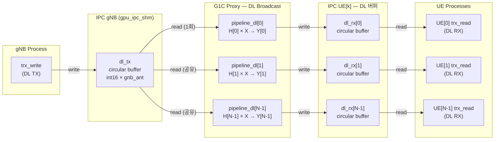

### 전체 시스템 구조 — UL 경로

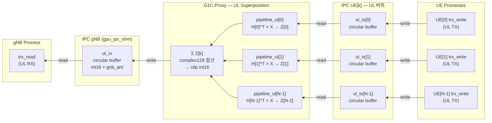

### IPC V6 Multi-Instance 전략

기존 IPC V6를 재사용하되, UE별로 독립 SHM 인스턴스를 생성:

| 인스턴스 | SHM 경로 | 사용 버퍼 | 미사용 (메모리 낭비) |
|----------|----------|-----------|---------------------|
| gNB | `/tmp/oai_gpu_ipc/gpu_ipc_shm` | dl_tx, ul_rx | dl_rx, ul_tx |
| UE[k] | `/tmp/oai_gpu_ipc/gpu_ipc_shm_ue{k}` | dl_rx, ul_tx | dl_tx, ul_rx |

### GPU Circular Buffer 구조 (IPC V6)

IPC V6의 각 버퍼는 **GPU circular buffer**로, timestamp 기반 인덱싱을 사용한다.

```
┌─────────────────────────────────────────────────────────────────────┐
│  IPC V6 인스턴스 1개 = GPU 버퍼 4개 + SHM 메타데이터 (4KB)         │
│                                                                     │
│  SHM (4KB): CUDA IPC handles × 4 + head/tail timestamps            │
│             + magic(0x47505537) + version + nbAnt per buffer        │
│                                                                     │
│  GPU Circular Buffer (per buffer):                                  │
│  ┌──────────────────────────────────────────────────────────────┐   │
│  │  cir_size = cir_time × nbAnt  (예: 460800 × 2 = 921600)    │   │
│  │                                                              │   │
│  │  int16 samples, interleaved: [s*nbAnt + a]                  │   │
│  │                                                              │   │
│  │  ◄──── cir_time (460800 samples = ~15ms @30.72MHz) ────►   │   │
│  │  ┌────┬────┬────┬────┬ ─ ─ ─ ─ ─ ─ ─ ─ ─ ┬────┬────┐      │   │
│  │  │s0a0│s0a1│s1a0│s1a1│                     │sNa0│sNa1│      │   │
│  │  └────┴────┴────┴────┴ ─ ─ ─ ─ ─ ─ ─ ─ ─ ┴────┴────┘      │   │
│  │   ▲                                                          │   │
│  │   └── offset = (timestamp % cir_time) × nbAnt               │   │
│  └──────────────────────────────────────────────────────────────┘   │
└─────────────────────────────────────────────────────────────────────┘

  s = IQ sample index (I,Q 각각 int16)
  a = antenna index (0 ~ nbAnt-1)
  nbAnt = gNB 안테나 수 (dl_tx, ul_rx) 또는 UE 안테나 수 (dl_rx, ul_tx)
```

### Multi-UE IPC 버퍼 전체 배치

G1C에서는 1개 gNB IPC + N개 UE IPC = **총 4+4N 개의 GPU circular buffer**가 할당된다.

```
GPU Memory Layout (2 UE, 2×2 MIMO 예시)
═══════════════════════════════════════════════════════════════════════

 IPC gNB (gpu_ipc_shm)                    ← Proxy가 SERVER로 생성
 ┌───────────────────────────────────┐
 │ dl_tx  [cir=921600, 2ant] ◄── gNB writes (DL 송신)
 │ dl_rx  [cir=921600, 2ant]    (미사용 — 낭비)
 │ ul_tx  [cir=921600, 2ant]    (미사용 — 낭비)
 │ ul_rx  [cir=921600, 2ant] ──► gNB reads  (UL 수신)
 └───────────────────────────────────┘

 IPC UE[0] (gpu_ipc_shm_ue0)              ← Proxy가 SERVER로 생성
 ┌───────────────────────────────────┐
 │ dl_tx  [cir=921600, 2ant]    (미사용 — 낭비)
 │ dl_rx  [cir=921600, 2ant] ──► UE[0] reads  (DL 수신)
 │ ul_tx  [cir=921600, 2ant] ◄── UE[0] writes (UL 송신)
 │ ul_rx  [cir=921600, 2ant]    (미사용 — 낭비)
 └───────────────────────────────────┘

 IPC UE[1] (gpu_ipc_shm_ue1)              ← Proxy가 SERVER로 생성
 ┌───────────────────────────────────┐
 │ dl_tx  [cir=921600, 2ant]    (미사용 — 낭비)
 │ dl_rx  [cir=921600, 2ant] ──► UE[1] reads  (DL 수신)
 │ ul_tx  [cir=921600, 2ant] ◄── UE[1] writes (UL 송신)
 │ ul_rx  [cir=921600, 2ant]    (미사용 — 낭비)
 └───────────────────────────────────┘

 총 GPU 메모리: 12 buffers × 921600 × 2B = ~21MB (이 중 6개만 사용, 6개 낭비)
```

### IQ 데이터 흐름 상세 (DL, MIMO 2×2)

gNB에서 UE까지 DL IQ 샘플이 이동하는 전체 경로:

```
OAI gNB (nr-softmodem)
  │
  │  trx_write(): DL IQ를 interleave하여 gpu_dl_tx에 기록
  │  format: int16[s*nbAnt + a]  (s=time sample, a=antenna)
  │  예: [s0_ant0, s0_ant1, s1_ant0, s1_ant1, ...]  (2-ant interleave)
  │
  ▼
┌─────────────────────────────────────────────────────────────────────┐
│  gpu_dl_tx (gNB IPC circular buffer)                                │
│  int16 × 30720×2 samples/slot = 122880 int16 per slot              │
│  timestamp head가 증가하면 Proxy가 감지                              │
└───────────────────────────┬─────────────────────────────────────────┘
                            │  Proxy: timestamp polling → new slot 감지
                            ▼
┌─────────────────────────────────────────────────────────────────────┐
│  Proxy _ipc_dl_broadcast()                                          │
│                                                                     │
│  1. gpu_circ_read: dl_tx → raw int16[30720×2]  (1회, gNB 공유)     │
│                                                                     │
│  ┌─ for k in range(N): ──────────────────────────────────────────┐  │
│  │                                                                │  │
│  │  2. de-interleave: int16[30720×2] → (30720, N_t, 2)          │  │
│  │     → complex128: (30720, N_t)                                │  │
│  │                                                                │  │
│  │  3. OFDM extract: GPU index array로 14심볼 추출               │  │
│  │     → (14, N_t, 2048)                                         │  │
│  │                                                                │  │
│  │  4. FFT: (14, N_t, 2048) → Xf (주파수 도메인)                │  │
│  │                                                                │  │
│  │  5. Channel: Yf = Σ_t H_k[s,r,t,f] × Xf[s,t,f]             │  │
│  │     H_k: (14, N_r, N_t, 2048) from RingBuffer[k]             │  │
│  │     Yf:  (14, N_r, 2048)              ← CUDA Graph replay     │  │
│  │                                                                │  │
│  │  6. IFFT: Yf → time domain (14, N_r, 2048)                   │  │
│  │                                                                │  │
│  │  7. OFDM reconstruct: GPU index scatter                       │  │
│  │     → (30720, N_r) → PL → AWGN                               │  │
│  │                                                                │  │
│  │  8. re-interleave + clip: complex128 → int16[30720×2]         │  │
│  │                                                                │  │
│  │  9. gpu_circ_write: → gpu_dl_rx[k] (UE[k] IPC)              │  │
│  └────────────────────────────────────────────────────────────────┘  │
└─────────────────────────────────────────────────────────────────────┘
                            │
          ┌─────────────────┼─────────────────┐
          ▼                 ▼                 ▼
┌──────────────┐  ┌──────────────┐  ┌──────────────┐
│ gpu_dl_rx[0] │  │ gpu_dl_rx[1] │  │gpu_dl_rx[N-1]│
│ UE[0] IPC    │  │ UE[1] IPC    │  │ UE[N-1] IPC  │
└──────┬───────┘  └──────┬───────┘  └──────┬───────┘
       ▼                 ▼                 ▼
  OAI UE[0]         OAI UE[1]        OAI UE[N-1]
  trx_read()        trx_read()        trx_read()
  de-interleave     de-interleave     de-interleave
```

### IQ 데이터 흐름 상세 (UL Channel Mode, MIMO 2×2)

N개 UE에서 gNB까지 UL IQ 샘플이 합산되어 전달되는 경로:

```
  OAI UE[0]         OAI UE[1]        OAI UE[N-1]
  trx_write()       trx_write()       trx_write()
  interleave        interleave        interleave
       │                 │                 │
       ▼                 ▼                 ▼
┌──────────────┐  ┌──────────────┐  ┌──────────────┐
│ gpu_ul_tx[0] │  │ gpu_ul_tx[1] │  │gpu_ul_tx[N-1]│
│ UE[0] IPC    │  │ UE[1] IPC    │  │ UE[N-1] IPC  │
└──────┬───────┘  └──────┬───────┘  └──────┬───────┘
       │                 │                 │
       └─────────────────┼─────────────────┘
                         │  Proxy: slowest UE criterion
                         ▼  (모든 UE timestamp ≥ target 대기)
┌─────────────────────────────────────────────────────────────────────┐
│  Proxy _ipc_ul_combine() → _ipc_ul_superposition_slot()            │
│                                                                     │
│  accum = zeros(complex128, 30720 × N_r)   ← gNB 안테나 기준        │
│                                                                     │
│  ┌─ for k in range(N): ──────────────────────────────────────────┐  │
│  │                                                                │  │
│  │  1. gpu_circ_read: ul_tx[k] → int16[30720×2]                 │  │
│  │                                                                │  │
│  │  2. de-interleave → complex128: (30720, N_t_ue)               │  │
│  │                                                                │  │
│  │  3. OFDM extract → FFT → (14, N_t_ue, 2048)                  │  │
│  │                                                                │  │
│  │  4. Channel: Zf_k = Σ_t H_k^T[s,r,t,f] × Xf[s,t,f]         │  │
│  │     H_k^T: (14, N_r_gnb, N_t_ue, 2048)    ← CUDA Graph      │  │
│  │     Zf_k:  (14, N_r_gnb, 2048)                                │  │
│  │                                                                │  │
│  │  5. IFFT → OFDM reconstruct → (30720, N_r_gnb)               │  │
│  │                                                                │  │
│  │  6. accum += pipeline_ul[k].gpu_out  (complex128 합산)        │  │
│  └────────────────────────────────────────────────────────────────┘  │
│                                                                     │
│  7. clip(accum, int16_max) → re-interleave → int16[30720×2]       │
│                                                                     │
│  8. gpu_circ_write: → gpu_ul_rx (gNB IPC)                         │
└─────────────────────────────────────────────────────────────────────┘
                            │
                            ▼
┌─────────────────────────────────────────────────────────────────────┐
│  gpu_ul_rx (gNB IPC circular buffer)                                │
│  Proxy가 timestamp 갱신 → gNB가 감지                                │
└───────────────────────────┬─────────────────────────────────────────┘
                            │
                            ▼
                      OAI gNB (nr-softmodem)
                      trx_read(): UL IQ 수신
                      de-interleave → L1 처리
```

### IQ 데이터 흐름 상세 (UL Bypass Mode)

```
  OAI UE[0]         OAI UE[1]
       │                 │
       ▼                 ▼
┌──────────────┐  ┌──────────────┐
│ gpu_ul_tx[0] │  │ gpu_ul_tx[1] │
└──────┬───────┘  └──────┬───────┘
       │                 │
       ▼                 ▼
┌─────────────────────────────────────────────────────────────────────┐
│  Proxy _ipc_ul_combine() — bypass mode                              │
│                                                                     │
│  for k in range(N):                                                 │
│    bypass_copy: gpu_ul_tx[k] ──copy──► gpu_ul_rx (gNB)             │
│                                                                     │
│  ※ 채널 미적용, 각 UE가 순차적으로 gNB ul_rx를 덮어씀               │
│  ※ 최종적으로 UE[N-1]의 데이터만 gNB에 유효                         │
└───────────────────────────┬─────────────────────────────────────────┘
                            ▼
                      gpu_ul_rx (gNB IPC)
                            │
                            ▼
                      OAI gNB trx_read()
```

### Timestamp Polling 메커니즘

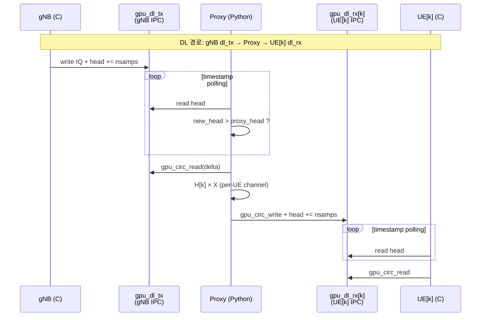

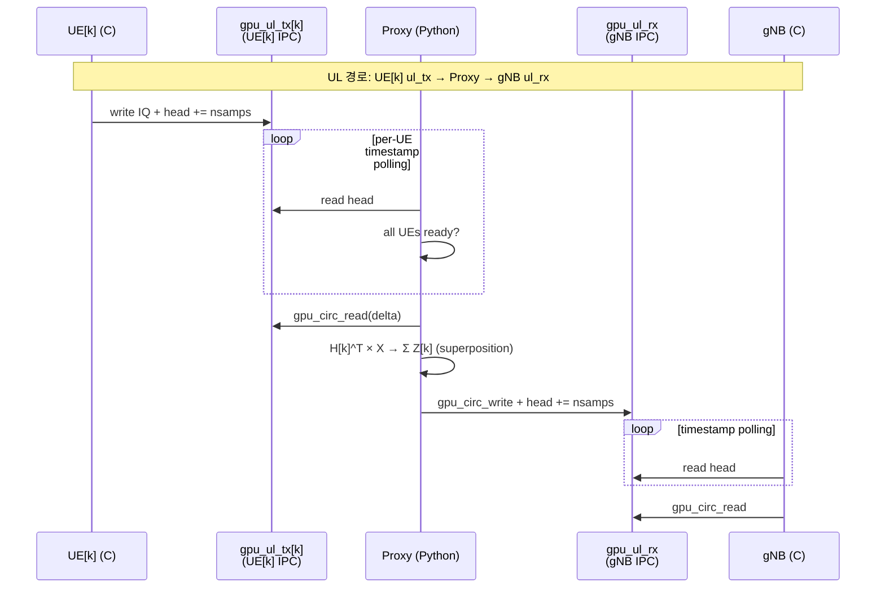

### GPU 버퍼 구조 (Per-UE 리소스 맵)

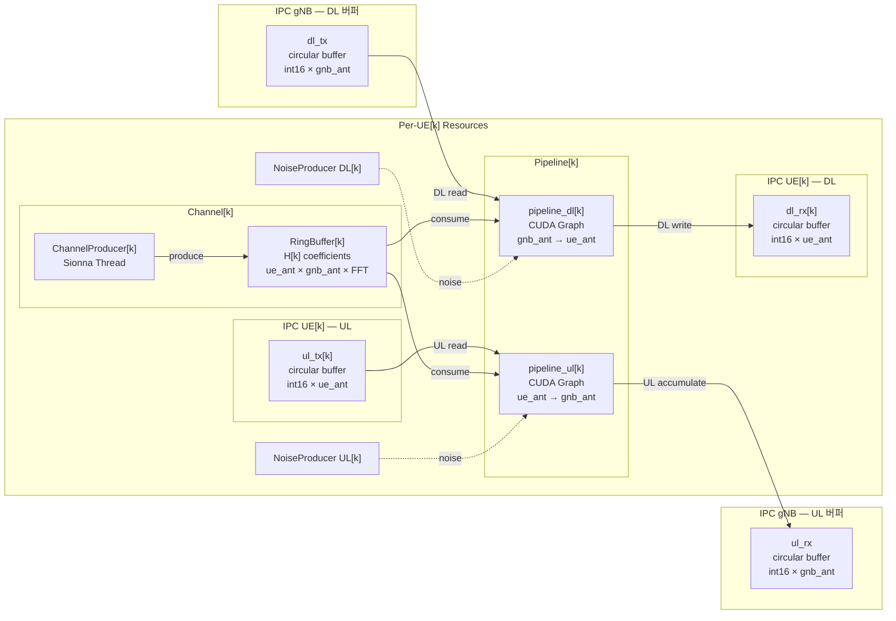

### DL Broadcast 흐름

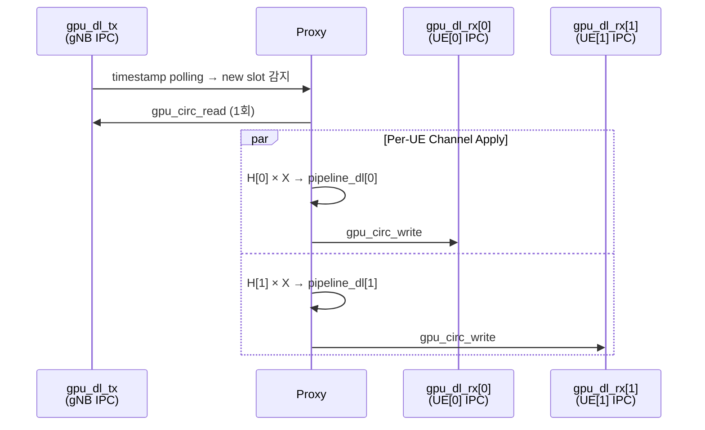

### UL Superposition 흐름 (Channel Mode)

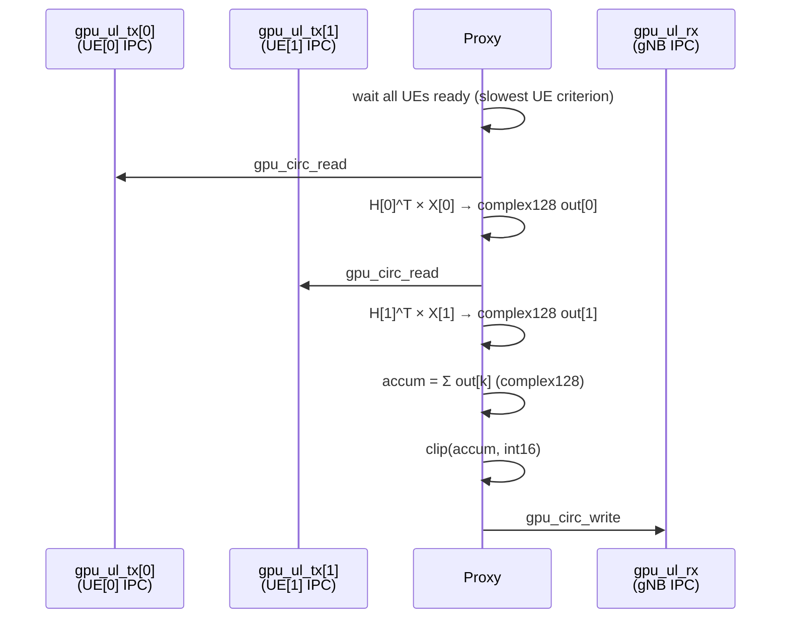

### UL Bypass 흐름

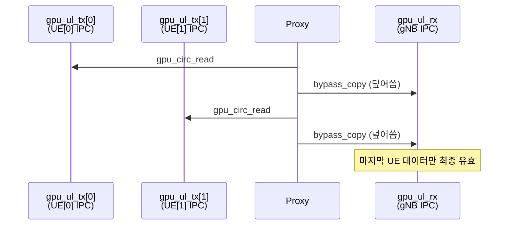

## Per-UE 독립 리소스

각 UE는 완전히 독립된 리소스를 가짐:

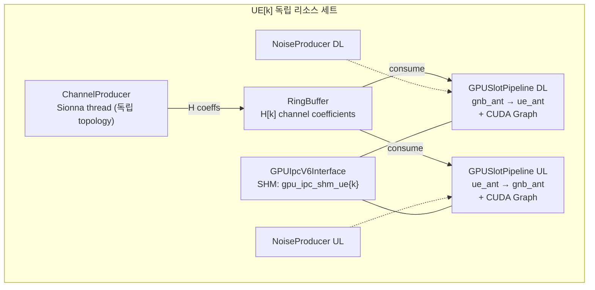

## C 코드 변경 (gpu_ipc_v6)

`gpu_ipc_v6.c`의 `gpu_ipc_v6_init()`에서 UE 역할일 때 `RFSIM_GPU_IPC_UE_IDX` 환경변수를 읽어 per-UE SHM 경로 생성:

```c
// UE role: RFSIM_GPU_IPC_UE_IDX=k → /tmp/oai_gpu_ipc/gpu_ipc_shm_ue{k}
// gNB role: 기본 경로 유지 → /tmp/oai_gpu_ipc/gpu_ipc_shm
```

`gpu_ipc_v6_ctx_t`에 `char shm_path[256]` 필드 추가.

**빌드 필요**: C 코드 변경 후 OAI 재빌드 필수.

```bash
cd ~/DevChannelProxyJIN/openairinterface5g_whan/cmake_targets
./build_oai --gNB --nrUE -w SIMU --ninja --build-lib "telnetsrv"
```

## 파일 구조

```
G1C_MultiUE_MIMO_Channel_Proxy/
├── v0.py                        # Multi-UE proxy v0 (IPC V6, G1B v8 기반)
├── v1.py                        # Multi-UE proxy v1 (IPC V7 futex + fused RawKernel)
├── launch_all.sh                # 통합 런처 (gNB + N UE + Proxy)
├── channel_coefficients_JIN.py  # Sionna 채널 계수 생성기
└── README.md                    # 이 문서
```

## 실행 방법

### 사전 조건

1. OAI 재빌드 (C 코드 변경 반영)
2. Sionna Docker 컨테이너 (`sionna-proxy`) 실행 중
3. GPU (CUDA) 사용 가능

### 검증 명령어

**Test 1: 1 UE, SISO Bypass (G1B 호환성 확인)**
```bash
sudo bash launch_all.sh -v v0 -m gpu-ipc -b -n 1
```

**Test 2: 1 UE, 2x2 MIMO Channel**
```bash
sudo bash launch_all.sh -v v0 -m gpu-ipc -ga 2 1 -ua 2 1 -n 1
```

**Test 3: 2 UEs, SISO Bypass**
```bash
sudo bash launch_all.sh -v v0 -m gpu-ipc -b -n 2
```

**Test 4: 2 UEs, 2x2 MIMO Bypass**
```bash
sudo bash launch_all.sh -v v0 -m gpu-ipc -b -ga 2 1 -ua 2 1 -n 2
```

**Test 5: 2 UEs, 2x2 MIMO Channel (DL broadcast + UL superposition)**
```bash
sudo bash launch_all.sh -v v0 -m gpu-ipc -ga 2 1 -ua 2 1 -n 2
```

**Test 6 (v1): 1 UE, 2x2 MIMO Channel with IPC V7 futex**
```bash
sudo bash launch_all.sh -v v1 -m gpu-ipc -ga 2 1 -ua 2 1 -n 1
```

**Test 7 (v1): 배치 크기 튜닝 — 채널 생성 스파이크 완화**
```bash
# -bs: 채널 생성 배치 크기 (기본 4200 = 300 slots)
# -bl: 채널 링버퍼 길이 (기본 42000 = 3000 slots)
sudo bash launch_all.sh -v v1 -m gpu-ipc -ga 2 1 -ua 2 1 -n 1 -bs 140
```

### 확인 사항

- `proxy.log`: 모든 UE IPC 초기화 성공 메시지 확인
- `gnb.log`: gNB DL/UL 정상 동작 확인
- `ue{k}.log`: 각 UE의 PSS/SSS 검출 및 동기화 확인
- `nrMAC_stats.log`: CQI/MCS/BLER 확인 (2 UE 모두 스케줄링)

## 실험 결과 (2026-03-12, H100 NVL)

### Test 결과 요약

| Test | 구성 | 결과 | DL Rate | Proxy/slot | UE 상태 |
|:----:|------|:----:|--------:|-----------:|---------|
| 1 | 1UE SISO bypass | **PASS** | 1567.7/s | 0.15 ms | in-sync |
| 2 | 1UE 2x2 channel | **PASS** | 323.9/s | ~1.0 ms | in-sync, RI=2 |
| 3 | 2UE SISO bypass | **PASS** | 1253.9/s | 0.27 ms | UE0 out-of-sync*, UE1 in-sync |
| 4 | 2UE 2x2 bypass | **PASS** | 1030.1/s | 0.24 ms | UE0 in-sync, UE1 연결됨 |
| 5 | 2UE 2x2 channel | **PASS** | 187.2/s | ~1.8 ms | **2UE 모두 in-sync, RI=2** |

\* Test 3~4 UE0 out-of-sync은 bypass UL 설계 특성 (마지막 UE 데이터만 gNB에 유효)

### 성능 상세

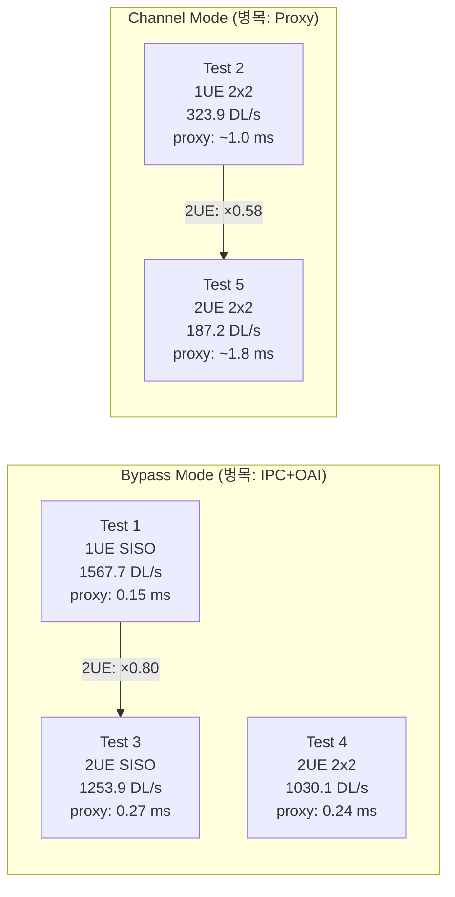

### Per-Slot 타이밍 분석

| Test | Proxy DL (ms) | Proxy UL (ms) | IPC+OAI (ms) | Wall (ms) | 병목 |
|:----:|:-------------:|:-------------:|:------------:|:---------:|:----:|
| 1 | 0.15 | 0.00 | 0.37 | 0.53 | IPC+OAI |
| 2 | ~0.5 | ~0.5 | 0.02 | ~1.0 | Proxy |
| 3 | 0.27 | 0.00 | 0.35 | 0.62 | IPC+OAI |
| 4 | 0.24 | 0.00 | 0.54 | 0.79 | IPC+OAI |
| 5 | ~0.7 | ~1.1 | 0.02 | ~1.8 | Proxy |

### 병목 구조 분석

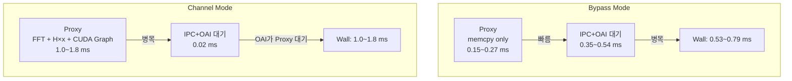

### Multi-UE 스케일링

| 비교 | 1UE | 2UE | Proxy 비율 | Rate 비율 |
|------|:---:|:---:|:----------:|:---------:|
| SISO bypass | 0.15 ms | 0.27 ms | **×1.8** | ×0.80 |
| 2x2 channel | ~1.0 ms | ~1.8 ms | **×1.8** | ×0.58 |

Proxy 처리 시간은 UE 수에 ~1.8배 비례 (이론 2.0배보다 낮음 — gNB dl_tx 읽기 등 공유 연산).

### 실시간 가능성 (5G NR SCS 30kHz 기준: 1 slot = 0.5ms)

| Test | Proxy/slot | 0.5ms 대비 | 실시간 |
|:----:|:----------:|:----------:|:------:|
| 1 (1UE SISO bypass) | 0.15 ms | 30% | **가능** |
| 3 (2UE SISO bypass) | 0.27 ms | 54% | **가능** |
| 4 (2UE 2x2 bypass) | 0.24 ms | 48% | **가능** |
| 2 (1UE 2x2 channel) | ~1.0 ms | 200% | 2× 초과 |
| 5 (2UE 2x2 channel) | ~1.8 ms | 360% | 3.6× 초과 |

### Test 5 상세 (핵심 — 2UE MIMO Channel)

| 항목 | UE0 (62f2) | UE1 (5a58) |
|------|:----------:|:----------:|
| 동기화 | **in-sync** | **in-sync** |
| CQI | 15 | 15 |
| RI | **2** | **2** |
| PMI | (0,1) | (0,0) |
| DL BLER | 5.3% | 9.2% |
| UL BLER | 5.6% | 1.3% |
| UL SNR | 20.0 dB | 61.5 dB |

PMI가 UE별로 다른 것은 독립 채널 적용이 정상 동작하는 증거. RI=2는 MIMO 경로 인식 성공.

## 실험 결과: v0 vs v1 비교 (2026-03-26, 1UE 2×2 MIMO, H100 NVL)

### 처리량 (Throughput)

| 항목 | v0 (IPC V6) | v1 (IPC V7) | 변화 |
|------|:-----------:|:-----------:|:----:|
| DL rate | 416 DL/s | **784 DL/s** | **×1.88** |
| Proxy per-slot 평균 | 1.71 ms | 1.17 ms | -32% |
| IPC+OAI 대기 | 0.02~1.29 ms | 0.00~0.04 ms | **≈0** |

v1의 throughput 2배 향상은 주로 OAI C측의 `usleep(1000)` 폴링이 `futex_wait`으로 교체되어 **IPC 대기 시간이 사실상 제거**된 결과이다.

### CQI / MCS / BLER

| 항목 | v0 | v1 | 비고 |
|------|:--:|:--:|------|
| CQI | 0 | **15** | v0는 보고 안 됨, v1은 최대값 |
| RI | 2 | 2 | 동일 (MIMO 경로 인식) |
| MCS | 0 | 0 | DL BLER >10%로 MAC이 MCS 상승 억제 |
| DL BLER | 11.8% | 21.2% | 채널 품질 개선 필요 |
| UL BLER | 12.3% | 4.6% | **v1에서 개선** |
| UL SNR | 63.5 dB | 63.0 dB | 동일 수준 |

### DL Pipeline 프로파일 (안정화 후, CPU 타이머)

| 단계 | v0 avg | v1 avg | v0 p99 | v1 p99 |
|------|:------:|:------:|:------:|:------:|
| GPU_COPY_IN | 0.07 ms | 0.33 ms | 0.35 ms | 0.36 ms |
| CH_COPY | 0.05 ms | 0.04 ms | 0.23 ms | 0.11 ms |
| NOISE_PREP | 0.01 ms | 0.02 ms | 0.04 ms | 0.08 ms |
| GPU_COMPUTE | 0.07 ms | 0.08 ms | 0.11 ms | 0.12 ms |
| GPU_COPY_OUT | 0.03 ms | 0.04 ms | 0.06 ms | 0.34 ms |
| **TOTAL** | **0.24 ms** | **0.51 ms** | **0.57 ms** | **0.63 ms** |

DL per-slot pipeline 자체는 v1이 약간 느려 보이나, 이는 v1에서 `futex_wake` 호출(timestamp 갱신 + syscall)이 포함된 결과이며, 시스템 전체로는 IPC 대기 제거로 **throughput 2배 향상**.

### 스파이크 분석

| 항목 | v0 | v1 |
|------|:--:|:--:|
| UL >60ms 스파이크 | 184/1122 (16.4%) | 214/5906 (3.6%) |
| 스파이크 원인 | `usleep` 폴링 누적 + 채널 버퍼 고갈 | **채널 버퍼 고갈만** (주기 ~4초) |
| 스파이크 크기 | 최대 ~98ms | 최대 ~86ms |
| 스파이크 패턴 | 불규칙 | **규칙적** (~320 E2E frame 간격) |

v1에서 스파이크 빈도가 대폭 감소(16.4% → 3.6%)했으며, 원인이 단일(채널 버퍼 고갈)로 수렴. 이는 `buffer-symbol-size` 튜닝 또는 채널 재활용으로 추가 개선 가능.

### 1회성 스파이크 (v1 초기화)

| 스파이크 | 시점 | 크기 | 원인 |
|----------|------|------|------|
| GPU_COPY_IN | slot ~1 | ~68ms | GPU SHM 첫 접근 page fault |
| GPU_COMPUTE | slot ~350 | ~65ms | TF XLA ↔ CuPy GPU 컨텍스트 경합 |

### 결론

v1(IPC V7)은 **futex 기반 알림으로 IPC 대기를 제거**하여 throughput을 2배로 향상시켰다. 남은 과제는:
1. **채널 버퍼 스파이크 완화**: `--buffer-symbol-size` 축소 (300→10 slots) 또는 채널 재활용
2. **MCS 상승**: DL BLER 개선을 통한 MCS adaptation 유도
3. **Multi-UE 스케일링**: GIL 경합 해소를 위한 Producer multiprocessing 분리

## v1 스파이크 개선 실험 계획

### 스파이크 원인 요약

v1의 주기적 UL 스파이크(~70-85ms, ~4초 간격)는 **ChannelProducer(Sionna)의 생산 속도 < Consumer(Proxy)의 소비 속도**에 기인한다.

```
Producer:  ~11,570 sym/s  (4200 sym/batch, ~360ms/batch)
Consumer:  ~21,924 sym/s  (14 sym/slot × DL+UL × 783 slot/s)
Buffer:    42,000 sym     (~4초 분량 → 4초마다 고갈 → 블로킹 스파이크)
```

두 가지 독립 조절 축:
- **`--buffer-symbol-size` (배치 크기)**: 스파이크 **크기** 결정 (작을수록 작은 스파이크)
- **`--buffer-len` (버퍼 길이)**: 스파이크 **빈도** 결정 (클수록 덜 자주)

### 권장 실험 순서

#### 1단계: 배치 크기 튜닝 (코드 변경 없음, 인자만 변경)

배치 크기를 줄이면 1 batch 생성 시간이 짧아져 스파이크 크기가 줄어든다. XLA overhead가 ~1ms로 작으므로 효율 손실도 미미.

```bash
# 기준 (현재 기본값)
sudo bash launch_all.sh -v v1 -m gpu-ipc -ga 2 1 -ua 2 1 -n 1

# A: 3 slots/batch (최소 단위)
sudo bash launch_all.sh -v v1 -m gpu-ipc -ga 2 1 -ua 2 1 -n 1 -bs 42

# B: 10 slots/batch (권장 시작점)
sudo bash launch_all.sh -v v1 -m gpu-ipc -ga 2 1 -ua 2 1 -n 1 -bs 140

# C: 20 slots/batch
sudo bash launch_all.sh -v v1 -m gpu-ipc -ga 2 1 -ua 2 1 -n 1 -bs 280

# D: 40 slots/batch
sudo bash launch_all.sh -v v1 -m gpu-ipc -ga 2 1 -ua 2 1 -n 1 -bs 560

# E: 100 slots/batch
sudo bash launch_all.sh -v v1 -m gpu-ipc -ga 2 1 -ua 2 1 -n 1 -bs 1400
```

| 테스트 | -bs | slots/batch | 예상 batch 시간 | 예상 스파이크 최대 | 효율 |
|:------:|----:|:-----------:|:---------------:|:-----------------:|:----:|
| 기준 | 4200 | 300 | ~360ms | ~70-85ms | 99.7% |
| A | 42 | 3 | ~4.6ms | ~4-5ms | ~78% |
| B | 140 | 10 | ~13ms | ~10-13ms | ~92% |
| C | 280 | 20 | ~25ms | ~15-25ms | ~96% |
| D | 560 | 40 | ~49ms | ~30-50ms | ~97% |
| E | 1400 | 100 | ~120ms | ~50-70ms | ~99% |

**비교 지표**: 각 테스트 후 `proxy.log`에서
- `DL rate` (throughput 변화 확인)
- `E2E frame` 중 UL >20ms 빈도 (스파이크 빈도)
- UL 스파이크 최대값 (스파이크 크기)

**목표**: 스파이크가 ~10-15ms 이하로 줄어들면 실질적으로 무시 가능한 수준.

#### 2단계: 최적 배치 크기로 장시간 실험

1단계에서 선정한 최적 `-bs` 값으로 장시간(수 분 이상) 실행하여 안정성 확인.

```bash
sudo bash launch_all.sh -v v1 -m gpu-ipc -ga 2 1 -ua 2 1 -n 1 -bs <최적값>
```

#### 3단계: 채널 재활용 (reuse) 구현 — 스파이크 근본 제거

동일 채널 계수를 N slot 동안 재사용하여 소비 속도를 줄인다. `reuse=2`만으로 Producer가 Consumer를 추월하여 **버퍼 고갈 자체가 사라진다.**

```
reuse=2: 소비 21,924 → 10,962 sym/s < 생산 11,570 → 고갈 없음
```

slow-fading 채널에서 연속 2 slot(~67μs)은 채널 변화가 거의 없으므로 물리적으로 정당화 가능. 코드 수정 필요.

#### 4단계: 1회성 스파이크 제거 — GPU Warmup 강화

메인 루프 진입 전 SHM GPU 메모리에 더미 read/write를 수행하여 page fault 선제 해소.

#### 5단계: Multi-UE 스케일 테스트

```bash
sudo bash launch_all.sh -v v1 -m gpu-ipc -ga 2 1 -ua 2 1 -n 2 -bs <최적값>
sudo bash launch_all.sh -v v1 -m gpu-ipc -ga 2 1 -ua 2 1 -n 4 -bs <최적값>
```

UE 증가 시 GIL 경합으로 성능 저하가 관측되면 6단계 진행.

#### 6단계: Producer multiprocessing 분리 (필요 시)

ChannelProducer를 `threading.Thread` → `multiprocessing.Process`로 변경하여 GIL 경합 제거.
- GIL 분리 → Producer/Consumer 양쪽 GPU 연산 독립 실행
- 채널 데이터는 shared memory로 전달
- Multi-UE에서 Producer 간 경합도 해소

### VRAM 예산 (H100 NVL 94GB 기준)

| UE 수 | buffer-len=42000 | buffer-len=4200 |
|:------:|:----------------:|:---------------:|
| 1 | 9.6 GB (✓) | 5.0 GB (✓) |
| 2 | 16.7 GB (✓) | 7.5 GB (✓) |
| 4 | 31.0 GB (✓) | 12.6 GB (✓) |
| 8 | 59.5 GB (✓) | 22.7 GB (✓) |
| 16 | 116.4 GB (✗) | 42.8 GB (✓) |

Multi-UE 확장 시 `buffer-len` 축소를 병행하면 16 UE까지 VRAM 내에서 수용 가능.

## G1B v8 대비 변경사항

| 항목 | G1B v8 | G1C v0 |
|------|--------|--------|
| UE 수 | 1 | N (--num-ues) |
| IPC 인스턴스 | 1 | 1 + N |
| SHM 파일 | gpu_ipc_shm | gpu_ipc_shm + gpu_ipc_shm_ue{k} |
| DL 처리 | 1:1 | 1:N broadcast |
| UL 처리 | 1:1 | N:1 superposition/bypass |
| 파이프라인 | DL 1개 + UL 1개 | DL N개 + UL N개 |
| 채널 생성 | 1 producer | N producers |
| GPU 메모리 | 4 buffers | 4 + 4N buffers |
| C 코드 | gpu_ipc_v6 | + RFSIM_GPU_IPC_UE_IDX 지원 |

## 알려진 제한사항 (v0)

- **GPU 메모리 낭비**: 각 IPC 인스턴스가 4 버퍼를 할당하지만 2개만 사용 (v0 단순화)
- **UL 노이즈 위치**: 수신기(gNB) 노이즈가 아닌 per-UE 노이즈 (물리적으로 부정확하지만 v0 허용)
- **채널 독립성**: 모든 UE가 동일한 PDP 기반 (위치/속도만 랜덤)
- **UL 타이밍**: slowest UE 기준으로 처리 — 느린 UE가 전체 UL 처리 지연 가능
- **Socket 모드**: Multi-UE 미지원 (GPU IPC 모드 전용)
- **Channel 모드 실시간**: 현재 v0는 최적화 미적용 상태로 실시간 기준(0.5ms/slot) 2~3.6배 초과
- **ChannelProducer 스파이크**: 2+ UE에서 TF GPU 경합으로 간헐적 처리 지연 (최대 ~25ms/slot)
