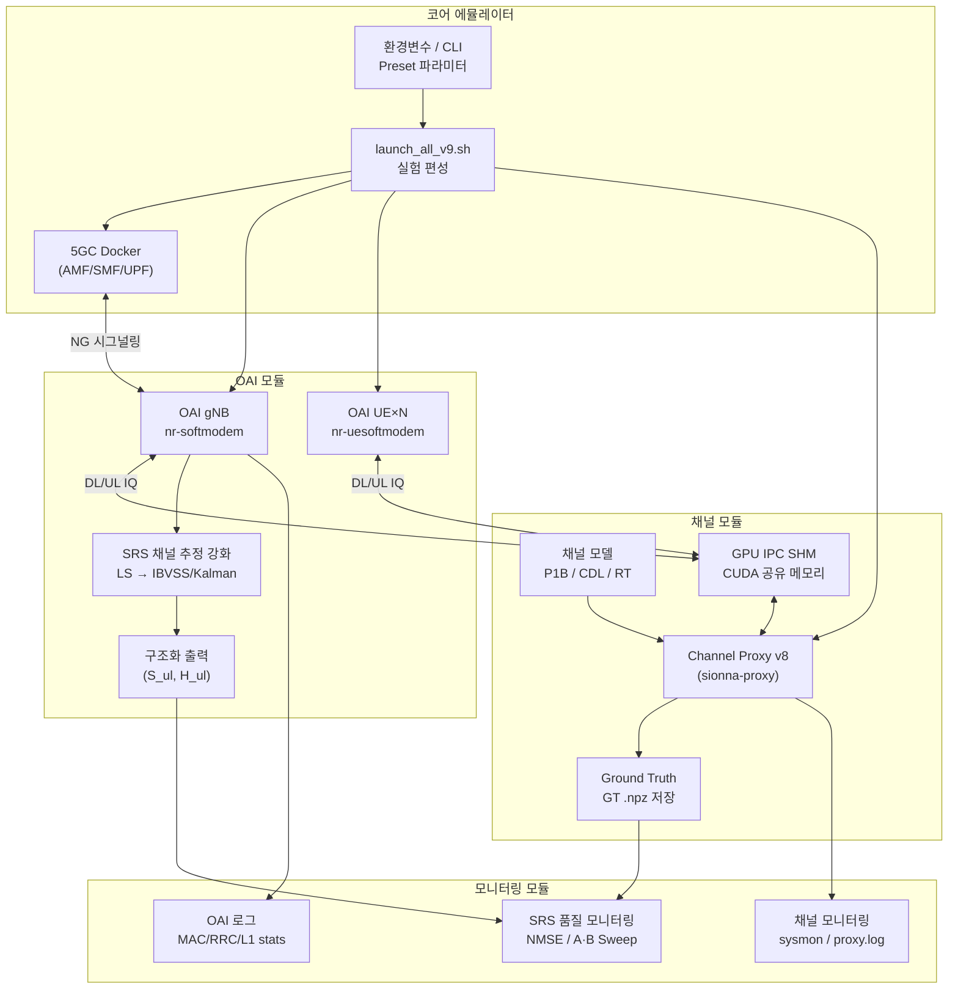
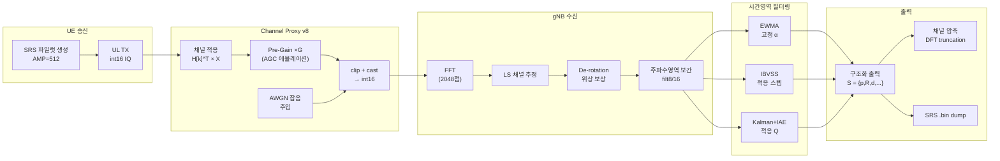
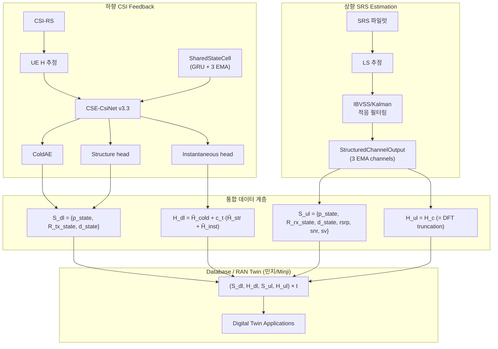

# OAI-Channel 통합 시뮬레이터 SRS 채널 추정 시스템 — ALDLC 요구사항

| 항목 | 값 |
|------|----|
| **프로젝트명** | OAI-Channel 통합 시뮬레이터 (SRS Channel Estimation & Digital Twin) |
| **버전** | v1.1 |
| **일자** | 2026-05-27 |
| **작성** | Lu |

---

## 1. 프로젝트 개요

### 1.1 서비스 비전

자체 제작 무선 채널 환경 기반으로 동작을 제어/모니터링 가능한 **표준 호환 OAI-Channel 통합 시뮬레이터** 를 구축하고, 이를 기반으로 고정밀 SRS 상향 채널 추정 및 Digital Twin 데이터를 생산한다.

### 1.2 핵심 가치 제안

1. **5G 표준 호환 실시간 구동**：OAI 오픈소스 프로토콜 스택 (gNB + UE) 기반 NR SA full-stack 동작
2. **실제 환경 기반 무선 채널로 원하는 지역을 모사하는 실험 가능**：Sionna Ray-Tracing / CDL 표준 모델을 통해 원하는 지역의 채널을 모사
3. **SRS 채널 추정 강화**：OAI gNB 물리계층 내부에서 EWMA / IBVSS / Kalman 등 적응형 시간영역 필터링 알고리즘 구현
4. **Digital Twin 데이터 브릿지**：구조화 출력 `(S, H)` 를 하향 CSI Feedback 포맷과 정렬하여 RAN Twin 및 AI 모델에 활용

### 1.3 현재의 고통

1. **OAI (C) ↔ 채널 (Python)** : 서로 다른 프로그래밍 언어별 입출력 인터페이스 통일이 어려움 → GPU IPC SHM으로 해결
2. **OAI (CPU) ↔ 채널 (GPU)** : Inter-chip 정보 전달 필요로 OAI 동작 sync 불일치 문제 발생 → futex 기반 IPC V7/V8로 해결
3. **int16 양자화 정밀도 병목** : rfsim에 RF AGC가 없어서 SRS 신호 RMS≈200, 유효 비트 7.6개 → NMSE 천장 ~-22 dB → UL Pre-Gain으로 완화
4. **채널 추정 하한** : Legacy filt8/16 단일 프레임 추정 NMSE ~-7 dB → 시간영역 다중 프레임 필터링 (IBVSS/Kalman)으로 -11 dB까지 개선
5. **구조화 출력과 DL 정렬** : UL SRS 출력을 준수 DL CSI Feedback 포맷과 consistent하게 유지 필요 → 진행 중

---

## 2. 서비스 구성

### 2.1 동작 구성 요소

1. **OAI 모듈** : 5G 표준 호환 full-stack 동작 시뮬레이터 (오픈 소스) — 단일 셀 (single cell)
   - gNB (nr-softmodem) : 기지국 측, Band 78, 106 PRB, 2T2R / 4T4R
   - UE (nr-uesoftmodem) : 단말 측, 다중 UE 동시 접속 지원
   - SRS 채널 추정 강화 : LS → 주파수영역 보간 → 시간영역 적응 필터링 (EWMA/IBVSS/Kalman)
   - 구조화 채널 출력 : `StructuredChannelOutput` → `(S_ul, H_ul)`

2. **채널 모듈** : PADP Interpolation, GPU 메모리 버퍼, 더미 채널 데이터 생성 및 OAI IQ 데이터에 채널 적용
   - Channel Proxy v8 (Python/CuPy/TF, Docker 컨테이너 `sionna-proxy`)
   - OAI-채널 간 입출력 버퍼 (CUDA IPC) 포함 — OAI-채널 간 GPU 입출력 버퍼 계약 포함
   - 채널 모델 입력 : P1B Ray-Tracing / CDL-A~E / Sionna RT 시나리오
   - DL Broadcast + UL Superposition + AWGN 잡음 주입
   - Ground Truth (GT) 비동기 저장

3. **코어 에뮬레이터** : Pre-defined Preset API, RRC 셋팅 파라미터 입력 제어
   - 5GC Docker Compose (AMF/SMF/UPF)
   - 환경변수 및 CLI 파라미터를 통한 RRC/SRS 설정 (Preset)
   - 실험 편성 : `launch_all_v9.sh` 통합 관리 (gNB + UE + Proxy + 5GC)

### 2.2 시각화 구성 요소

1. **모니터링 모듈**
   1. OAI 결과 모니터링 : `nrMAC_stats.log` (CQI/MCS/BLER), `nrRRC_stats.log`, `nrL1_stats.log`
   2. 채널 동작 모니터링 : `sysmon.csv` (CPU/RAM/GPU 1초 간격), Proxy 프레임 통계, `proxy.log`
   3. SRS 추정 품질 모니터링 : NMSE per-frame 추적, GT-SRS 정렬 상태
   4. Attach 상태 진단 : `attach_diag_v9.log`, `attach_result_v9.txt`

### 2.3 전체 구성 요소 요약 다이어그램



---

## 3. 용어 정의

| 용어 | 정식 명칭 | 설명 |
|------|----------|------|
| SRS | Sounding Reference Signal | 5G NR 상향 탐침 참조 신호, 채널 추정에 사용 |
| LS | Least Squares | 최소제곱 채널 추정 (기준 방법) |
| MMSE | Minimum Mean Square Error | 최소평균제곱오차 채널 추정 |
| EWMA | Exponentially Weighted Moving Average | 지수가중이동평균 시간영역 필터링 |
| IBVSS | Innovation-Based Variable Step-Size | 혁신 기반 가변 스텝 사이즈 적응 필터링 |
| Kalman | Scalar Kalman Filter + IAE | 스칼라 칼만 필터 + 혁신 적응 추정 |
| NMSE | Normalized Mean Square Error | 정규화 평균제곱오차 (채널 추정 품질 지표) |
| PDP | Power Delay Profile | 전력지연분포 |
| GT | Ground Truth | Sionna 채널 모델 출력의 참값 채널 행렬 |
| AGC | Automatic Gain Control | 자동이득제어 |
| IPC | Inter-Process Communication | GPU 공유 메모리 프로세스 간 통신 |
| CDL | Clustered Delay Line | 3GPP 38.901 표준 채널 모델 |
| P1B | Phase 1B Ray-Tracing | Sionna 광선 추적 채널 데이터 |

---

## 4. 핵심 기능 요구 사항 (Functional Requirement)

### 4.1 코어 에뮬레이터 입출력 설정

#### 4.1.1 목적

연구원이 원하는 코어 네트워크 파라미터 및 채널/SRS 설정으로 실험을 수행할 수 있도록, 통합 실험 편성 인터페이스를 제공한다.

#### 4.1.2 기능 요구사항

1. 환경변수 및 CLI 파라미터를 통한 Preset 입력 (`SRS_ESTIMATOR`, `SRS_2D_METHOD`, `UL_PRE_GAIN`, `CHANNEL_SEED` 등)
2. 기준 Preset 선택 : 알고리즘 모드 (`legacy`/`ewma`/`ibvss`/`kalman`), 채널 모델 (P1B/CDL), SNR, 안테나 구성 등
3. Preset 검증 : 파라미터 유효성 검사 (양수, 범위 체크, 상호 배타 옵션 검증 등)
4. 검증된 Preset을 OAI gNB/UE 및 Channel Proxy에 전달 :
   ```
   환경변수 (UL_PRE_GAIN, SRS_ESTIMATOR, SRS_2D_METHOD, ...)
     → run_q4_snr_sweep_v9.sh
       → launch_all_v9.sh (-ulg, -snr, -ga, -ua, ...)
         → v8.py (--ul-pre-gain, --snr-dB, ...)
         → OAI gNB/UE (환경변수 → RRC/PHY 설정)
   ```
5. 5GC Docker Compose (AMF/SMF/UPF) 자동 헬스체크 및 재시작
6. 실험별 타임스탬프 로그 디렉토리 자동 생성 (`logs/<timestamp>_<tag>/`)

---

### 4.2 OAI 모듈의 동작 규칙 설정

#### 4.2.1 목적

OAI 기지국/단말 모듈이 코어 에뮬레이터의 Preset 입력을 통해 동작하고, 채널 모듈과의 연동을 통한 통합 동작을 수행한다.

#### 4.2.2 기능 요구사항

1. 코어 에뮬레이터의 Preset을 입력으로 받아 RRC/PHY 설정값으로 사용
   - `SRS_ESTIMATOR` : 추정기 유형 선택 (`legacy` / `mmse2d`)
   - `SRS_2D_METHOD` : 시간영역 알고리즘 선택 (`ewma` / `ibvss` / `kalman`)
   - `SRS_PERIOD_SLOTS` : SRS 주기 설정 (기본 10)
2. OAI 에뮬레이터 모드 (rfsimulator) 동작 중 채널 적용에 대해 OAI 외부의 채널 모듈 적용
   - `RFSIM_GPU_IPC_V8=1` : GPU IPC 모드 활성화
   - Proxy가 IPC SERVER로 SHM 생성; gNB/UE가 CLIENT로 연결
   - 각 UE 인스턴스 독립 SHM 사용 (`gpu_ipc_shm_ue0`, `gpu_ipc_shm_ue1`, ...)
3. AGC 제어
   - `NR_DIGITAL_AGC_ENABLED=0` : OAI 디지털 AGC 비활성화 (권장)
   - Proxy 측 UL Pre-Gain (`--ul-pre-gain G`) 사용하여 FFT 전 시간영역 증폭
4. SRS 채널 추정 강화 알고리즘 (OAI C 코드 내 구현)
   - LS 기준 채널 추정 + filt8/16 주파수영역 보간
   - 시간영역 적응 필터링 3종 (환경변수로 전환) :
     - **EWMA** : `H_smooth(t) = α·H_smooth(t-1) + (1-α)·H_new(t)`
     - **IBVSS** : innovation 기반 자동 스텝 사이즈 조정
     - **Kalman+IAE** : 스칼라 칼만 필터, Innovation Adaptive Estimation (Fix1-5 robust화)
   - De-rotation 위상 보상 (CFO, timing drift)
5. 구조화 채널 출력 (`StructuredChannelOutput`) :
   - 통합 출력 포맷 `(S_ul, H_ul)` — 하향 CSI Feedback과 데이터 계층 정렬
   - S_ul 공유 필드 : `p_inst/p_state` (PDP), `R_rx_inst/R_rx_state` (공간 공분산), `d_inst/d_state` (Doppler), `confidence`
   - S_ul UL 전용 필드 : `rsrp`, `snr_db`, `doppler_hz`, `speed_ms`, `ds_rms_s`, `sv`
   - H_ul : `h_taps` (지연영역 압축 payload) + `H_c` (전대역 DFT 복원)
6. 성능 요구 :
   - 1회 SRS 처리 지연 < 1 ms
   - SNR=20 dB에서 Kalman NMSE ≤ -11 dB, IBVSS ≤ -9.6 dB
   - CDL 8/8 조건 전체 통과 (ε=5%)

---

### 4.3 채널 모듈에서의 채널 데이터 생성/동작

#### 4.3.1 목적

원하는 채널을 생성하고 이를 통신 시뮬레이션에 적용하며, 동시에 Ground Truth 참값 데이터를 생산한다.

#### 4.3.2 기능 요구사항

1. 기지국/단말 위치를 입력받아 그에 맞는 PADP 기반 채널 생성
   - P1B Ray-Tracing 채널 데이터 (`.npz` 포맷) 지원
   - CDL-A/B/C/D/E 표준 채널 모델 (TR 38.901 기반) 지원
   - CLI 파라미터로 SNR (`-snr`), UE 수 (`-n`), 안테나 구성 (`-ga`/`-ua`) 지정
   - `CHANNEL_SEED` 환경변수로 난수 시드 고정, 실험 재현성 보장
2. 생성한 채널을 OAI 데이터의 TX IQ 심볼에 적용하여 RX IQ 심볼 생성
   - GPU IPC 공유 메모리 (`/tmp/oai_gpu_ipc`) 를 통한 IQ 데이터 교환
   - DL 경로 : gNB `dl_tx` → Proxy `H[k]×X` → UE `dl_rx` (각 UE 독립 채널)
   - UL 경로 : UE `ul_tx` → Proxy `H[k]^T×X` → gNB `ul_rx` (다중 UE 중첩)
   - IPC 동기화 : futex 기반 (V7/V8)
3. 다중 UE MIMO 지원
   - N개 UE 동시 접속 지원 (현재 검증 : 1~2 UE)
   - 2×2 및 4×4 MIMO 안테나 구성 지원
   - DL Broadcast : gNB 신호에 N개 UE 각각 독립 채널 적용
   - UL Superposition : N개 UE 신호에 각각 채널 적용 후 합산하여 gNB에 전달
4. UL Pre-Gain (AGC 에뮬레이션)
   - `--ul-pre-gain G` 파라미터 (기본 1.0)
   - int16 양자화 전 UL 신호에 고정 이득 적용, rfsim의 RF AGC 부재 보완
   - 권장 G=4 (+12 dB SQNR 개선, FFT 입력 RMS 200→800)
5. 이중 소스 데이터 생산
   - Sionna GT (`.npz`) : Ground Truth 채널 행렬, 비동기 저장 (메인 루프 비차단)
   - SRS dump (`.bin V2`) : OAI gNB 측 SRS 채널 추정 결과 (magic/RNTI 포함)
   - 시나리오 메타데이터 : UE 위치, 속도, 채널 유형 등
6. 자동화 Sweep 프레임워크
   - `run_q4_snr_sweep_v9.sh` : 다중 SNR 포인트 자동 스윕 + 후처리 파이프라인
   - 각 실험마다 manifest 파일에 완전한 실험 파라미터 기록

---

### 4.4 OAI/채널 모듈 모니터링

#### 4.4.1 목적

OAI 동작 및 채널 생성/동작을 시각화하고, SRS 채널 추정 품질을 정량적으로 검증한다.

#### 4.4.2 기능 요구사항

1. OAI 기지국/단말 로그 시각화
   - `nrMAC_stats.log` : CQI/PMI/RSRP/BLER/MCS 통계
   - `nrRRC_stats.log` : RRC 연결 UE 목록
   - `nrL1_stats.log` : PRB I0, PRACH I0 통계
   - `attach_diag_v9.log` : Attach 상태 머신 진단
2. 채널 생성/적용 단계에서 추출 가능한 값 시각화
   - `sysmon.csv` : 1초 간격 CPU/RAM/GPU 사용률
   - `proxy.log` : 프레임별 처리 시간, IPC 상태, 채널 생성 통계
   - Sionna GT 파일 수 및 SRS dump 파일 수 실시간 추적
3. GT-SRS 정렬 및 NMSE 평가 파이프라인
   - Sionna GT (`.npz`)와 OAI SRS dump (`.bin`)의 슬롯 매칭
   - STO (Sampling Time Offset) 보정 + LS 진폭 정렬 (per-antenna)
   - `eval_nmse_clean.py` : per-frame NMSE, p10/p50/p90 백분위 통계
   - SNR vs NMSE 전경도 (panorama)
   - `CHANNEL_SEED=42` 고정으로 공정 비교 보장
4. A/B Sweep 비교 프레임워크
   - 다중 SNR 포인트 (5/10/15/20/25/30/40 dB) 자동 스윕
   - 다중 알고리즘 (Legacy/EWMA/IBVSS/Kalman) 동일 조건 비교
   - 다중 채널 조건 검증 :
     - CDL 표준 모델 : CDL-A/C/D × 정적/저속/중속/고속 = 8 조건
     - P1B Ray-Tracing : 6 조건
     - 과도 상태 추적 테스트 : 4 조건
   - 통과 기준 : Legacy 대비 NMSE 개선 > 0 dB, ε=5% 허용

---

## 5. 비기능 요구 사항 (Non-Functional Requirement)

### 5.1 성능 요구

| 지표 | 요구 | 현재 상태 |
|------|------|----------|
| SRS 처리 지연 | < 1 ms / SRS 블록 | ✅ Legacy ~0.1 ms, IBVSS/Kalman ~0.3 ms |
| Proxy 슬롯당 시간 | < 2.5 ms (2UE) | ✅ v4 2UE ~2.07 ms |
| GPU VRAM 사용 | < 24 GB (2UE 2×2) | ✅ v4 2UE ~20 GB |
| 실험 재현성 | 고정 seed에서 결과 일치 | ✅ CHANNEL_SEED=42 |

### 5.2 확장성 요구

| 차원 | 현재 | 목표 |
|------|------|------|
| UE 수 | 1~2 | 3~5 |
| MIMO 구성 | 2×2 / 4×4 | 4×4 상시화 |
| 채널 모델 | P1B + CDL | + Sionna RT 시나리오 |
| 시간영역 알고리즘 | EWMA/IBVSS/Kalman | + 2D 분리형 MMSE |

### 5.3 호환성 요구

- OAI 코드 수정이 기존 Legacy 경로에 영향 없음 (환경변수로 전환)
- 구조화 출력 클래스 이전 인터페이스와 하위 호환
- Proxy v0~v8 다중 버전 전환 지원

---

## 6. 시스템 아키텍처 상세도

### 6.1 신호 처리 전체 링크



### 6.2 상향/하향 통합 데이터 아키텍처



---

## 7. 현재 개발 진도

| 모듈 | 상태 | 완성도 |
|------|------|--------|
| Channel Proxy v8 (GPU IPC, Multi-UE MIMO) | ✅ 완료 | 95% |
| UL Pre-Gain (AGC 에뮬레이션) | ✅ 구현, 엔드투엔드 검증 대기 | 80% |
| OAI C측 EWMA 필터 | ✅ 완료 | 100% |
| OAI C측 IBVSS 필터 | ✅ 완료 | 100% |
| OAI C측 Kalman + IAE | ✅ C 이식 완료, CMake 빌드 검증 대기 | 90% |
| Python StructuredChannelOutput | ✅ prototype 완료 | 85% |
| 출력 포맷 규격 (output_format_spec.md) | ✅ 완료 | 100% |
| GT-SRS 정렬 및 NMSE 평가 | ✅ 완료 | 95% |
| SNR Sweep 자동화 | ✅ 완료 | 100% |
| C측 구조화 출력 | 📋 계획 중 | 0% |
| AI 특징 추출 | 📋 향후 방향 | 0% |
| AI 모델 학습 | 📋 향후 방향 | 0% |
| RAN Twin 배포 | 📋 향후 방향 | 0% |

---

## 8. 향후 확장 방향

| 단계 | 내용 | 타임라인 |
|------|------|----------|
| 2단계 마무리 | 2D 분리형 MMSE (주파수영역 Wiener + 시간영역 Wiener) | 2026 Q3 |
| 3단계 | 특징 추출 체계 확정 (PDP/Cov/SVD/Doppler → State Sample) | 2026 Q3-Q4 |
| 4단계 | AI 모델 학습 (MLP/CNN/Transformer) + RAN Twin 통합 | 2026 Q4+ |
| 장기 | Sim-to-Real 검증, 온라인 적응, Fingerprint/Session Resumption | 2027+ |
