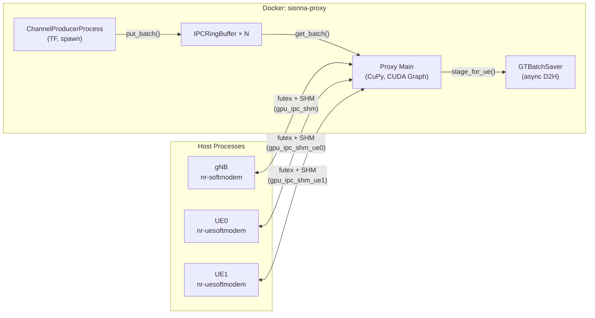
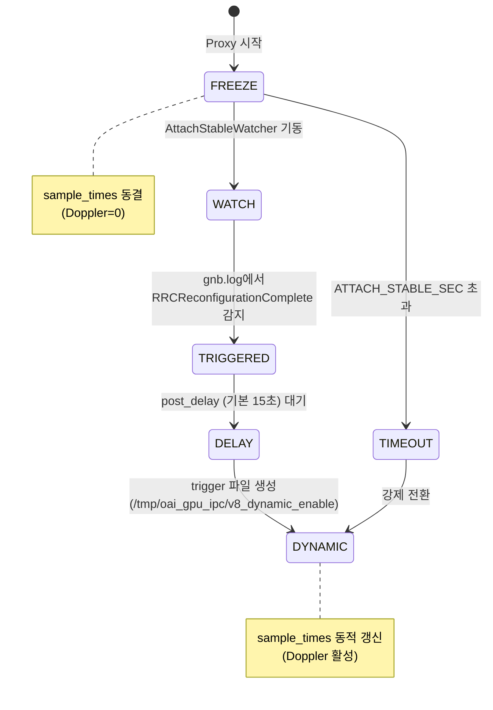
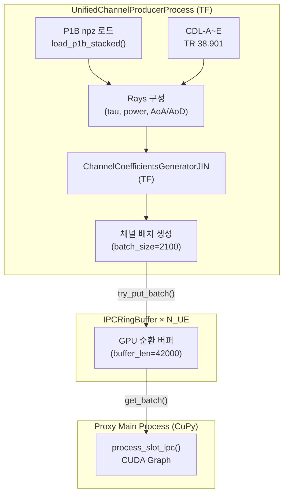
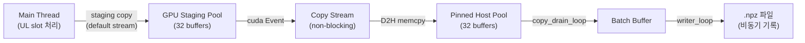
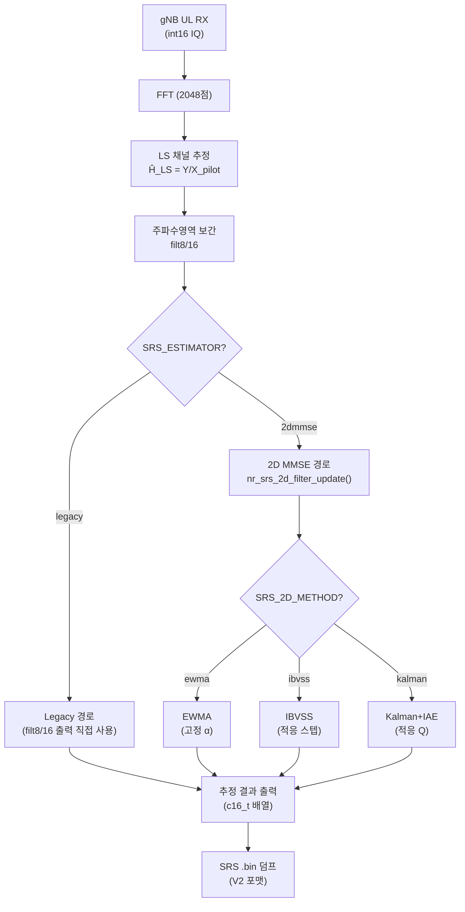
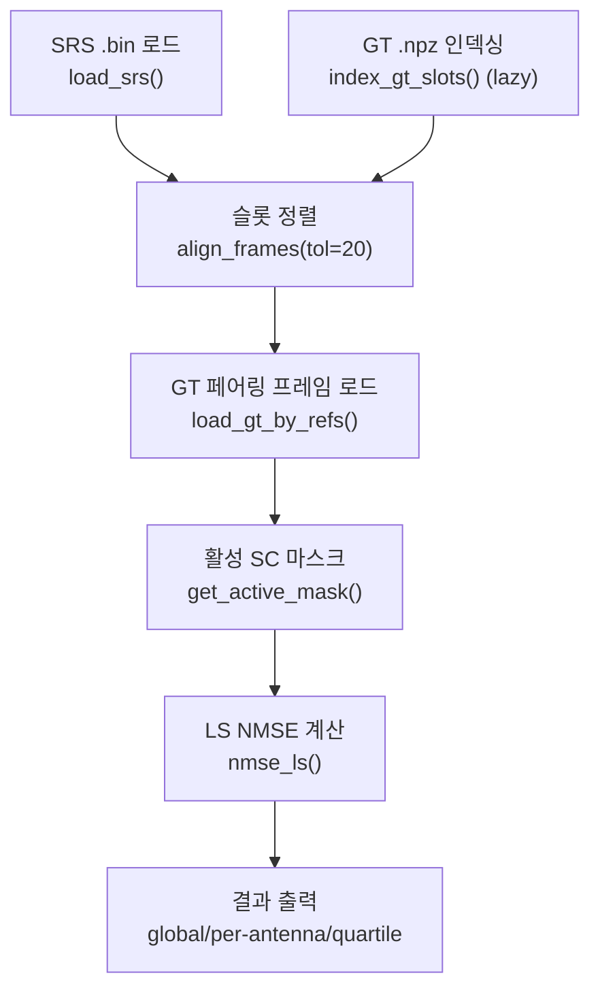
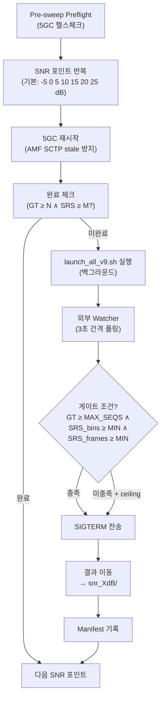

# OAI-Channel 통합 시뮬레이터 설계 명세서 — ALDLC Spec

| 항목 | 값 |
|------|----|
| **프로젝트명** | OAI-Channel 통합 시뮬레이터 (SRS Channel Estimation & Digital Twin) |
| **버전** | v1.0 |
| **일자** | 2026-05-27 |
| **작성** | Lu |
| **관련 문서** | `SRS_ALDLC_요구사항.md` (What), 본 문서 (How) |

---

## 1. 문서 범위

본 문서는 `SRS_ALDLC_요구사항.md`에서 정의된 기능/비기능 요구사항을 **어떻게 구현하는지** (How) 를 기술하는 설계 명세서 (Specification) 이다.

요구사항 문서가 "외부에서 볼 때 필요한 기능 (What)"을 정리했다면, 본 문서는 다음을 포함한다:

- 모듈별 내부 아키텍처 및 인터페이스 명세
- 데이터 포맷 및 프로토콜 정의
- 알고리즘 상세 설계 (수식, 파라미터, 상태 머신)
- 파일/디렉토리 구조 및 빌드 체계
- 실험 자동화 파이프라인 워크플로우

---

## 2. 시스템 전체 구조

### 2.1 배포 토폴로지

```
┌──────────────────────── Host (Ubuntu, NVIDIA GPU) ────────────────────────┐
│                                                                           │
│  ┌─────────────────────────────────────────────────────────┐              │
│  │  Docker: sionna-proxy                                   │              │
│  │  ┌───────────────────────────────────────────────┐      │              │
│  │  │ v8.py (Python/TF/CuPy)                        │      │              │
│  │  │  ├─ UnifiedChannelProducerProcess (spawn)      │      │              │
│  │  │  ├─ IPCRingBuffer × N_UE                       │      │              │
│  │  │  ├─ GTBatchSaver (async D2H pipeline)          │      │              │
│  │  │  └─ NoiseProducer                              │      │              │
│  │  └───────────────────────────────────────────────┘      │              │
│  └──────────────────┬──────────────────────────────────────┘              │
│                     │ CUDA IPC SHM (/tmp/oai_gpu_ipc/)                    │
│  ┌──────────────────┴──────────────────────────────────────┐              │
│  │  Host Processes (OAI C)                                  │              │
│  │  ┌──────────────┐  ┌──────────────┐                      │              │
│  │  │ nr-softmodem  │  │nr-uesoftmodem│ × N_UE              │              │
│  │  │ (gNB)         │  │ (UE)         │                      │              │
│  │  └──────────────┘  └──────────────┘                      │              │
│  └──────────────────────────────────────────────────────────┘              │
│                                                                           │
│  ┌───────────────────────────────────┐                                    │
│  │  Docker Compose: 5GC              │                                    │
│  │  AMF / SMF / UPF / MySQL          │                                    │
│  └───────────────────────────────────┘                                    │
└───────────────────────────────────────────────────────────────────────────┘
```

### 2.2 프로세스 간 통신 구조



### 2.3 디렉토리 구조

```
OAI_luuuuuu/
├── DevChannelProxyJIN/
│   ├── openairinterface5g_whan/           # OAI 소스 (수정본)
│   │   ├── openair1/PHY/NR_ESTIMATION/
│   │   │   ├── nr_ul_channel_estimation.c # SRS 추정 디스패처 (수정)
│   │   │   ├── nr_srs_2d_filter.c         # 시간영역 적응 필터 (신규)
│   │   │   ├── nr_srs_2d_filter.h         # 2D 필터 헤더 (신규)
│   │   │   └── nr_srs_mmse.c              # MMSE 관련 (수정)
│   │   ├── cmake_targets/ran_build/build/ # 빌드 산출물
│   │   ├── targets/PROJECTS/.../CONF/     # gNB/UE 설정 파일
│   │   └── doc/tutorial_resources/oai-cn5g/
│   │       └── docker-compose.yaml        # 5GC 컨테이너
│   ├── vRAN_Socket/G1C_MultiUE_MIMO_Channel_Proxy/
│   │   ├── v8.py                          # Channel Proxy 메인
│   │   ├── channel_coefficients_JIN.py    # 채널 계수 생성기
│   │   ├── launch_all_v9.sh               # 통합 런처
│   │   ├── run_q4_snr_sweep_v9.sh         # SNR Sweep 자동화
│   │   ├── eval_nmse_clean.py             # NMSE 평가
│   │   ├── digital_twin_stats.py          # GT 인덱싱/로딩
│   │   ├── srs_2d_mmse.py                 # Python 참조 구현
│   │   ├── preflight.sh                   # 환경 정리 스크립트
│   │   └── test_ibvss_*.py                # IBVSS 단위 테스트
│   ├── logs/                              # 실험 로그 루트
│   │   ├── latest -> (최근 실행 심링크)
│   │   └── q4_sweep_YYYYMMDD_HHMMSS/      # Sweep 결과
│   └── P1B_Valid_Results/                 # P1B Ray-Tracing 데이터
├── SRS_ALDLC_요구사항.md                   # 요구사항 문서 (What)
├── SRS_ALDLC_설계명세서.md                  # 본 문서 (How)
└── output_format_spec.md                  # 출력 포맷 규격
```

---

## 3. 모듈별 설계 명세

### 3.1 코어 에뮬레이터 (실험 편성 계층)

#### 3.1.1 파라미터 전달 체계

```
환경변수 (UL_PRE_GAIN, SRS_ESTIMATOR, SRS_2D_METHOD, ...)
  │
  ▼
run_q4_snr_sweep_v9.sh          ← Sweep 자동화 (다중 SNR 포인트 반복)
  │  환경변수 + CLI 인자 조합
  ▼
launch_all_v9.sh                ← 통합 런처 (단일 실험)
  │
  ├─→ v8.py (Docker exec)      ← --ul-pre-gain, --snr-dB, --seed, ...
  ├─→ nr-softmodem (Host)      ← 환경변수 SRS_ESTIMATOR, SRS_2D_METHOD, ...
  └─→ nr-uesoftmodem (Host)    ← 환경변수 RFSIM_GPU_IPC_V8=1
```

#### 3.1.2 `launch_all_v9.sh` 런처 명세

| 항목 | 명세 |
|------|------|
| 위치 | `G1C_MultiUE_MIMO_Channel_Proxy/launch_all_v9.sh` |
| 실행 권한 | `sudo` 필수 (CUDA IPC, 프로세스 관리) |
| 프로세스 기동 순서 | 5GC 헬스체크 → Preflight 환경 정리 → SHM 초기화 → Proxy 기동 → gNB 기동 → UE 기동 → Attach Stable Watcher |
| 종료 순서 | SIGINT → gNB (SRS partial flush 대기 최대 12초) → Proxy SIGTERM → Hard-kill → GT 데이터 이동 |
| 로그 디렉토리 | `logs/YYYYMMDD_HHMMSS_G1C_v8_ipc_<tag>/` |
| GT 저장 경로 | `/tmp/oai_gpu_ipc/sionna_gt/` → 종료 시 로그 디렉토리로 이동 |

**CLI 파라미터 요약:**

| 파라미터 | 기본값 | 설명 |
|----------|--------|------|
| `-v VERSION` | `v8` | Proxy 버전 (`v8.py` 실행) |
| `-m MODE` | `gpu-ipc` | 통신 모드 (`gpu-ipc` / `socket`) |
| `-n NUM_UES` | `1` | 동시 접속 UE 수 |
| `-snr dB` | off | AWGN 상대 SNR |
| `-ulg G` | `1.0` | UL Pre-Gain 배수 |
| `-ga Nx Ny` | `2 1` | gNB 안테나 배열 (가로×세로) |
| `-ua Nx Ny` | `2 1` | UE 안테나 배열 |
| `-mf N` | off | N 프레임 수집 후 자동 종료 |
| `-seed N` | (없음) | 채널 난수 시드 |
| `-speed M/S` | `3` | UE 이동 속도 (m/s) |
| `-stable SEC` | `300` | Attach 안정화 최대 시간 |

#### 3.1.3 Attach 안정화 메커니즘



| 파라미터 | 기본값 | 설명 |
|----------|--------|------|
| `ATTACH_STABLE_MODE` | `auto` | `auto`: trigger 기반, `time`: 고정 시간 |
| `ATTACH_STABLE_TRIGGER` | `rrc_reconfig` | `rrc_reconfig` / `srs` / `off` |
| `ATTACH_STABLE_POST_DELAY` | `15`초 | Trigger 감지 후 dynamic handoff 지연 |
| `ATTACH_STABLE_SEC` | `300`초 | 최대 freeze 시간 (fallback ceiling) |

---

### 3.2 채널 모듈 (Channel Proxy v8)

#### 3.2.1 아키텍처 개요

| 항목 | 명세 |
|------|------|
| 소스 파일 | `v8.py` (~4200행) |
| 런타임 | Docker `sionna-proxy` (Python 3, TensorFlow, CuPy) |
| 프로세스 모델 | 메인 프로세스 (CuPy) + ChannelProducer (TF, `multiprocessing.spawn`) |
| GPU 통신 | CUDA IPC Shared Memory (futex 동기화, V8 프로토콜) |
| 채널 적용 | `process_slot_ipc()` — CUDA Graph 가속 (Relaxed 모드) |

#### 3.2.2 채널 생성 파이프라인



**채널 계수 생성기 (`ChannelCoefficientsGeneratorJIN`):**

| 파라미터 | 값 | 설명 |
|----------|------|------|
| `carrier_frequency` | 3.5 GHz | NR Band 78 |
| `scs` | 30 kHz | Numerology 1 |
| `FFT_SIZE` | 2048 | OFDM FFT 크기 |
| `N_SYM` | 14 | 슬롯당 OFDM 심볼 수 |
| `Speed` | 3 m/s (기본) | UE 이동 속도 |
| `batch_size` | 2100 | 채널 생성 배치 크기 |
| `buffer_len` | 42000 | 순환 버퍼 길이 (20배) |

**P1B Ray-Tracing 데이터 구조:**

```python
ray_data = {
    'tau':     ndarray,  # (1, 1, N_UE, 1, 400) — 지연 (초)
    'power':   ndarray,  # (1, 1, N_UE, 1, 400) — 선형 전력
    'phi_r':   ndarray,  # (1, 1, N_UE, 1, 400) — RX 방위각 (rad)
    'phi_t':   ndarray,  # (1, 1, N_UE, 1, 400) — TX 방위각 (rad)
    'theta_r': ndarray,  # (1, 1, N_UE, 1, 400) — RX 천정각 (rad)
    'theta_t': ndarray,  # (1, 1, N_UE, 1, 400) — TX 천정각 (rad)
}
```

#### 3.2.3 GPU IPC 공유 메모리 프로토콜 (V8)

**SHM 파일 레이아웃:**

```
/tmp/oai_gpu_ipc/
├── gpu_ipc_shm        ← gNB 전용 (DL TX / UL RX 겸용)
├── gpu_ipc_shm_ue0    ← UE0 전용 (DL RX / UL TX)
├── gpu_ipc_shm_ue1    ← UE1 전용
└── v8_dynamic_enable  ← Attach stable trigger 파일
```

**동기화 프로토콜 (futex 기반):**

```
┌──────────┐                    ┌──────────┐
│ OAI      │                    │ Proxy    │
│ (Client) │                    │ (Server) │
└────┬─────┘                    └────┬─────┘
     │                               │
     │  1. SHM 연결 (IPC handle)      │
     │  ◄────────────────────────────│  SHM 생성
     │                               │
     │  2. TX 데이터 기록 (int16 IQ)   │
     │  ───────────────────────────►│
     │  3. futex WAKE (tx_ready)     │
     │  ───────────────────────────►│
     │                               │  4. 채널 적용 H[k]×X
     │                               │  5. RX 데이터 기록
     │  6. futex WAIT (rx_ready)     │
     │  ◄────────────────────────────│  futex WAKE
     │  7. RX 데이터 수신             │
     └───────────────────────────────┘
```

**IPC 타임스탬프 기반 슬롯 매칭:**
- TX 헤더: `(size, nb_ant, timestamp, frame, subframe)`
- 헤더 포맷: `<I I Q I I` (little-endian, 24 바이트)
- gNB DL timestamp → UE DL timestamp 매칭
- UE UL timestamp → gNB UL timestamp 매칭

#### 3.2.4 DL/UL 신호 처리 경로

**DL (하향) 경로 — Broadcast:**

```python
for ue_idx in range(N_UE):
    H_ue = channels_dl[ue_idx]           # (N_ue_ant, N_gnb_ant, FFT)
    rx_freq = H_ue × gnb_tx_freq         # 주파수영역 채널 적용
    rx_iq = IFFT(rx_freq) + noise        # 시간영역 변환 + 잡음
    cast_to_int16(rx_iq) → ue[idx].dl_rx # int16 양자화
```

**UL (상향) 경로 — Superposition:**

```python
gnb_ul_rx = zeros(N_gnb_ant, FFT)
for ue_idx in active_set:
    H_ue = channels_ul[ue_idx]           # (N_gnb_ant, N_ue_ant, FFT)
    rx_freq = H_ue.T × ue_tx_freq       # H^T × X (전치)
    gnb_ul_rx += rx_freq                 # 다중 UE 신호 중첩

gnb_ul_rx *= UL_PRE_GAIN                # Pre-Gain 적용
gnb_ul_rx += noise                      # AWGN 주입
clip_cast_int16(gnb_ul_rx) → gnb.ul_rx  # int16 양자화
```

#### 3.2.5 UL Pre-Gain 상세 설계

| 항목 | 명세 |
|------|------|
| 목적 | rfsim RF AGC 부재로 인한 int16 양자화 정밀도 병목 완화 |
| 적용 위치 | UL 경로, `clip_cast_int16` 직전 |
| 파라미터 | `--ul-pre-gain G` (기본 1.0) |
| 권장값 | G=4 (≈ +12 dB SQNR 개선) |
| 수식 | `rx_int16 = clip(round(rx_float × G), -32768, 32767)` |
| 효과 | FFT 입력 RMS 200→800, 유효 비트 7.6→9.6 |

#### 3.2.6 Ground Truth 비동기 저장 (v8 신규)



**GT `.npz` 파일 포맷:**

| 필드 | 타입 | 형상 | 설명 |
|------|------|------|------|
| `h_matrix` | complex64 | `(batch, n_sym, gnb_ant, ue_ant, fft)` | 채널 행렬 |
| `slot_ids` | int64 | `(batch,)` | 슬롯 인덱스 |
| `bypass_flags` | bool | `(batch,)` | 바이패스 여부 |
| `symbol_indices` | int32 | `(n_sym,)` | 심볼 인덱스 |
| `gnb_ant` | int32 | scalar | gNB 안테나 수 |
| `ue_ant` | int32 | scalar | UE 안테나 수 |
| `fft_size` | int32 | scalar | FFT 크기 |

**저장 주기:** `--gt-save-every N` (기본 100) — 매 N번째 UL 슬롯마다 GT 캡처

---

### 3.3 OAI 모듈 SRS 채널 추정 강화

#### 3.3.1 SRS 추정 전체 파이프라인



#### 3.3.2 수정 파일 및 연동 관계

| 파일 | 역할 | 수정 유형 |
|------|------|----------|
| `nr_ul_channel_estimation.c` | SRS 추정 디스패처 | 기존 수정 — `NR_SRS_EST_MMSE2D` 분기 추가 |
| `nr_srs_2d_filter.h` | 2D 필터 헤더 | 신규 |
| `nr_srs_2d_filter.c` | 시간영역 적응 필터 본체 (~1230행) | 신규 |
| `nr_srs_mmse.c` | MMSE 관련 유틸리티 | 기존 수정 |

#### 3.3.3 데이터 구조 명세

**Per-Subcarrier 상태 (`ewma_state_t`):**

```c
typedef struct {
  float r;          // 평활화된 실수부
  float i;          // 평활화된 허수부
  uint32_t count;   // 갱신 횟수 (warm-up 판정용)
} ewma_state_t;
```

메모리: `4 RX × 4 TX × 8192 SC × 12 bytes = 1.5 MB` (정적 할당)

**Per-Antenna 상태 (`kalman_state_t` — 가장 복잡한 상태):**

```c
typedef struct {
  float K;               // Kalman 이득 (= alpha 동치)
  float P;               // 후험 공분산
  float Q;               // 프로세스 잡음 추정
  float innov_smooth;    // 혁신 전력 EMA
  float c_model_est;     // 채널 모델 추정 (even-odd pair)
  uint32_t frame_count;
  uint32_t outlier_count;     // Fix3: 이상치 카운터
  float P_prev;               // Fix1: 수렴 감지용
  uint8_t use_riccati;        // Fix1: 0=IBVSS warm-up, 1=Riccati
  uint8_t consecutive_match;  // Fix1: debounce 카운터
  int64_t last_abs_slot;      // Fix2: 적응적 dt
  int64_t expected_period;    // Fix2: SRS 주기 자동 감지
  int64_t gap_history[10];    // Fix2: 간격 이력
  uint8_t gap_count;
  uint8_t initialized;
} kalman_state_t;
```

#### 3.3.4 알고리즘 상세 — EWMA

**수식:**

```
H_smooth(t) = α · H_smooth(t-1) + (1 - α) · H_new(t)
```

| 파라미터 | 환경변수 | 기본값 | 범위 |
|----------|----------|--------|------|
| α | `SRS_2D_ALPHA` | 0.9 | (0, 1) |
| warm-up | `SRS_2D_N_WARM` | 3 | ≥ 0 |

warm-up 기간 동안은 입력을 그대로 출력 (필터 미적용).

#### 3.3.5 알고리즘 상세 — IBVSS (Innovation-Based Variable Step Size)

**핵심 원리:**
Kalman 정상 상태에서 `innov_smooth / R_est = 1 / (1 - α_opt)` 관계를 이용하여 최적 α를 자동 추적.

**2-Pass 구조:**

```
Pass 1: 전 서브캐리어 순회
  ├─ 내적(inner product) → de-rotation 위상 추출
  └─ even-odd pair → R_est (잡음 전력 추정)

Pass 2: 전 서브캐리어 순회
  ├─ De-rotation: H_derot = H_obs × conj(rot)
  ├─ Innovation: diff = H_derot - H_smooth
  ├─ EMA 갱신: H_smooth += α × diff
  ├─ Per-band 혁신 전력 → 중앙값 (8 band, 주파수 선택성 강건화)
  └─ α 갱신: ratio = innov_smooth / R_est
             α = 1 - 1/ratio  (clamped)
```

| 파라미터 | 환경변수 | 기본값 | 설명 |
|----------|----------|--------|------|
| α 초기값 | `SRS_2D_IBVSS_ALPHA_INIT` | 0.5 | 초기 스텝 사이즈 |
| α 하한 | `SRS_2D_IBVSS_ALPHA_MIN` | 0.02 | 최소 스텝 사이즈 |
| α 상한 | `SRS_2D_IBVSS_ALPHA_MAX` | 0.98 | 최대 스텝 사이즈 |
| 혁신 EMA | `SRS_2D_IBVSS_INNOV_EMA` | 0.15 | 혁신 전력 평활 계수 |
| warm-up | `SRS_2D_IBVSS_WARMUP` | 20 | warm-up 프레임 수 |
| 적응 c_model | `SRS_2D_IBVSS_ADAPTIVE_CMODEL` | 1 (on) | even-odd 채널 모델 적응 |

**적응 c_model 추정:**

```
c_model = (|H_smooth[2k] - H_smooth[2k+1]|² / 4) - noise_bias
noise_bias = α / (2·(2-α)) · R_est
```

#### 3.3.6 알고리즘 상세 — Scalar Kalman + IAE (Fix1-5)

**핵심 수식 (Riccati 재귀):**

```
P_pred = P + Q                    // 예측 공분산
K = P_pred / (P_pred + R)         // Kalman 이득
H_smooth += K × innovation       // 상태 갱신
P = (1 - K) × P_pred             // 후험 공분산
Q_est = innov_smooth - P - R      // IAE: Q 추정
Q = EMA(Q, max(Q_est, Q_floor))  // Q 평활 + 하한 클램프
```

**Fix1-5 강건화:**

| Fix | 문제 | 해결 |
|-----|------|------|
| Fix1 | Riccati 조기 전환 시 P_pred 발산 | warm-up 중 IBVSS 사용, P_pred 수렴 감지 후 debounce 전환 |
| Fix2 | SRS 간격 불균일 시 Q 과소추정 | `abs_slot` 기반 dt 적응, 주기 자동 감지 (`gap_history`) |
| Fix3 | 이상치(outlier) innov spike | `innov / innov_smooth > 10` 시 outlier 카운터 증가, 갱신 억제 |
| Fix4 | Q_floor 과소 | `Q_floor = R × 0.001` 하한 보장 |
| Fix5 | 초기 P 불안정 | `P = 1.0` 초기화, warm-up 최소/최대 프레임 분리 |

| 파라미터 | 환경변수 | 기본값 |
|----------|----------|--------|
| α 하한 | `SRS_2D_KALMAN_ALPHA_MIN` | 0.02 |
| α 상한 | `SRS_2D_KALMAN_ALPHA_MAX` | 0.98 |
| 혁신 EMA | `SRS_2D_KALMAN_INNOV_EMA` | 0.15 |
| Q EMA | `SRS_2D_KALMAN_Q_EMA` | 0.10 |
| warm-up 최소 | `SRS_2D_KALMAN_WARMUP_MIN` | 10 |
| warm-up 최대 | `SRS_2D_KALMAN_WARMUP_MAX` | 50 |
| debounce | `SRS_2D_KALMAN_DEBOUNCE` | 3 |

#### 3.3.7 De-rotation 위상 보상

모든 적응 알고리즘 (Adaptive, IBVSS, Kalman) 에서 공통 사용:

```
inner = Σ_sc (H_new[sc] × conj(H_smooth[sc]))
rot = inner / |inner|                          // 단위 위상 벡터
H_derot[sc] = H_new[sc] × conj(rot)           // CFO/timing drift 보상
```

목적: SRS 프레임 간 CFO (Carrier Frequency Offset) 및 timing drift에 의한 위상 회전을 제거하여 시간영역 필터링의 정확도를 보장.

#### 3.3.8 Even-Odd Pair SNR 추정

```
P_plus  = Σ |H[2k] + H[2k+1]|² / (4·N_pairs)  ≈ |H|² + σ²
P_minus = Σ |H[2k] - H[2k+1]|² / (4·N_pairs)  ≈ c_model + σ²
R_est   = 2 × (P_minus - c_model)               // 잡음 전력
SNR_lin = (P_plus - P_minus) / (P_minus - c_model)
```

인접 서브캐리어 쌍의 합/차를 이용하여, 별도의 잡음 기준 없이 실시간으로 SNR 및 잡음 전력을 추정.

#### 3.3.9 SRS 주기 자동 조정 (Offset 오버플로우 방지)

TDD 10-slot 프레임(DDDDDDDXUU)에서 full UL 슬롯은 2개(slot 8, 9)뿐이므로, uid≥2 시 offset이 요청 주기를 초과하여 ASN.1 인코딩 실패 (segfault) 가 발생할 수 있다.

**수정 내용 (`configure_periodic_srs()` in `nr_radio_config.c`):**

3GPP TS 38.331 후보 주기 테이블에서, `check_periodicity()` **및** `offset < period` 을 동시에 만족하는 최소 주기를 자동 선택:

```c
static const int srs_periods[] = {4, 5, 8, 10, 16, 20, 32, 40, 64, 80, 160, 320, 640, 1280, 2560};
int selected_period = 2560;
for (int i = 0; i < sizeof(srs_periods)/sizeof(srs_periods[0]); i++) {
  if (check_periodicity(srs_periods[i], ideal_period, fs) && offset < srs_periods[i]) {
    selected_period = srs_periods[i];
    break;
  }
}
```

**`SRS_PERIOD_SLOTS=10`, TDD 10-slot 동작 예시:**

| uid | offset | 선택 주기 | 비고 |
|-----|--------|----------|------|
| 0 | 8 | sl10 | 정상 (8 < 10) |
| 1 | 9 | sl10 | 정상 (9 < 10) |
| 2 | 18 | **sl20** | 자동 상향 (18 < 20) |
| 3 | 19 | **sl20** | 자동 상향 (19 < 20) |

주기 조정 시 `LOG_W` 경고 출력: `SRS period adjusted for uid 2: requested=10 selected=20 offset=18`

#### 3.3.10 Gap 감지 및 리셋

```c
#define SRS_2D_GAP_THRESHOLD 500  // 슬롯

if (abs_slot - last_abs_slot > GAP_THRESHOLD) {
    // 채널 비상관 → 전체 상태 리셋
    nr_srs_2d_filter_reset();
}
```

SRS 슬롯 간격이 500을 초과하면 채널 비상관으로 판단하여 필터 상태를 전면 초기화.

#### 3.3.11 SRS .bin 덤프 포맷 (V2)

```
[파일 헤더 — 32 바이트]
  magic:    0x53525331 ("SRS1")        uint32
  version:  2                           uint32
  rx:       수신 안테나 수               uint32
  tx:       송신 안테나 수               uint32
  n_sc:     서브캐리어 수               uint32
  n_frames: 프레임 수                   uint32
  pad:      8 바이트 예약

[프레임 × n_frames]
  frame_id:  uint32
  slot_id:   uint32
  rnti:      uint16
  pad:       uint16
  iq_data:   int16[rx × tx × n_sc × 2]  (I/Q interleaved)
```

파일당 최대 `MAX_DUMP_FRAMES = 100` 프레임, 시퀀스 번호로 분할 (`srs_matrix_gNB_RxTx_seq*.bin`).

---

### 3.4 모니터링 모듈

#### 3.4.1 GT-SRS 정렬 및 NMSE 평가

**`eval_nmse_clean.py` 워크플로우:**



**NMSE 계산 방법:**

```
per-antenna α (LS 정렬):
  α_i = <G_i, S_i> / <G_i, G_i>     (antenna별 최적 스케일)
  NMSE_i = |S_i - α_i·G_i|² / |α_i·G_i|²

global α:
  α = <G, S> / <G, G>                (전체 채널 행렬에 대한 단일 스케일)
  NMSE = |S - α·G|² / |α·G|²
```

**GT-SRS 고유 매칭 (`_pair_unique_nearest()`):**

SRS 주기(20 slots)와 GT 저장 주기(100 slots)의 비율 차이로, 다수 SRS 프레임이 동일 GT에 중복 매칭되는 문제를 방지. 각 GT 프레임에 대해 미사용 SRS 프레임 중 최근접을 탐색하고 `used_srs` 집합으로 1:1 매칭을 보장.

| 지표 | 수정 전 | 수정 후 |
|------|--------|--------|
| paired | 275 | **105** |
| unique GT | 105 | **105** |
| 중복 GT | 170 | **0** |
| Q4-Q1 drift | +2.6 dB (WARNING) | **+2.0 dB (stable)** |

**시간 안정성 분석:** 전체 프레임을 4분위로 나누어 Q1~Q4 별 NMSE 중앙값 비교. Q4-Q1 drift > 2 dB 시 경고.

**SFN Unwrap:** `frame_id × 20 + slot_id`, 10240-frame wrap 감지/보정.

#### 3.4.2 SNR Sweep 자동화

**`run_q4_snr_sweep_v9.sh` 워크플로우:**



**게이트 조건:**

| 조건 | 기본값 | 설명 |
|------|--------|------|
| `MAX_FRAMES` | 300 | GT `.npz` 파일 수 ≥ `ceil(MAX_FRAMES/100)` |
| `MIN_SRS_BINS` | 1 | SRS `.bin` 파일 수 ≥ 1 |
| `MIN_SRS_FRAMES` | `MAX_FRAMES` | SRS 헤더의 `n_frames` 합 ≥ MAX_FRAMES |
| `HARD_CEILING_SEC` | 900 | 단일 SNR 포인트 최대 벽시계 시간 |

**Manifest 필드명:** `n_gt` → `n_gt_files` 로 변경 (GT 프레임 수가 아닌 GT npz 파일 수임을 명확화).

**결과 디렉토리 구조:**

```
logs/q4_sweep_YYYYMMDD_HHMMSS/
├── sweep_manifest.txt              ← 전체 Sweep 요약
├── snr_m5dB/                       ← SNR = -5 dB
│   ├── gnb.log
│   ├── proxy.log
│   ├── attach_diag_v9.log
│   ├── srs_matrix_gNB_2x2_seq0.bin
│   ├── srs_matrix_gNB_2x2_seq1.bin
│   └── sionna_gt/
│       ├── gt_batch_ue0_seq0.npz
│       └── gt_batch_ue0_seq1.npz
├── snr_0dB/
├── snr_5dB/
└── ...
```

---

## 4. 구조화 출력 포맷 명세

### 4.1 통합 출력 튜플 `(S, H)`

DL CSI Feedback과 UL SRS 파이프라인 모두 동일한 `(S, H)` 구조를 출력하여, 하류 DB/RAN Twin에서 포맷 분기 없이 수집 가능.

### 4.2 구조 S — 공유 필드

| 필드 | 타입 | 형상 | 단위 | 설명 |
|------|------|------|------|------|
| `p_inst` | real ndarray | `(N_tap,)` | 선형 전력 | 순시 PDP (현재 프레임) |
| `p_state` | real ndarray | `(N_tap,)` | 선형 전력 | EMA 누적 PDP (장기 지연 구조) |
| `R_rx_inst` | complex ndarray | `(N_rx, N_rx)` | — | 순시 공간 공분산 |
| `R_rx_state` | complex ndarray | `(N_rx, N_rx)` | — | EMA 누적 공간 공분산 |
| `d_inst` | real ndarray | `(L_lag,)` | [0,1] | 순시 시간 자기상관 |
| `d_state` | real ndarray | `(L_lag,)` | [0,1] | EMA 누적 시간 일관성 |
| `confidence` | float | scalar | [0,1] | 신뢰도 게이트 |

### 4.3 구조 S — UL 전용 필드

| 필드 | 타입 | 형상 | 단위 | 설명 |
|------|------|------|------|------|
| `rsrp` | float | scalar | 선형 전력 | 참조 신호 수신 전력 |
| `snr_db` | float | scalar | dB | SNR (even-odd pair 추정) |
| `doppler_hz` | float | scalar | Hz | Doppler 주파수 |
| `speed_ms` | float | scalar | m/s | UE 속도 (`fd·c/fc`) |
| `ds_rms_s` | float | scalar | 초 | RMS 지연 확산 |
| `sv` | real ndarray | `(min(Nr,Nt),)` | 선형 | 광대역 평균 특이값 |

### 4.4 압축 채널 H

| 필드 | 타입 | 형상 | 설명 |
|------|------|------|------|
| `h_taps` | complex ndarray | `(N_rx, N_tx, 2·N_tap)` | 지연영역 유효 탭 (저장 payload) |
| `H_c` | complex ndarray | `(N_rx, N_tx, N_sc)` | 전대역 DFT 복원 (평가/시각화용) |

**압축/복원 관계:**

```
h_taps = concat(h_time[..., :N_tap], h_time[..., -N_tap:])  // 압축
H_c    = FFT(zero_pad(h_taps, N_sc))                         // 복원
```

### 4.5 EMA 누적 규약

```
x_state[t] = (1 - α) · x_state[t-1] + α · x_inst[t]
```

| | UL (본 프로젝트) |
|--|-----------------|
| 속도 유형 | 고정 (신호처리) |
| 기본값 | α_p=0.10, α_R=0.05, α_d=0.15 |
| 초기화 | 첫 프레임 복사 |

### 4.6 Doppler 자기상관 규약

```
d_inst[τ] = |⟨H_t, H_{t-τ}⟩| / sqrt(‖H_t‖² · ‖H_{t-τ}‖²)
```

- 양측 정규화 (bilateral normalization)
- τ 단위: SRS 주기 (정수 lag 인덱스)
- 기본 `L_lag = 8`

### 4.7 기본 차원값

| 기호 | 기본값 | 의미 |
|------|--------|------|
| `N_sc` | 1248 (활성 SC) | 서브캐리어 수 |
| `N_tap` | 64 | 지연 탭 수 (≈ 2 μs @ 30 kHz SCS) |
| `L_lag` | 8 | 시간 자기상관 래그 수 |
| `N_rx` | 2 | gNB 수신 안테나 |
| `N_tx` | 2 | UE 송신 안테나 (SRS 포트) |

---

## 5. 성능 벤치마크 및 검증 기준

### 5.1 처리 지연

| 모듈 | 지표 | 요구 | 실측 |
|------|------|------|------|
| SRS 추정 (Legacy) | per-SRS 블록 | < 1 ms | ~0.1 ms |
| SRS 추정 (IBVSS/Kalman) | per-SRS 블록 | < 1 ms | ~0.3 ms |
| Channel Proxy (2UE) | per-slot | < 2.5 ms | ~2.07 ms |

### 5.2 NMSE 목표 (SNR=20 dB, CDL-A, 2×2 MIMO)

| 알고리즘 | 목표 NMSE | 비고 |
|----------|----------|------|
| Legacy (filt8/16) | ~-7 dB | 기준선 |
| EWMA | ≤ -8 dB | 고정 α=0.9 |
| IBVSS | ≤ -9.6 dB | 적응 α |
| Kalman+IAE | ≤ -11 dB | Riccati + IAE |

### 5.3 CDL 채널 검증 매트릭스

| 채널 모델 | 속도 조건 | 테스트 조건 수 | 통과 기준 |
|-----------|----------|--------------|----------|
| CDL-A / CDL-C / CDL-D | 정적 / 저속(3m/s) / 중속(30m/s) / 고속(120m/s) | 8 | Legacy 대비 NMSE 개선 > 0 dB (ε=5% 허용) |
| P1B Ray-Tracing | 다양한 RX 위치 | 6 | 동일 |
| 과도 상태 추적 | 채널 변화 시점 | 4 | 동일 |

---

## 6. 환경변수 종합 참조

### 6.1 SRS 추정 관련

| 환경변수 | 기본값 | 설명 |
|----------|--------|------|
| `SRS_ESTIMATOR` | `legacy` | 추정기 모드: `legacy` / `2dmmse` |
| `SRS_2D_METHOD` | (없음) | 시간영역 알고리즘: `ewma` / `ibvss` / `kalman` |
| `SRS_2D_ALPHA` | `0.9` | EWMA 기본 alpha |
| `SRS_2D_N_WARM` | `3` | EWMA warm-up 프레임 수 |
| `SRS_2D_DEBUG` | (없음) | `"1"` 시 주기적 디버그 로그 |
| `SRS_PERIOD_SLOTS` | `10` | SRS 주기 override (슬롯 단위) |
| `SRS_OPTFILT` | `0` | SRS 보간 필터 관련 |
| `SRS_REF_DUMP_PATH` | `/tmp/oai_gpu_ipc/srs_ref.bin` | SRS 덤프 경로 |

### 6.2 IBVSS 파라미터

| 환경변수 | 기본값 |
|----------|--------|
| `SRS_2D_IBVSS_ALPHA_INIT` | `0.5` |
| `SRS_2D_IBVSS_ALPHA_MIN` | `0.02` |
| `SRS_2D_IBVSS_ALPHA_MAX` | `0.98` |
| `SRS_2D_IBVSS_INNOV_EMA` | `0.15` |
| `SRS_2D_IBVSS_WARMUP` | `20` |
| `SRS_2D_IBVSS_ADAPTIVE_CMODEL` | `"1"` (on) |

### 6.3 Kalman 파라미터

| 환경변수 | 기본값 |
|----------|--------|
| `SRS_2D_KALMAN_ALPHA_MIN` | `0.02` |
| `SRS_2D_KALMAN_ALPHA_MAX` | `0.98` |
| `SRS_2D_KALMAN_INNOV_EMA` | `0.15` |
| `SRS_2D_KALMAN_Q_EMA` | `0.10` |
| `SRS_2D_KALMAN_WARMUP_MIN` | `10` |
| `SRS_2D_KALMAN_WARMUP_MAX` | `50` |
| `SRS_2D_KALMAN_DEBOUNCE` | `3` |
| `SRS_2D_KALMAN_ADAPTIVE_CMODEL` | `"1"` (on) |

### 6.4 Proxy / 실험 제어

| 환경변수 | 기본값 | 설명 |
|----------|--------|------|
| `UL_PRE_GAIN` | `1.0` | UL Pre-Gain 배수 |
| `CHANNEL_SEED` | `42` | 채널 난수 시드 |
| `GT_SAVE_EVERY` | `100` | GT 저장 주기 (UL 슬롯 단위) |
| `DIGITAL_AGC` | `0` | OAI 디지털 AGC (0=비활성화 권장) |
| `RFSIM_GPU_IPC_V8` | `1` | GPU IPC V8 모드 활성화 |
| `NR_DIGITAL_AGC_ENABLED` | `0` | OAI 디지털 AGC 비활성화 |

---

## 7. 빌드 및 실행

### 7.1 OAI 빌드

```bash
cd DevChannelProxyJIN/openairinterface5g_whan/cmake_targets
./build_oai -w SIMU --ninja --gNB --nrUE -c
```

`nr_srs_2d_filter.c` / `.h` 는 CMakeLists.txt에 등록되어 OAI 빌드 시 자동 포함.

### 7.2 Docker 환경

```bash
# 5GC 기동
docker compose -f doc/tutorial_resources/oai-cn5g/docker-compose.yaml up -d

# sionna-proxy 컨테이너 (TF + CuPy + Sionna)
docker exec -it sionna-proxy bash
```

### 7.3 단일 실험

```bash
sudo bash launch_all_v9.sh -ga 2 1 -ua 2 1 -snr 20 -mf 200
```

### 7.4 다중 SNR Sweep

```bash
sudo \
ONLY_SNR="20 30 40" \
MAX_FRAMES=200 \
SRS_ESTIMATOR=2dmmse \
SRS_2D_METHOD=kalman \
CHANNEL_SEED=42 \
bash run_q4_snr_sweep_v9.sh
```

### 7.5 NMSE 평가

```bash
python3 eval_nmse_clean.py \
  --run-dir logs/q4_sweep_.../snr_20dB \
  --tol 20
```

---

## 8. 향후 구현 계획

| 단계 | 내용 | 상태 |
|------|------|------|
| C측 구조화 출력 | `StructuredChannelOutput` C 구현 + `.bin` 확장 | 📋 계획 중 |
| 2D 분리형 MMSE | 주파수영역 Wiener + 시간영역 Wiener | 📋 2026 Q3 |
| 특징 추출 체계 | PDP/Cov/SVD/Doppler → State Sample | 📋 2026 Q3-Q4 |
| AI 모델 학습 | MLP/CNN/Transformer + RAN Twin 통합 | 📋 2026 Q4+ |
