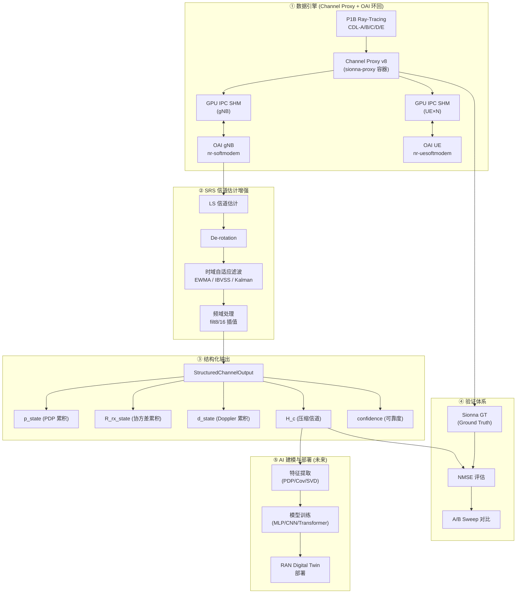
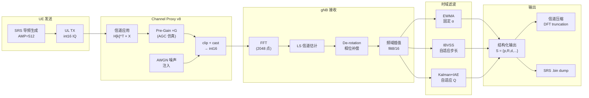
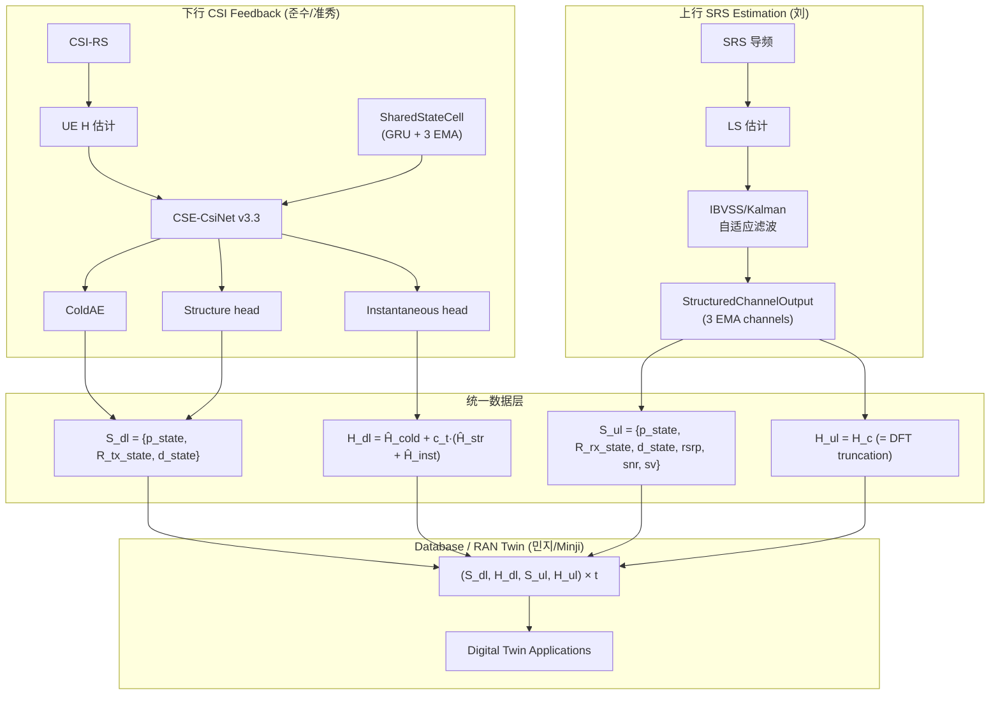

# OAI 数字孪生 SRS 信道估计系统 — ALDLC 要求事项

| 字段 | 值 |
|------|----|
| **项目名称** | OAI Digital Twin SRS Channel Estimation & Sensing |
| **版本** | v1.0 |
| **日期** | 2026-05-27 |
| **编制** | 刘 |

---

## 1. 系统概述



---

## 2. 术语定义

| 术语 | 全称 | 说明 |
|------|------|------|
| SRS | Sounding Reference Signal | 5G NR 上行探测参考信号，用于信道估计 |
| LS | Least Squares | 最小二乘信道估计（基线方法） |
| MMSE | Minimum Mean Square Error | 最小均方误差信道估计 |
| EWMA | Exponentially Weighted Moving Average | 指数加权移动平均时域滤波 |
| IBVSS | Innovation-Based Variable Step-Size | 基于创新序列的变步长自适应滤波 |
| Kalman | Scalar Kalman Filter + IAE | 标量卡尔曼滤波 + 创新自适应估计 |
| NMSE | Normalized Mean Square Error | 归一化均方误差（信道估计质量指标） |
| PDP | Power Delay Profile | 功率延迟分布 |
| GT | Ground Truth | Sionna 信道模型产出的真值信道矩阵 |
| AGC | Automatic Gain Control | 自动增益控制 |
| IPC | Inter-Process Communication | GPU 共享内存进程间通信 |
| CDL | Clustered Delay Line | 3GPP 38.901 标准信道模型 |
| P1B | Phase 1B Ray-Tracing | Sionna 光线追踪信道数据 |

---

## 3. 核心功能要求事项 (Functional Requirement)

### 3.1 数据引擎：Channel Proxy 信道仿真

#### 3.1.1 목적 (目的)

研究员可通过配置信道模型参数（SNR、信道类型、UE 数量、天线配置等），在 OAI 真实协议栈环境下自动生成带真值标签的信道数据，用于信道估计算法验证和 AI 模型训练。

#### 3.1.2 기능 요구사항 (功能要求)

1. **信道模型输入配置**
   - 支持 P1B Ray-Tracing 信道数据（`.npz` 格式）作为输入
   - 支持 CDL-A/B/C/D/E 标准信道模型作为输入
   - 支持通过 CLI 参数指定 SNR（`-snr`）、UE 数（`-n`）、天线配置（`-ga`/`-ua`）
   - 支持通过环境变量 `CHANNEL_SEED` 固定随机种子，确保实验可复现

2. **GPU IPC 数据传输**
   - Proxy 通过 GPU 共享内存（`/tmp/oai_gpu_ipc`）与 OAI gNB/UE 交换 IQ 数据
   - DL 路径：gNB `dl_tx` → Proxy `H[k]×X` → UE `dl_rx`（每 UE 独立信道）
   - UL 路径：UE `ul_tx` → Proxy `H[k]^T×X` → gNB `ul_rx`（多 UE 叠加）
   - IPC 同步使用 futex（V7/V8），非 usleep 轮询

3. **多 UE MIMO 支持**
   - 支持 N 个 UE 同时接入（当前验证：1~2 UE）
   - 支持 2×2 和 4×4 MIMO 天线配置
   - DL Broadcast：gNB 信号对 N 个 UE 分别施加独立信道
   - UL Superposition：N 个 UE 信号分别施加信道后合成送入 gNB

4. **UL Pre-Gain（AGC 仿真）**
   - 支持 `--ul-pre-gain G` 参数（默认 1.0）
   - 在 int16 量化前对 UL 信号施加固定增益，弥补 rfsim 缺少 RF AGC 的问题
   - 推荐 G=4（+12 dB SQNR 改善，FFT 输入 RMS 从 200 提升至 800）

5. **双源数据产出**
   - Sionna GT（`.npz`）：Ground Truth 信道矩阵，异步保存不阻塞主循环
   - SRS dump（`.bin V2`）：OAI gNB 侧 SRS 信道估计结果（带 magic/RNTI）
   - 场景元数据：UE 位置、速度、信道类型等

6. **自动化 Sweep 框架**
   - `launch_all_v9.sh`：统一启动 gNB + N UE + Proxy + sysmon
   - `run_q4_snr_sweep_v9.sh`：多 SNR 点自动扫参 + 后处理管线
   - 每次实验自动生成结构化日志目录（`logs/<timestamp>_<tag>/`）

---

### 3.2 OAI 信道估计增强算法

#### 3.2.1 목적 (目的)

在 OAI gNB 物理层内，以可忽略的复杂度（≪ 1 ms/SRS 块）提升 SRS 信道估计精度，为下游特征提取和 AI 模型提供高质量信道数据。

#### 3.2.2 기능 요구사항 (功能要求)

1. **LS 基线信道估计**
   - 从 SRS 导频子载波提取 LS 信道估计
   - 支持 `nr_srs_collect_pilots_dense()` 导频打包
   - 频域插值使用 filt8/16 固定 FIR 滤波器

2. **时域自适应滤波算法（三选一切换）**
   - 通过环境变量 `SRS_2D_METHOD` 切换算法：
     - `ewma`：固定步长 EWMA（`α` 通过 `SRS_2D_ALPHA` 设置）
     - `ibvss`：Innovation-Based Variable Step-Size（自动步长调整）
     - `kalman`：Scalar Kalman Filter + IAE（最优高 SNR 性能）
   - 所有算法均在 OAI C 代码中实现（`nr_srs_2d_filter.c`）
   - Python 验证版本在 `srs_2d_mmse.py` 中

3. **EWMA 滤波器**
   - 公式：`H_smooth(t) = α · H_smooth(t-1) + (1-α) · H_new(t)`
   - 固定 `α` 参数，通过 `SRS_2D_ALPHA` 环境变量设置
   - 适用于低复杂度基线场景

4. **IBVSS 自适应滤波器**
   - 基于创新序列 `e(t) = H_obs(t) - H_smooth(t-1)` 自动调整步长
   - 步长公式：`μ(t) = clamp(μ_base · σ²_e / σ²_ref, μ_min, μ_max)`
   - 使用 per-band 4 段分割 + EMA 平滑的创新功率估计
   - CDL 8/8 信道条件全部通过验证

5. **Scalar Kalman 滤波器 + IAE**
   - 状态空间模型：`x(t+1) = F·x(t) + w`，`y(t) = H·x(t) + v`
   - Innovation Adaptive Estimation（IAE）动态调整过程噪声 `Q`
   - Fix1-5 鲁棒性强化：
     - Fix1：warmup 前 20 帧使用 passthrough 避免灾难
     - Fix2：提高最小 `Q_min` 改善瞬态跟踪
     - Fix3：双模 IAE window 缩短至 4 帧加速响应
     - Fix4：clip `K_gain` 防止异常放大
     - Fix5：per-band median 替代 mean 消除 p90 异常

6. **De-rotation 相位补偿**
   - 补偿 SRS 到 SRS 之间的相位旋转（CFO、timing drift）
   - 通过 `rot_angle` 差分计算 Doppler 信息

7. **性能要求**
   - 单次 SRS 处理延迟 < 1 ms
   - SNR=20 dB 时，Kalman NMSE ≤ -11 dB，IBVSS ≤ -9.6 dB，EWMA ≤ -6 dB
   - CDL 8/8 条件（CDL-A/C/D × 静态/低速/中速/高速）全部通过（ε=5%）

---

### 3.3 结构化信道输出

#### 3.3.1 목적 (目的)

将信道估计结果转化为标准化结构信息 `(S, H)`，与准秀下行 CSE-CsiNet 的输出格式保持 Digital Twin 数据层一致（consistent），供 Minji 的 RAN Twin 数据库和下游 AI 模型使用。

#### 3.3.2 기능 요구사항 (功能要求)

1. **统一输出格式 `(S_ul, H_ul)`**
   - S_ul：结构化信道统计信息字典
   - H_ul：压缩信道表示（`h_taps` 存储 + `H_c` 评估）

2. **共享结构字段（与 DL 对齐）**

   | 字段 | 类型 | Shape | 说明 |
   |------|------|-------|------|
   | `p_inst` | real ndarray | `(N_tap,)` | 当前帧 PDP（功率延迟分布） |
   | `p_state` | real ndarray | `(N_tap,)` | EMA 累积 PDP（长期延迟结构） |
   | `R_rx_inst` | complex ndarray | `(N_rx, N_rx)` | 当前帧 RX 空间协方差 |
   | `R_rx_state` | complex ndarray | `(N_rx, N_rx)` | EMA 累积 RX 空间协方差 |
   | `d_inst` | real ndarray | `(L_lag,)` | 多延迟归一化时域自相关 |
   | `d_state` | real ndarray | `(L_lag,)` | EMA 累积时间相干性代理 |
   | `confidence` | float | scalar [0,1] | 冷启动/数据可靠度门控 |

3. **UL 独有字段**

   | 字段 | 类型 | 说明 |
   |------|------|------|
   | `rsrp` | float | 参考信号接收功率 |
   | `snr_db` | float | SNR 估计（even-odd 方法） |
   | `doppler_hz` | float | 标量多普勒频移 |
   | `speed_ms` | float | UE 速度估计 |
   | `ds_rms_s` | float | RMS 延迟扩展 |
   | `sv` | ndarray | MIMO 奇异值谱 |

4. **信道压缩**
   - `h_taps`：延迟域截断保留 `2×N_tap` 个抽头（实际压缩存储 payload）
   - `H_c`：DFT 零填充重建的全带 H（用于 NMSE 评估和后续处理）
   - 压缩关系：`h_taps = concat(h_time[..., :N_tap], h_time[..., -N_tap:])`

5. **EMA 累积约定**
   - 公式：`x_state[t] = (1 − α) · x_state[t-1] + α · x_inst[t]`
   - 默认速率：α_p=0.10，α_R=0.05，α_d=0.15
   - 初始化：首帧直接复制（非零初始化）

6. **Doppler 自相关约定**
   - 公式：`d_inst[τ] = |⟨H_t, H_{t-τ}⟩| / sqrt(‖H_t‖² · ‖H_{t-τ}‖²)`
   - 双边归一化，默认 `L_lag = 8`
   - 为非均匀 SRS cadence 预留扩展

7. **向后兼容**
   - 保留 `pdp` → `p_inst`、`R_rx` → `R_rx_inst` 别名
   - `extract()` 三参数旧接口仍正常工作

---

### 3.4 验证与评估体系

#### 3.4.1 목적 (目的)

建立可重复、公平的 A/B 对比验证框架，确保信道估计改进的量化可信。

#### 3.4.2 기능 요구사항 (功能要求)

1. **GT-SRS 对齐**
   - Sionna GT（`.npz`）与 OAI SRS dump（`.bin`）的 slot 配对
   - STO（Sampling Time Offset）校正
   - LS 幅度对齐（per-antenna）

2. **NMSE 评估管线**
   - `eval_nmse_clean.py`：主评估器
   - 支持 per-frame NMSE、p10/p50/p90 百分位统计
   - 支持 SNR vs NMSE 全景图
   - 固定 `CHANNEL_SEED=42` 确保公平比较

3. **多信道条件验证**
   - CDL 标准模型：CDL-A/C/D × 静态/低速/中速/高速 = 8 条件
   - P1B Ray-Tracing 信道：6 条件
   - 瞬态跟踪测试：4 条件
   - 通过准则：NMSE 相对于 Legacy 改善 > 0 dB，允许 ε=5% 容差

4. **A/B Sweep 框架**
   - 支持多 SNR 点（5/10/15/20/25/30/40 dB）自动扫参
   - 支持多算法（Legacy/EWMA/IBVSS/Kalman）同条件对比
   - 每次 sweep 生成 manifest 记录完整实验参数
   - 自动后处理生成对比图表

5. **系统监控**
   - `sysmon.csv`：1 秒间隔记录 CPU/RAM/GPU 使用率
   - `nrMAC_stats.log`：CQI/PMI/RSRP/BLER/MCS 统计
   - `nrRRC_stats.log`：RRC 连接 UE 列表
   - `nrL1_stats.log`：PRB I0、PRACH I0 统计

---

### 3.5 OAI 运行规则设置

#### 3.5.1 목적 (目的)

OAI gNB/UE 模块通过环境变量和启动参数配置运行模式，与 Channel Proxy 联动实现端到端信道仿真和信道估计。

#### 3.5.2 기능 요구사항 (功能要求)

1. **SRS 估计器选择**
   - `SRS_ESTIMATOR` 环境变量选择估计器类型：
     - `legacy`：OAI 原始 filt8/16
     - `mmse2d`：启用 2D 时域滤波增强
   - `SRS_2D_METHOD` 选择具体时域算法（ewma/ibvss/kalman）

2. **OAI 编译与构建**
   - C 代码修改后需重新 `cmake` 编译
   - 关键修改文件：
     - `nr_srs_2d_filter.c/h`：时域滤波器
     - `nr_srs_mmse.c/h`：频域 MMSE
     - `nr_ul_channel_estimation.c`：估计器 dispatcher
     - `nr_digital_agc.c`：数字 AGC（FFT 后，对 SQNR 无改善）

3. **GPU IPC 模式**
   - `RFSIM_GPU_IPC_V7=1`：启用 V7 futex-based IPC
   - Proxy 作为 IPC SERVER 创建 SHM；gNB/UE 作为 CLIENT 连接
   - 每个 UE 实例使用独立 SHM（`gpu_ipc_shm_ue0`, `gpu_ipc_shm_ue1`, ...）

4. **AGC 控制**
   - `NR_DIGITAL_AGC_ENABLED=0`：禁用 OAI 数字 AGC（推荐，使用 Proxy 侧 Pre-Gain 替代）
   - 原因：OAI digital AGC 在 FFT 后作用，对信号和量化噪声等比放大，不改善 FFT SQNR

5. **实验参数传递链路**
   ```
   环境变量 (UL_PRE_GAIN, SRS_ESTIMATOR, SRS_2D_METHOD, ...)
     → run_q4_snr_sweep_v9.sh
       → launch_all_v9.sh (-ulg, -snr, ...)
         → v8.py (--ul-pre-gain, ...)
         → OAI gNB/UE (环境变量)
   ```

---

### 3.6 数据存储与 RAN Twin 对接

#### 3.6.1 목적 (目的)

将信道估计结构化输出持续存储，供 Minji 的 RAN Digital Twin 数据库和下游 AI 训练使用。

#### 3.6.2 기능 요구사항 (功能要求)

1. **存储记录格式**
   ```python
   record = {
       "timestamp_ms": int,         # 时间戳
       "link_dir": "ul",            # 上行
       "ue_id": int,                # UE 标识
       "S": { ... },                # 结构化信息字典
       "h_taps": ndarray,           # 压缩信道 payload
   }
   ```

2. **文件格式**
   - 初期：NPZ per session（NumPy 原生 I/O，最简）
   - 后续：HDF5（支持流式追加、多 UE）

3. **提取间隔**
   - 离线分析：每帧提取（`extract_every=1`）
   - 实时 DB：每 10~50 帧（50~250 ms @ 5 ms SRS 周期）
   - 可通过参数调整存储预算

4. **与 DL 输出格式一致**
   - UL `(S_ul, H_ul)` 与 DL `(S_dl, H_dl)` 共享结构字段定义
   - 数据库可以无需方向特定分支即可同时摄取 DL/UL 数据

---

## 4. 非功能要求 (Non-Functional Requirement)

### 4.1 性能要求

| 指标 | 要求 | 当前状态 |
|------|------|----------|
| SRS 处理延迟 | < 1 ms / SRS 块 | ✅ Legacy ~0.1 ms, IBVSS/Kalman ~0.3 ms |
| Proxy 每 slot 时间 | < 2.5 ms (2UE) | ✅ v4 2UE ~2.07 ms |
| GPU VRAM 占用 | < 24 GB (2UE 2×2) | ✅ v4 2UE ~20 GB |
| 实验可复现性 | 固定 seed 下结果一致 | ✅ CHANNEL_SEED=42 |

### 4.2 可扩展性要求

| 维度 | 当前 | 目标 |
|------|------|------|
| UE 数量 | 1~2 | 3~5 |
| MIMO 配置 | 2×2 / 4×4 | 4×4 常态化 |
| 信道模型 | P1B + CDL | + Sionna RT 场景 |
| 时域算法 | EWMA/IBVSS/Kalman | + 2D 可分离 MMSE |

### 4.3 兼容性要求

- OAI 代码修改不影响原始 Legacy 路径（通过环境变量切换）
- 结构化输出类向后兼容旧接口
- Proxy 支持 v0~v8 多版本切换

---

## 5. 系统架构详图

### 5.1 信号处理全链路



### 5.2 上下行统一数据架构



---

## 6. 当前开发进度

| 模块 | 状态 | 完成度 |
|------|------|--------|
| Channel Proxy v8 (GPU IPC, Multi-UE MIMO) | ✅ 完成 | 95% |
| UL Pre-Gain (AGC 仿真) | ✅ 实现，待端到端验证 | 80% |
| OAI C 端 EWMA 滤波器 | ✅ 完成 | 100% |
| OAI C 端 IBVSS 滤波器 | ✅ 完成 | 100% |
| OAI C 端 Kalman + IAE | ✅ C 移植完成，待 CMake 编译验证 | 90% |
| Python StructuredChannelOutput | ✅ prototype 完成 | 85% |
| 输出格式规范 (output_format_spec.md) | ✅ 完成 | 100% |
| GT-SRS 对齐与 NMSE 评估 | ✅ 完成 | 95% |
| SNR Sweep 自动化 | ✅ 完成 | 100% |
| C 端结构化输出 | 📋 计划中 | 0% |
| AI 特征提取 | 📋 未来方向 | 0% |
| AI 模型训练 | 📋 未来方向 | 0% |
| RAN Twin 部署 | 📋 未来方向 | 0% |

---

## 7. 文件结构概览

```
OAI_luuuuuu/
├── DevChannelProxyJIN/
│   ├── openairinterface5g_whan/          # OAI 5G 代码 (修改版)
│   │   └── openair1/PHY/NR_ESTIMATION/
│   │       ├── nr_srs_mmse.c/h           # 频域 MMSE
│   │       ├── nr_srs_2d_filter.c/h      # 时域滤波 (EWMA/IBVSS/Kalman)
│   │       └── nr_ul_channel_estimation.c # 估计器 dispatcher
│   │
│   └── vRAN_Socket/
│       └── G1C_MultiUE_MIMO_Channel_Proxy/
│           ├── v8.py                      # Channel Proxy 主程序
│           ├── launch_all_v9.sh           # 统一启动脚本
│           ├── run_q4_snr_sweep_v9.sh     # SNR Sweep 脚本
│           ├── srs_2d_mmse.py             # Python 算法验证 + 结构化输出
│           └── srs_adaptive_alpha.c       # adaptive alpha C 参考
│
├── output_format_spec.md                  # 统一输出格式规范
├── 未来最终愿景.md                         # 项目全链路蓝图
├── csi结构.md                             # CSE-CsiNet v3.3 架构 (准秀)
├── PLAN_0525_UL_DL_Alignment.md           # UL-DL 对齐计划
├── 0527日志.AGC_Pre_Gain分析.md            # AGC Pre-Gain 分析
└── 0524日志.SRS_MMSE_FULL_LOGmd           # SRS 完整开发日志
```

---

## 8. 未来扩展方向

| 阶段 | 内容 | 时间线 |
|------|------|--------|
| 阶段二收尾 | 2D 可分离 MMSE (频域 Wiener + 时域 Wiener) | 2026 Q3 |
| 阶段三 | 特征提取体系固化 (PDP/Cov/SVD/Doppler → State Sample) | 2026 Q3-Q4 |
| 阶段四 | AI 模型训练 (MLP/CNN/Transformer) + RAN Twin 集成 | 2026 Q4+ |
| 长期 | Sim-to-Real 验证、在线适应、Fingerprint/Session Resumption | 2027+ |
