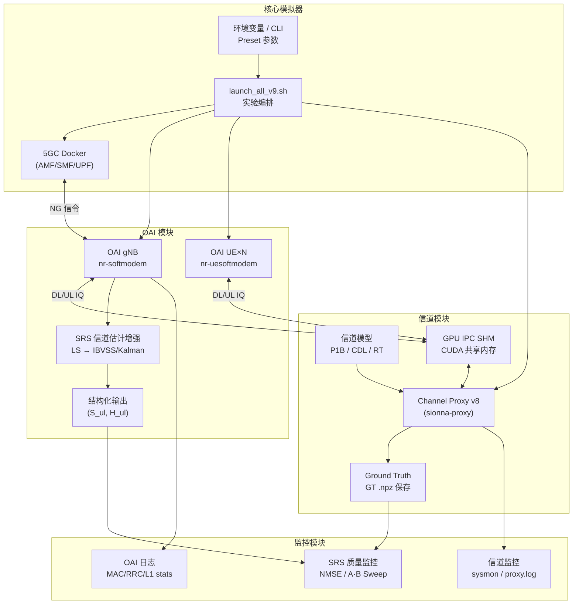
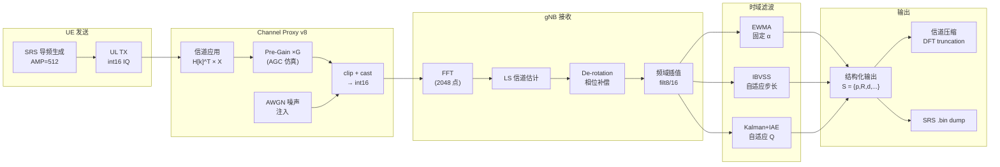
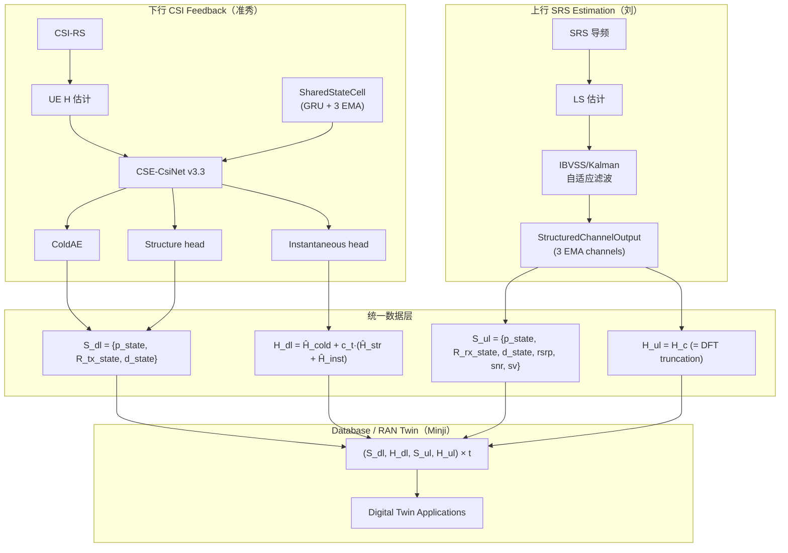

# OAI-Channel 统合模拟器 SRS 信道估计系统 — ALDLC 要求事项

| 字段 | 值 |
|------|----|
| **项目名称** | OAI-Channel 统合模拟器 (SRS Channel Estimation & Digital Twin) |
| **版本** | v1.1 |
| **日期** | 2026-05-27 |
| **编制** | 刘 |

---

## 1. 项目概述

### 1.1 服务愿景

在自主搭建的无线信道环境基础上，构建一个可控制/监控动作的 **标准兼容 OAI-Channel 统合模拟器**，并在此基础上实现高精度 SRS 上行信道估计及 Digital Twin 数据生产。

### 1.2 核心价值

1. **5G 标准兼容实时驱动**：基于 OAI 开源协议栈（gNB + UE），实现 NR SA full-stack 运行
2. **基于真实环境的无线信道模拟任意地域实验**：通过 Sionna Ray-Tracing / CDL 标准模型，可模拟任意目标地域的信道
3. **SRS 信道估计增强**：在 OAI gNB 物理层内部实现 EWMA / IBVSS / Kalman 等自适应时域滤波算法
4. **Digital Twin 数据桥梁**：结构化输出 `(S, H)` 与下行 CSI Feedback 格式对齐，供 RAN Twin 及 AI 模型使用

### 1.3 当前痛点

1. **OAI (C) ↔ 信道 (Python)**：不同编程语言间的输入输出接口统一困难 → 已通过 GPU IPC SHM 解决
2. **OAI (CPU) ↔ 信道 (GPU)**：跨芯片数据传递导致 OAI 动作同步不一致 → 已通过 futex 基 IPC V7/V8 解决
3. **int16 量化精度瓶颈**：rfsim 缺少 RF AGC，SRS 信号 RMS≈200，仅 7.6 有效比特 → NMSE 天花板 ~-22 dB → 通过 UL Pre-Gain 缓解
4. **信道估计底板**：Legacy filt8/16 单帧估计 NMSE ~-7 dB → 通过时域多帧滤波（IBVSS/Kalman）改善至 -11 dB
5. **结构化输出与下行对齐**：UL SRS 输出需与准秀 DL CSI Feedback 格式保持一致（consistent）→ 正在推进

---

## 2. 服务组成

### 2.1 动作组件

1. **OAI 模块**：5G 标准兼容 full-stack 动作模拟器（开源）— 单小区（single cell）
   - gNB（nr-softmodem）：基站侧，Band 78, 106 PRB, 2T2R / 4T4R
   - UE（nr-uesoftmodem）：终端侧，支持多 UE 同时接入
   - SRS 信道估计增强：LS → 频域插值 → 时域自适应滤波（EWMA/IBVSS/Kalman）
   - 结构化信道输出：`StructuredChannelOutput` → `(S_ul, H_ul)`

2. **信道模块**：PADP 插值、GPU 内存缓冲、信道数据生成及 OAI IQ 数据信道应用
   - Channel Proxy v8（Python/CuPy/TF，Docker 容器 `sionna-proxy`）
   - OAI-信道间输入输出缓冲（CUDA IPC）— 包含 OAI-信道间 GPU 输入输出缓冲契约
   - 信道模型输入：P1B Ray-Tracing / CDL-A~E / Sionna RT 场景
   - DL 广播 + UL 叠加 + AWGN 噪声注入
   - Ground Truth（GT）异步保存

3. **核心模拟器**：Pre-defined Preset API，RRC 设置参数输入控制
   - 5GC Docker Compose（AMF/SMF/UPF）
   - 通过环境变量和 CLI 参数进行 RRC/SRS 设置（Preset）
   - 实验编排：`launch_all_v9.sh` 统一管理（gNB + UE + Proxy + 5GC）

### 2.2 可视化组件

1. **监控模块**
   1. OAI 结果监控：`nrMAC_stats.log`（CQI/MCS/BLER）、`nrRRC_stats.log`、`nrL1_stats.log`
   2. 信道动作监控：`sysmon.csv`（CPU/RAM/GPU 1秒间隔）、Proxy 帧统计、`proxy.log`
   3. SRS 估计质量监控：NMSE 逐帧追踪、GT-SRS 对齐状态
   4. Attach 状态诊断：`attach_diag_v9.log`、`attach_result_v9.txt`

### 2.3 整体组件总图



---

## 3. 术语定义

| 术语 | 全称 | 说明 |
|------|------|------|
| SRS | Sounding Reference Signal | 5G NR 上行探测参考信号，用于信道估计 |
| LS | Least Squares | 最小二乘信道估计（基线方法） |
| MMSE | Minimum Mean Square Error | 最小均方误差信道估计 |
| EWMA | Exponentially Weighted Moving Average | 指数加权移动平均时域滤波 |
| IBVSS | Innovation-Based Variable Step-Size | 基于创新序列的变步长自适应滤波 |
| Kalman | Scalar Kalman Filter + IAE | 标量卡尔曼滤波 + 创新自适应估计 |
| NMSE | Normalized Mean Square Error | 归一化均方误差（信道估计质量指标） |
| PDP | Power Delay Profile | 功率延迟分布 |
| GT | Ground Truth | Sionna 信道模型产出的真值信道矩阵 |
| AGC | Automatic Gain Control | 自动增益控制 |
| IPC | Inter-Process Communication | GPU 共享内存进程间通信 |
| CDL | Clustered Delay Line | 3GPP 38.901 标准信道模型 |
| P1B | Phase 1B Ray-Tracing | Sionna 光线追踪信道数据 |

---

## 4. 核心功能要求事项（Functional Requirement）

### 4.1 核心模拟器输入输出设置

#### 4.1.1 目的

为研究员提供统一的实验编排接口，使其可通过配置核心网参数及信道/SRS 设置来执行实验。

#### 4.1.2 功能要求

1. 通过环境变量和 CLI 参数输入 Preset（`SRS_ESTIMATOR`、`SRS_2D_METHOD`、`UL_PRE_GAIN`、`CHANNEL_SEED` 等）
2. 基准 Preset 选择：算法模式（`legacy`/`ewma`/`ibvss`/`kalman`）、信道模型（P1B/CDL）、SNR、天线配置等
3. Preset 校验：参数有效性检查（正数、范围检查、互斥选项校验等）
4. 将校验通过的 Preset 传递给 OAI gNB/UE 和 Channel Proxy：
   ```
   环境变量 (UL_PRE_GAIN, SRS_ESTIMATOR, SRS_2D_METHOD, ...)
     → run_q4_snr_sweep_v9.sh
       → launch_all_v9.sh (-ulg, -snr, -ga, -ua, ...)
         → v8.py (--ul-pre-gain, --snr-dB, ...)
         → OAI gNB/UE (环境变量 → RRC/PHY 设置)
   ```
5. 5GC Docker Compose（AMF/SMF/UPF）自动健康检查及重启
6. 每次实验自动生成带时间戳的日志目录（`logs/<timestamp>_<tag>/`）

---

### 4.2 OAI 模块动作规则设置

#### 4.2.1 目的

OAI 基站/终端模块通过核心模拟器的 Preset 输入进行动作，并与信道模块联动实现统合运行。

#### 4.2.2 功能要求

1. 将核心模拟器的 Preset 作为输入，用作 RRC/PHY 设置值
   - `SRS_ESTIMATOR`：估计器类型选择（`legacy` / `mmse2d`）
   - `SRS_2D_METHOD`：时域算法选择（`ewma` / `ibvss` / `kalman`）
   - `SRS_PERIOD_SLOTS`：SRS 周期设置（默认 10）
2. OAI 模拟器模式（rfsimulator）运行中，对信道应用动作使用 OAI 外部的信道模块
   - `RFSIM_GPU_IPC_V8=1`：启用 GPU IPC 模式
   - Proxy 作为 IPC SERVER 创建 SHM；gNB/UE 作为 CLIENT 连接
   - 每个 UE 实例使用独立 SHM（`gpu_ipc_shm_ue0`、`gpu_ipc_shm_ue1`、...）
3. AGC 控制
   - `NR_DIGITAL_AGC_ENABLED=0`：禁用 OAI 数字 AGC（推荐）
   - 使用 Proxy 侧 UL Pre-Gain（`--ul-pre-gain G`），在 FFT 前进行时域增益
4. SRS 信道估计增强算法（OAI C 代码内实现）
   - LS 基线信道估计 + filt8/16 频域插值
   - 时域自适应滤波三选一（通过环境变量切换）：
     - **EWMA**：`H_smooth(t) = α·H_smooth(t-1) + (1-α)·H_new(t)`
     - **IBVSS**：基于创新序列的自动步长调整
     - **Kalman+IAE**：标量卡尔曼滤波，Innovation Adaptive Estimation（Fix1-5 鲁棒性强化）
   - De-rotation 相位补偿（CFO、timing drift）
5. 结构化信道输出（`StructuredChannelOutput`）：
   - 统一输出格式 `(S_ul, H_ul)` — 与下行 CSI Feedback 数据层对齐
   - S_ul 共享字段：`p_inst/p_state`（PDP）、`R_rx_inst/R_rx_state`（空间协方差）、`d_inst/d_state`（Doppler）、`confidence`
   - S_ul UL 独有字段：`rsrp`、`snr_db`、`doppler_hz`、`speed_ms`、`ds_rms_s`、`sv`
   - H_ul：`h_taps`（延迟域压缩 payload）+ `H_c`（全带 DFT 重建）
6. 性能要求：
   - 单次 SRS 处理延迟 < 1 ms
   - SNR=20 dB 时，Kalman NMSE ≤ -11 dB，IBVSS ≤ -9.6 dB
   - CDL 8/8 条件全部通过（ε=5%）

---

### 4.3 信道模块的信道数据生成/动作

#### 4.3.1 目的

生成所需信道并将其应用于通信仿真，同时生产 Ground Truth 真值数据。

#### 4.3.2 功能要求

1. 输入基站/终端位置，生成对应的 PADP 基础信道
   - 支持 P1B Ray-Tracing 信道数据（`.npz` 格式）
   - 支持 CDL-A/B/C/D/E 标准信道模型（基于 TR 38.901）
   - 通过 CLI 参数指定 SNR（`-snr`）、UE 数（`-n`）、天线配置（`-ga`/`-ua`）
   - 通过 `CHANNEL_SEED` 环境变量固定随机种子，确保实验可复现
2. 将生成的信道应用于 OAI 数据的 TX IQ 符号，生成 RX IQ 符号
   - 通过 GPU IPC 共享内存（`/tmp/oai_gpu_ipc`）交换 IQ 数据
   - DL 路径：gNB `dl_tx` → Proxy `H[k]×X` → UE `dl_rx`（每 UE 独立信道）
   - UL 路径：UE `ul_tx` → Proxy `H[k]^T×X` → gNB `ul_rx`（多 UE 叠加）
   - IPC 同步：基于 futex（V7/V8）
3. 多 UE MIMO 支持
   - 支持 N 个 UE 同时接入（当前验证：1~2 UE）
   - 支持 2×2 和 4×4 MIMO 天线配置
   - DL 广播：对 gNB 信号分别施加 N 个 UE 的独立信道
   - UL 叠加：N 个 UE 信号分别施加信道后合成送入 gNB
4. UL Pre-Gain（AGC 仿真）
   - `--ul-pre-gain G` 参数（默认 1.0）
   - 在 int16 量化前对 UL 信号施加固定增益，弥补 rfsim 缺少 RF AGC 的问题
   - 推荐 G=4（+12 dB SQNR 改善，FFT 输入 RMS 从 200 提升至 800）
5. 双源数据产出
   - Sionna GT（`.npz`）：Ground Truth 信道矩阵，异步保存（不阻塞主循环）
   - SRS dump（`.bin V2`）：OAI gNB 侧 SRS 信道估计结果（带 magic/RNTI）
   - 场景元数据：UE 位置、速度、信道类型等
6. 自动化 Sweep 框架
   - `run_q4_snr_sweep_v9.sh`：多 SNR 点自动扫参 + 后处理管线
   - 每次实验在 manifest 文件中记录完整实验参数

---

### 4.4 OAI/信道模块监控

#### 4.4.1 目的

对 OAI 动作和信道生成/动作进行可视化，并定量验证 SRS 信道估计质量。

#### 4.4.2 功能要求

1. OAI 基站/终端日志可视化
   - `nrMAC_stats.log`：CQI/PMI/RSRP/BLER/MCS 统计
   - `nrRRC_stats.log`：RRC 连接 UE 列表
   - `nrL1_stats.log`：PRB I0、PRACH I0 统计
   - `attach_diag_v9.log`：Attach 状态机诊断
2. 信道生成/应用阶段可提取值的可视化
   - `sysmon.csv`：1秒间隔 CPU/RAM/GPU 使用率
   - `proxy.log`：逐帧处理时间、IPC 状态、信道生成统计
   - Sionna GT 文件数和 SRS dump 文件数实时追踪
3. GT-SRS 对齐与 NMSE 评估管线
   - Sionna GT（`.npz`）与 OAI SRS dump（`.bin`）的 slot 配对
   - STO（Sampling Time Offset）校正 + LS 幅度对齐（per-antenna）
   - `eval_nmse_clean.py`：per-frame NMSE、p10/p50/p90 百分位统计
   - SNR vs NMSE 全景图
   - 固定 `CHANNEL_SEED=42` 确保公平比较
4. A/B Sweep 对比框架
   - 多 SNR 点（5/10/15/20/25/30/40 dB）自动扫参
   - 多算法（Legacy/EWMA/IBVSS/Kalman）同条件对比
   - 多信道条件验证：
     - CDL 标准模型：CDL-A/C/D × 静态/低速/中速/高速 = 8 条件
     - P1B Ray-Tracing：6 条件
     - 瞬态跟踪测试：4 条件
   - 通过准则：相对 Legacy NMSE 改善 > 0 dB，允许 ε=5% 容差

---

## 5. 非功能要求（Non-Functional Requirement）

### 5.1 性能要求

| 指标 | 要求 | 当前状态 |
|------|------|----------|
| SRS 处理延迟 | < 1 ms / SRS 块 | ✅ Legacy ~0.1 ms, IBVSS/Kalman ~0.3 ms |
| Proxy 每 slot 时间 | < 2.5 ms（2UE） | ✅ v4 2UE ~2.07 ms |
| GPU VRAM 占用 | < 24 GB（2UE 2×2） | ✅ v4 2UE ~20 GB |
| 实验可复现性 | 固定 seed 下结果一致 | ✅ CHANNEL_SEED=42 |

### 5.2 可扩展性要求

| 维度 | 当前 | 目标 |
|------|------|------|
| UE 数量 | 1~2 | 3~5 |
| MIMO 配置 | 2×2 / 4×4 | 4×4 常态化 |
| 信道模型 | P1B + CDL | + Sionna RT 场景 |
| 时域算法 | EWMA/IBVSS/Kalman | + 2D 可分离 MMSE |

### 5.3 兼容性要求

- OAI 代码修改不影响原始 Legacy 路径（通过环境变量切换）
- 结构化输出类向后兼容旧接口
- Proxy 支持 v0~v8 多版本切换

---

## 6. 系统架构详图

### 6.1 信号处理全链路



### 6.2 上下行统一数据架构



---

## 7. 当前开发进度

| 模块 | 状态 | 完成度 |
|------|------|--------|
| Channel Proxy v8（GPU IPC, Multi-UE MIMO） | ✅ 完成 | 95% |
| UL Pre-Gain（AGC 仿真） | ✅ 已实现，待端到端验证 | 80% |
| OAI C 端 EWMA 滤波器 | ✅ 完成 | 100% |
| OAI C 端 IBVSS 滤波器 | ✅ 完成 | 100% |
| OAI C 端 Kalman + IAE | ✅ C 移植完成，待 CMake 编译验证 | 90% |
| Python StructuredChannelOutput | ✅ prototype 完成 | 85% |
| 输出格式规范（output_format_spec.md） | ✅ 完成 | 100% |
| GT-SRS 对齐与 NMSE 评估 | ✅ 完成 | 95% |
| SNR Sweep 自动化 | ✅ 完成 | 100% |
| C 端结构化输出 | 📋 计划中 | 0% |
| AI 特征提取 | 📋 未来方向 | 0% |
| AI 模型训练 | 📋 未来方向 | 0% |
| RAN Twin 部署 | 📋 未来方向 | 0% |

---

## 8. 未来扩展方向

| 阶段 | 内容 | 时间线 |
|------|------|--------|
| 阶段二收尾 | 2D 可分离 MMSE（频域 Wiener + 时域 Wiener） | 2026 Q3 |
| 阶段三 | 特征提取体系固化（PDP/Cov/SVD/Doppler → State Sample） | 2026 Q3-Q4 |
| 阶段四 | AI 模型训练（MLP/CNN/Transformer）+ RAN Twin 集成 | 2026 Q4+ |
| 长期 | Sim-to-Real 验证、在线适应、Fingerprint/Session Resumption | 2027+ |
