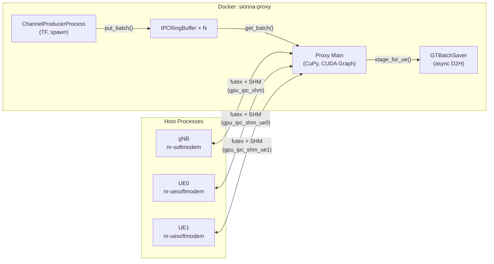
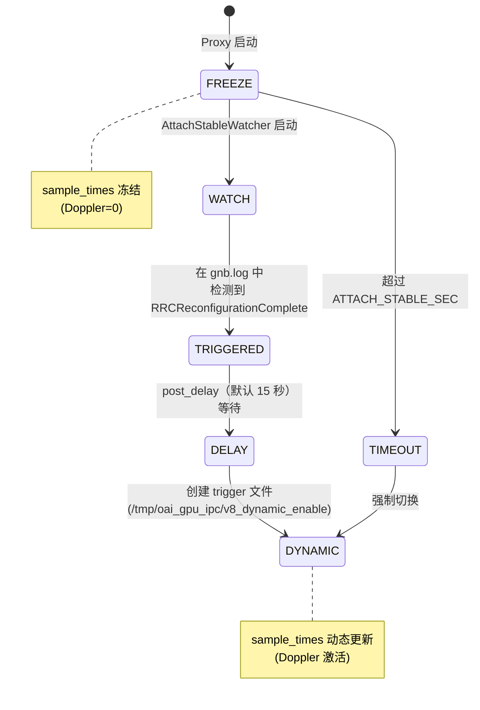
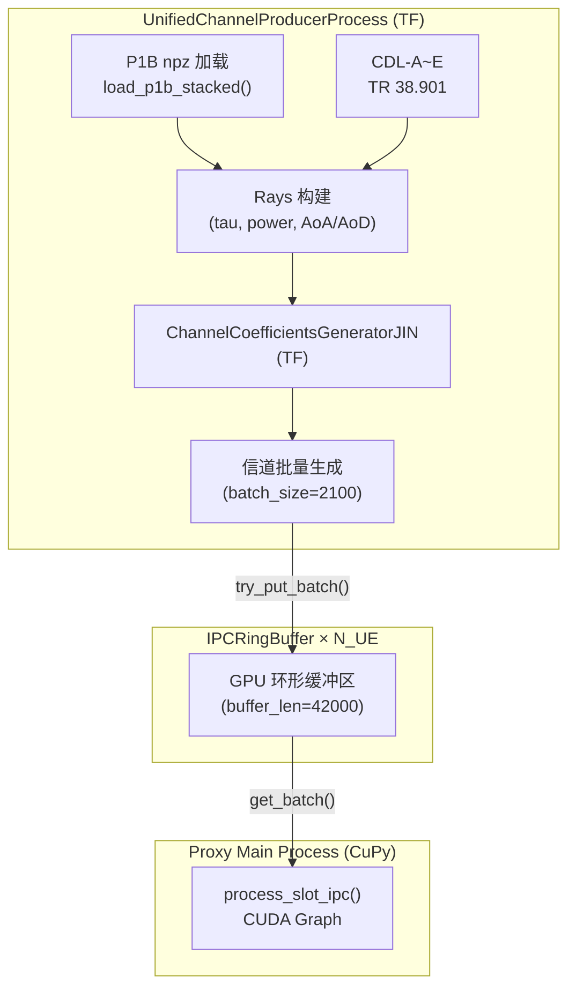
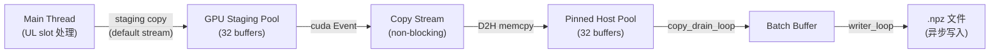
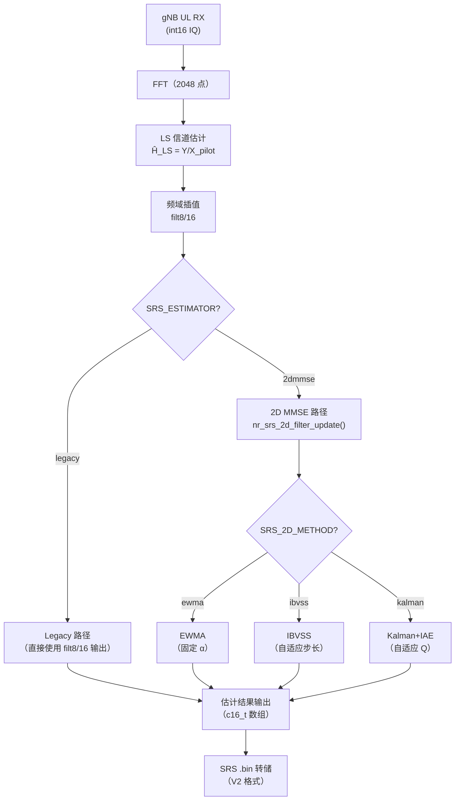
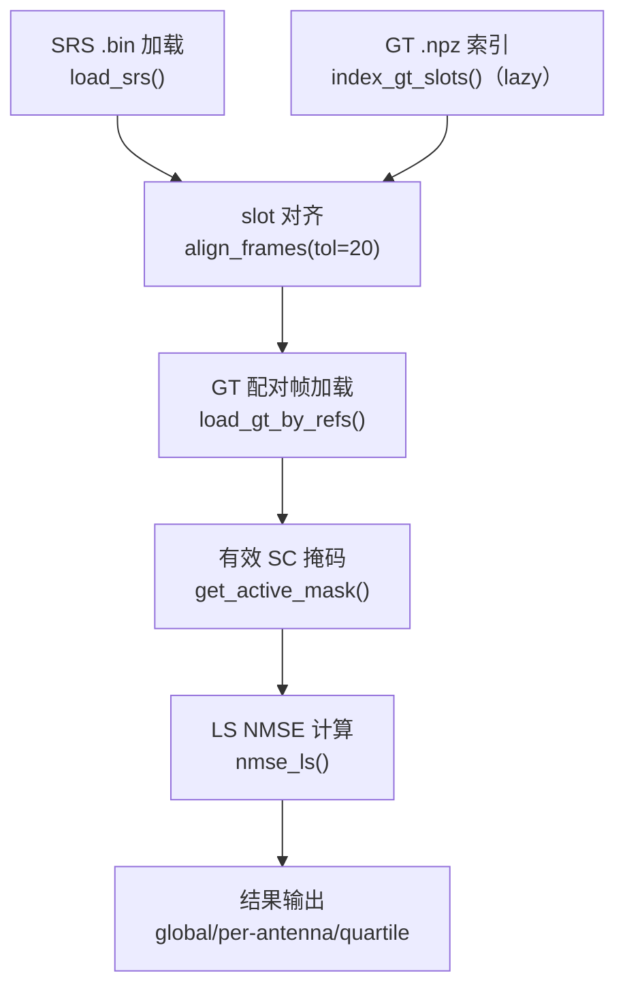
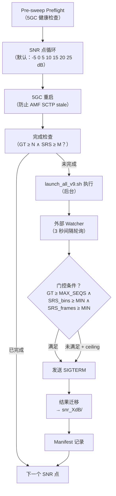

# OAI-Channel 统合仿真器设计说明书 — ALDLC Spec

| 项目 | 值 |
|------|----|
| **项目名称** | OAI-Channel 统合仿真器 (SRS Channel Estimation & Digital Twin) |
| **版本** | v1.0 |
| **日期** | 2026-05-27 |
| **编写** | Lu |
| **关联文档** | `SRS_ALDLC_요구사항.md` (What), 本文档 (How) |

---

## 1. 文档范围

本文档是针对 `SRS_ALDLC_요구사항.md` 中定义的功能/非功能需求，阐述**如何实现** (How) 的设计说明书 (Specification)。

需求文档整理了"从外部视角来看需要的功能 (What)"，而本文档包含以下内容：

- 各模块内部架构及接口规格
- 数据格式及协议定义
- 算法详细设计（公式、参数、状态机）
- 文件/目录结构及构建体系
- 实验自动化流水线工作流

---

## 2. 系统整体架构

### 2.1 部署拓扑

```
┌──────────────────────── Host (Ubuntu, NVIDIA GPU) ────────────────────────┐
│                                                                           │
│  ┌─────────────────────────────────────────────────────────┐              │
│  │  Docker: sionna-proxy                                   │              │
│  │  ┌───────────────────────────────────────────────┐      │              │
│  │  │ v8.py (Python/TF/CuPy)                        │      │              │
│  │  │  ├─ UnifiedChannelProducerProcess (spawn)      │      │              │
│  │  │  ├─ IPCRingBuffer × N_UE                       │      │              │
│  │  │  ├─ GTBatchSaver (async D2H pipeline)          │      │              │
│  │  │  └─ NoiseProducer                              │      │              │
│  │  └───────────────────────────────────────────────┘      │              │
│  └──────────────────┬──────────────────────────────────────┘              │
│                     │ CUDA IPC SHM (/tmp/oai_gpu_ipc/)                    │
│  ┌──────────────────┴──────────────────────────────────────┐              │
│  │  Host Processes (OAI C)                                  │              │
│  │  ┌──────────────┐  ┌──────────────┐                      │              │
│  │  │ nr-softmodem  │  │nr-uesoftmodem│ × N_UE              │              │
│  │  │ (gNB)         │  │ (UE)         │                      │              │
│  │  └──────────────┘  └──────────────┘                      │              │
│  └──────────────────────────────────────────────────────────┘              │
│                                                                           │
│  ┌───────────────────────────────────┐                                    │
│  │  Docker Compose: 5GC              │                                    │
│  │  AMF / SMF / UPF / MySQL          │                                    │
│  └───────────────────────────────────┘                                    │
└───────────────────────────────────────────────────────────────────────────┘
```

### 2.2 进程间通信结构



### 2.3 目录结构

```
OAI_luuuuuu/
├── DevChannelProxyJIN/
│   ├── openairinterface5g_whan/           # OAI 源码（修改版）
│   │   ├── openair1/PHY/NR_ESTIMATION/
│   │   │   ├── nr_ul_channel_estimation.c # SRS 估计调度器（修改）
│   │   │   ├── nr_srs_2d_filter.c         # 时域自适应滤波器（新增）
│   │   │   ├── nr_srs_2d_filter.h         # 2D 滤波器头文件（新增）
│   │   │   └── nr_srs_mmse.c              # MMSE 相关（修改）
│   │   ├── cmake_targets/ran_build/build/ # 构建产物
│   │   ├── targets/PROJECTS/.../CONF/     # gNB/UE 配置文件
│   │   └── doc/tutorial_resources/oai-cn5g/
│   │       └── docker-compose.yaml        # 5GC 容器
│   ├── vRAN_Socket/G1C_MultiUE_MIMO_Channel_Proxy/
│   │   ├── v8.py                          # Channel Proxy 主程序
│   │   ├── channel_coefficients_JIN.py    # 信道系数生成器
│   │   ├── launch_all_v9.sh               # 统一启动器
│   │   ├── run_q4_snr_sweep_v9.sh         # SNR Sweep 自动化
│   │   ├── eval_nmse_clean.py             # NMSE 评估
│   │   ├── digital_twin_stats.py          # GT 索引/加载
│   │   ├── srs_2d_mmse.py                 # Python 参考实现
│   │   ├── preflight.sh                   # 环境清理脚本
│   │   └── test_ibvss_*.py                # IBVSS 单元测试
│   ├── logs/                              # 实验日志根目录
│   │   ├── latest -> （最近运行软链接）
│   │   └── q4_sweep_YYYYMMDD_HHMMSS/      # Sweep 结果
│   └── P1B_Valid_Results/                 # P1B Ray-Tracing 数据
├── SRS_ALDLC_요구사항.md                   # 需求文档 (What)
├── SRS_ALDLC_설계명세서.md                  # 韩文设计说明书 (How)
├── SRS_ALDLC_设计说明书_中文版.md            # 本文档 (How)
└── output_format_spec.md                  # 输出格式规范
```

---

## 3. 各模块设计规格

### 3.1 核心仿真器（实验编排层）

#### 3.1.1 参数传递体系

```
环境变量 (UL_PRE_GAIN, SRS_ESTIMATOR, SRS_2D_METHOD, ...)
  │
  ▼
run_q4_snr_sweep_v9.sh          ← Sweep 自动化（多 SNR 点循环）
  │  环境变量 + CLI 参数组合
  ▼
launch_all_v9.sh                ← 统一启动器（单次实验）
  │
  ├─→ v8.py (Docker exec)      ← --ul-pre-gain, --snr-dB, --seed, ...
  ├─→ nr-softmodem (Host)      ← 环境变量 SRS_ESTIMATOR, SRS_2D_METHOD, ...
  └─→ nr-uesoftmodem (Host)    ← 环境变量 RFSIM_GPU_IPC_V8=1
```

#### 3.1.2 `launch_all_v9.sh` 启动器规格

| 项目 | 规格 |
|------|------|
| 位置 | `G1C_MultiUE_MIMO_Channel_Proxy/launch_all_v9.sh` |
| 执行权限 | 需要 `sudo`（CUDA IPC、进程管理） |
| 进程启动顺序 | 5GC 健康检查 → Preflight 环境清理 → SHM 初始化 → Proxy 启动 → gNB 启动 → UE 启动 → Attach Stable Watcher |
| 关闭顺序 | SIGINT → gNB（SRS partial flush 等待最多 12 秒）→ Proxy SIGTERM → Hard-kill → GT 数据迁移 |
| 日志目录 | `logs/YYYYMMDD_HHMMSS_G1C_v8_ipc_<tag>/` |
| GT 存储路径 | `/tmp/oai_gpu_ipc/sionna_gt/` → 结束时迁移至日志目录 |

**CLI 参数汇总：**

| 参数 | 默认值 | 说明 |
|------|--------|------|
| `-v VERSION` | `v8` | Proxy 版本（执行 `v8.py`） |
| `-m MODE` | `gpu-ipc` | 通信模式（`gpu-ipc` / `socket`） |
| `-n NUM_UES` | `1` | 同时接入 UE 数 |
| `-snr dB` | off | AWGN 相对 SNR |
| `-ulg G` | `1.0` | UL Pre-Gain 倍数 |
| `-ga Nx Ny` | `2 1` | gNB 天线阵列（横×纵） |
| `-ua Nx Ny` | `2 1` | UE 天线阵列 |
| `-mf N` | off | 采集 N 帧后自动停止 |
| `-seed N` | （无） | 信道随机种子 |
| `-speed M/S` | `3` | UE 移动速度（m/s） |
| `-stable SEC` | `300` | Attach 稳定化最大时间 |

#### 3.1.3 Attach 稳定化机制



| 参数 | 默认值 | 说明 |
|------|--------|------|
| `ATTACH_STABLE_MODE` | `auto` | `auto`：基于触发器，`time`：固定时间 |
| `ATTACH_STABLE_TRIGGER` | `rrc_reconfig` | `rrc_reconfig` / `srs` / `off` |
| `ATTACH_STABLE_POST_DELAY` | `15` 秒 | 触发检测后 dynamic handoff 延迟 |
| `ATTACH_STABLE_SEC` | `300` 秒 | 最大冻结时间（fallback ceiling） |

---

### 3.2 信道模块（Channel Proxy v8）

#### 3.2.1 架构概要

| 项目 | 规格 |
|------|------|
| 源文件 | `v8.py`（约 4200 行） |
| 运行时 | Docker `sionna-proxy`（Python 3, TensorFlow, CuPy） |
| 进程模型 | 主进程（CuPy）+ ChannelProducer（TF, `multiprocessing.spawn`） |
| GPU 通信 | CUDA IPC Shared Memory（futex 同步，V8 协议） |
| 信道应用 | `process_slot_ipc()` — CUDA Graph 加速（Relaxed 模式） |

#### 3.2.2 信道生成流水线



**信道系数生成器（`ChannelCoefficientsGeneratorJIN`）：**

| 参数 | 值 | 说明 |
|------|------|------|
| `carrier_frequency` | 3.5 GHz | NR Band 78 |
| `scs` | 30 kHz | Numerology 1 |
| `FFT_SIZE` | 2048 | OFDM FFT 大小 |
| `N_SYM` | 14 | 每 slot OFDM 符号数 |
| `Speed` | 3 m/s（默认） | UE 移动速度 |
| `batch_size` | 2100 | 信道生成批量大小 |
| `buffer_len` | 42000 | 环形缓冲区长度（20 倍） |

**P1B Ray-Tracing 数据结构：**

```python
ray_data = {
    'tau':     ndarray,  # (1, 1, N_UE, 1, 400) — 延迟（秒）
    'power':   ndarray,  # (1, 1, N_UE, 1, 400) — 线性功率
    'phi_r':   ndarray,  # (1, 1, N_UE, 1, 400) — RX 方位角（rad）
    'phi_t':   ndarray,  # (1, 1, N_UE, 1, 400) — TX 方位角（rad）
    'theta_r': ndarray,  # (1, 1, N_UE, 1, 400) — RX 天顶角（rad）
    'theta_t': ndarray,  # (1, 1, N_UE, 1, 400) — TX 天顶角（rad）
}
```

#### 3.2.3 GPU IPC 共享内存协议（V8）

**SHM 文件布局：**

```
/tmp/oai_gpu_ipc/
├── gpu_ipc_shm        ← gNB 专用（DL TX / UL RX 兼用）
├── gpu_ipc_shm_ue0    ← UE0 专用（DL RX / UL TX）
├── gpu_ipc_shm_ue1    ← UE1 专用
└── v8_dynamic_enable  ← Attach stable 触发文件
```

**同步协议（基于 futex）：**

```
┌──────────┐                    ┌──────────┐
│ OAI      │                    │ Proxy    │
│ (Client) │                    │ (Server) │
└────┬─────┘                    └────┬─────┘
     │                               │
     │  1. SHM 连接（IPC handle）     │
     │  ◄────────────────────────────│  SHM 创建
     │                               │
     │  2. TX 数据写入（int16 IQ）    │
     │  ───────────────────────────►│
     │  3. futex WAKE (tx_ready)     │
     │  ───────────────────────────►│
     │                               │  4. 信道应用 H[k]×X
     │                               │  5. RX 数据写入
     │  6. futex WAIT (rx_ready)     │
     │  ◄────────────────────────────│  futex WAKE
     │  7. RX 数据接收               │
     └───────────────────────────────┘
```

**IPC 时间戳 slot 匹配：**
- TX 头部：`(size, nb_ant, timestamp, frame, subframe)`
- 头部格式：`<I I Q I I`（little-endian，24 字节）
- gNB DL timestamp → UE DL timestamp 匹配
- UE UL timestamp → gNB UL timestamp 匹配

#### 3.2.4 DL/UL 信号处理路径

**DL（下行）路径 — Broadcast：**

```python
for ue_idx in range(N_UE):
    H_ue = channels_dl[ue_idx]           # (N_ue_ant, N_gnb_ant, FFT)
    rx_freq = H_ue × gnb_tx_freq         # 频域信道应用
    rx_iq = IFFT(rx_freq) + noise        # 时域变换 + 噪声
    cast_to_int16(rx_iq) → ue[idx].dl_rx # int16 量化
```

**UL（上行）路径 — Superposition：**

```python
gnb_ul_rx = zeros(N_gnb_ant, FFT)
for ue_idx in active_set:
    H_ue = channels_ul[ue_idx]           # (N_gnb_ant, N_ue_ant, FFT)
    rx_freq = H_ue.T × ue_tx_freq       # H^T × X（转置）
    gnb_ul_rx += rx_freq                 # 多 UE 信号叠加

gnb_ul_rx *= UL_PRE_GAIN                # Pre-Gain 应用
gnb_ul_rx += noise                      # AWGN 注入
clip_cast_int16(gnb_ul_rx) → gnb.ul_rx  # int16 量化
```

#### 3.2.5 UL Pre-Gain 详细设计

| 项目 | 规格 |
|------|------|
| 目的 | 缓解因 rfsim 缺少 RF AGC 导致的 int16 量化精度瓶颈 |
| 应用位置 | UL 路径，`clip_cast_int16` 之前 |
| 参数 | `--ul-pre-gain G`（默认 1.0） |
| 推荐值 | G=4（约 +12 dB SQNR 改善） |
| 公式 | `rx_int16 = clip(round(rx_float × G), -32768, 32767)` |
| 效果 | FFT 输入 RMS 200→800，有效比特 7.6→9.6 |

#### 3.2.6 Ground Truth 异步保存（v8 新增）



**GT `.npz` 文件格式：**

| 字段 | 类型 | 形状 | 说明 |
|------|------|------|------|
| `h_matrix` | complex64 | `(batch, n_sym, gnb_ant, ue_ant, fft)` | 信道矩阵 |
| `slot_ids` | int64 | `(batch,)` | slot 索引 |
| `bypass_flags` | bool | `(batch,)` | 是否 bypass |
| `symbol_indices` | int32 | `(n_sym,)` | 符号索引 |
| `gnb_ant` | int32 | scalar | gNB 天线数 |
| `ue_ant` | int32 | scalar | UE 天线数 |
| `fft_size` | int32 | scalar | FFT 大小 |

**保存周期：** `--gt-save-every N`（默认 100）— 每第 N 个 UL slot 捕获 GT

---

### 3.3 OAI 模块 SRS 信道估计增强

#### 3.3.1 SRS 估计完整流水线



#### 3.3.2 修改文件及关联关系

| 文件 | 角色 | 修改类型 |
|------|------|----------|
| `nr_ul_channel_estimation.c` | SRS 估计调度器 | 已有文件修改 — 添加 `NR_SRS_EST_MMSE2D` 分支 |
| `nr_srs_2d_filter.h` | 2D 滤波器头文件 | 新增 |
| `nr_srs_2d_filter.c` | 时域自适应滤波器主体（约 1230 行） | 新增 |
| `nr_srs_mmse.c` | MMSE 相关工具 | 已有文件修改 |

#### 3.3.3 数据结构规格

**Per-Subcarrier 状态（`ewma_state_t`）：**

```c
typedef struct {
  float r;          // 平滑后实部
  float i;          // 平滑后虚部
  uint32_t count;   // 更新次数（warm-up 判定用）
} ewma_state_t;
```

内存：`4 RX × 4 TX × 8192 SC × 12 bytes = 1.5 MB`（静态分配）

**Per-Antenna 状态（`kalman_state_t` — 最复杂的状态）：**

```c
typedef struct {
  float K;               // Kalman 增益（= alpha 等价）
  float P;               // 后验协方差
  float Q;               // 过程噪声估计
  float innov_smooth;    // 创新功率 EMA
  float c_model_est;     // 信道模型估计（even-odd pair）
  uint32_t frame_count;
  uint32_t outlier_count;     // Fix3：异常值计数器
  float P_prev;               // Fix1：收敛检测用
  uint8_t use_riccati;        // Fix1：0=IBVSS warm-up, 1=Riccati
  uint8_t consecutive_match;  // Fix1：debounce 计数器
  int64_t last_abs_slot;      // Fix2：自适应 dt
  int64_t expected_period;    // Fix2：SRS 周期自动检测
  int64_t gap_history[10];    // Fix2：间隔历史
  uint8_t gap_count;
  uint8_t initialized;
} kalman_state_t;
```

#### 3.3.4 算法详细 — EWMA

**公式：**

```
H_smooth(t) = α · H_smooth(t-1) + (1 - α) · H_new(t)
```

| 参数 | 环境变量 | 默认值 | 范围 |
|------|----------|--------|------|
| α | `SRS_2D_ALPHA` | 0.9 | (0, 1) |
| warm-up | `SRS_2D_N_WARM` | 3 | ≥ 0 |

warm-up 期间直接输出输入（不应用滤波）。

#### 3.3.5 算法详细 — IBVSS（Innovation-Based Variable Step Size）

**核心原理：**
利用 Kalman 稳态下 `innov_smooth / R_est = 1 / (1 - α_opt)` 的关系，自动跟踪最优 α。

**2-Pass 结构：**

```
Pass 1：遍历所有子载波
  ├─ 内积（inner product）→ 提取 de-rotation 相位
  └─ even-odd pair → R_est（噪声功率估计）

Pass 2：遍历所有子载波
  ├─ De-rotation：H_derot = H_obs × conj(rot)
  ├─ Innovation：diff = H_derot - H_smooth
  ├─ EMA 更新：H_smooth += α × diff
  ├─ Per-band 创新功率 → 中位数（8 band，频率选择性鲁棒化）
  └─ α 更新：ratio = innov_smooth / R_est
             α = 1 - 1/ratio（clamped）
```

| 参数 | 环境变量 | 默认值 | 说明 |
|------|----------|--------|------|
| α 初始值 | `SRS_2D_IBVSS_ALPHA_INIT` | 0.5 | 初始步长 |
| α 下限 | `SRS_2D_IBVSS_ALPHA_MIN` | 0.02 | 最小步长 |
| α 上限 | `SRS_2D_IBVSS_ALPHA_MAX` | 0.98 | 最大步长 |
| 创新 EMA | `SRS_2D_IBVSS_INNOV_EMA` | 0.15 | 创新功率平滑系数 |
| warm-up | `SRS_2D_IBVSS_WARMUP` | 20 | warm-up 帧数 |
| 自适应 c_model | `SRS_2D_IBVSS_ADAPTIVE_CMODEL` | 1 (on) | even-odd 信道模型自适应 |

**自适应 c_model 估计：**

```
c_model = (|H_smooth[2k] - H_smooth[2k+1]|² / 4) - noise_bias
noise_bias = α / (2·(2-α)) · R_est
```

#### 3.3.6 算法详细 — Scalar Kalman + IAE（Fix1-5）

**核心公式（Riccati 递推）：**

```
P_pred = P + Q                    // 预测协方差
K = P_pred / (P_pred + R)         // Kalman 增益
H_smooth += K × innovation       // 状态更新
P = (1 - K) × P_pred             // 后验协方差
Q_est = innov_smooth - P - R      // IAE：Q 估计
Q = EMA(Q, max(Q_est, Q_floor))  // Q 平滑 + 下限钳位
```

**Fix1-5 鲁棒化：**

| Fix | 问题 | 解决方案 |
|-----|------|----------|
| Fix1 | Riccati 过早切换时 P_pred 发散 | warm-up 期间使用 IBVSS，P_pred 收敛检测后 debounce 切换 |
| Fix2 | SRS 间隔不均匀时 Q 低估 | 基于 `abs_slot` 的 dt 自适应，周期自动检测（`gap_history`） |
| Fix3 | 异常值 innov spike | `innov / innov_smooth > 10` 时增加 outlier 计数器，抑制更新 |
| Fix4 | Q_floor 过低 | `Q_floor = R × 0.001` 下限保证 |
| Fix5 | 初始 P 不稳定 | `P = 1.0` 初始化，warm-up 最小/最大帧数分离 |

| 参数 | 环境变量 | 默认值 |
|------|----------|--------|
| α 下限 | `SRS_2D_KALMAN_ALPHA_MIN` | 0.02 |
| α 上限 | `SRS_2D_KALMAN_ALPHA_MAX` | 0.98 |
| 创新 EMA | `SRS_2D_KALMAN_INNOV_EMA` | 0.15 |
| Q EMA | `SRS_2D_KALMAN_Q_EMA` | 0.10 |
| warm-up 最小 | `SRS_2D_KALMAN_WARMUP_MIN` | 10 |
| warm-up 最大 | `SRS_2D_KALMAN_WARMUP_MAX` | 50 |
| debounce | `SRS_2D_KALMAN_DEBOUNCE` | 3 |

#### 3.3.7 De-rotation 相位补偿

所有自适应算法（Adaptive、IBVSS、Kalman）共同使用：

```
inner = Σ_sc (H_new[sc] × conj(H_smooth[sc]))
rot = inner / |inner|                          // 单位相位向量
H_derot[sc] = H_new[sc] × conj(rot)           // CFO/timing drift 补偿
```

目的：消除 SRS 帧间因 CFO（Carrier Frequency Offset）和 timing drift 引起的相位旋转，保证时域滤波的精度。

#### 3.3.8 Even-Odd Pair SNR 估计

```
P_plus  = Σ |H[2k] + H[2k+1]|² / (4·N_pairs)  ≈ |H|² + σ²
P_minus = Σ |H[2k] - H[2k+1]|² / (4·N_pairs)  ≈ c_model + σ²
R_est   = 2 × (P_minus - c_model)               // 噪声功率
SNR_lin = (P_plus - P_minus) / (P_minus - c_model)
```

利用相邻子载波对的和/差，无需额外噪声基准即可实时估计 SNR 和噪声功率。

#### 3.3.9 SRS 周期自动调整（Offset 溢出防护）

TDD 10-slot 帧（DDDDDDDXUU）中只有 2 个 full UL slot（slot 8、9），因此 uid≥2 时 offset 会超出请求周期的合法范围，导致 ASN.1 编码失败（segfault）。

**修改内容（`configure_periodic_srs()` in `nr_radio_config.c`）：**

从 3GPP TS 38.331 候选周期表中，自动选择同时满足 `check_periodicity()` **和** `offset < period` 的最小周期：

```c
static const int srs_periods[] = {4, 5, 8, 10, 16, 20, 32, 40, 64, 80, 160, 320, 640, 1280, 2560};
int selected_period = 2560;
for (int i = 0; i < sizeof(srs_periods)/sizeof(srs_periods[0]); i++) {
  if (check_periodicity(srs_periods[i], ideal_period, fs) && offset < srs_periods[i]) {
    selected_period = srs_periods[i];
    break;
  }
}
```

**`SRS_PERIOD_SLOTS=10`，TDD 10-slot 运行示例：**

| uid | offset | 选择的周期 | 备注 |
|-----|--------|-----------|------|
| 0 | 8 | sl10 | 正常（8 < 10） |
| 1 | 9 | sl10 | 正常（9 < 10） |
| 2 | 18 | **sl20** | 自动提升（18 < 20） |
| 3 | 19 | **sl20** | 自动提升（19 < 20） |

周期调整时输出 `LOG_W` 警告：`SRS period adjusted for uid 2: requested=10 selected=20 offset=18`

#### 3.3.10 Gap 检测与重置

```c
#define SRS_2D_GAP_THRESHOLD 500  // slot

if (abs_slot - last_abs_slot > GAP_THRESHOLD) {
    // 信道不相关 → 全面重置状态
    nr_srs_2d_filter_reset();
}
```

当 SRS slot 间隔超过 500 时，判定信道不相关，全面初始化滤波器状态。

#### 3.3.11 SRS .bin 转储格式（V2）

```
[文件头 — 32 字节]
  magic:    0x53525331 ("SRS1")        uint32
  version:  2                           uint32
  rx:       接收天线数                   uint32
  tx:       发送天线数                   uint32
  n_sc:     子载波数                    uint32
  n_frames: 帧数                       uint32
  pad:      8 字节保留

[帧 × n_frames]
  frame_id:  uint32
  slot_id:   uint32
  rnti:      uint16
  pad:       uint16
  iq_data:   int16[rx × tx × n_sc × 2]  (I/Q 交织)
```

每文件最多 `MAX_DUMP_FRAMES = 100` 帧，按序列号分割（`srs_matrix_gNB_RxTx_seq*.bin`）。

---

### 3.4 监控模块

#### 3.4.1 GT-SRS 对齐及 NMSE 评估

**`eval_nmse_clean.py` 工作流：**



**NMSE 计算方法：**

```
per-antenna α（LS 对齐）：
  α_i = <G_i, S_i> / <G_i, G_i>     （每天线最优缩放）
  NMSE_i = |S_i - α_i·G_i|² / |α_i·G_i|²

global α：
  α = <G, S> / <G, G>                （整体信道矩阵的单一缩放）
  NMSE = |S - α·G|² / |α·G|²
```

**GT-SRS 唯一配对（`_pair_unique_nearest()`）：**

由于 SRS 周期（20 slots）与 GT 保存周期（100 slots）存在倍数差，多个 SRS 帧会重复匹配到同一 GT 帧。为此新增唯一配对逻辑：对每个 GT 帧搜索最近的未使用 SRS 帧，用 `used_srs` 集合保证 1:1 配对。

| 指标 | 修复前 | 修复后 |
|------|--------|--------|
| paired | 275 | **105** |
| unique GT | 105 | **105** |
| 重复 GT | 170 | **0** |
| Q4-Q1 drift | +2.6 dB (WARNING) | **+2.0 dB (stable)** |

**时间稳定性分析：** 将全部帧按四分位划分，比较 Q1~Q4 各自 NMSE 中位数。Q4-Q1 drift > 2 dB 时发出警告。

**SFN Unwrap：** `frame_id × 20 + slot_id`，10240-frame wrap 检测/修正。

#### 3.4.2 SNR Sweep 自动化

**`run_q4_snr_sweep_v9.sh` 工作流：**



**门控条件：**

| 条件 | 默认值 | 说明 |
|------|--------|------|
| `MAX_FRAMES` | 300 | GT `.npz` 文件数 ≥ `ceil(MAX_FRAMES/100)` |
| `MIN_SRS_BINS` | 1 | SRS `.bin` 文件数 ≥ 1 |
| `MIN_SRS_FRAMES` | `MAX_FRAMES` | SRS 头部 `n_frames` 总和 ≥ MAX_FRAMES |
| `HARD_CEILING_SEC` | 900 | 单个 SNR 点最大挂钟时间 |

**Manifest 字段名：** `n_gt` → `n_gt_files`（明确表示是 GT npz 文件数而非 GT 帧数）。

**结果目录结构：**

```
logs/q4_sweep_YYYYMMDD_HHMMSS/
├── sweep_manifest.txt              ← 整体 Sweep 摘要
├── snr_m5dB/                       ← SNR = -5 dB
│   ├── gnb.log
│   ├── proxy.log
│   ├── attach_diag_v9.log
│   ├── srs_matrix_gNB_2x2_seq0.bin
│   ├── srs_matrix_gNB_2x2_seq1.bin
│   └── sionna_gt/
│       ├── gt_batch_ue0_seq0.npz
│       └── gt_batch_ue0_seq1.npz
├── snr_0dB/
├── snr_5dB/
└── ...
```

---

## 4. 结构化输出格式规格

### 4.1 统一输出元组 `(S, H)`

DL CSI Feedback 和 UL SRS 流水线均输出相同的 `(S, H)` 结构，下游 DB/RAN Twin 可无需格式分支直接采集。

### 4.2 结构 S — 共享字段

| 字段 | 类型 | 形状 | 单位 | 说明 |
|------|------|------|------|------|
| `p_inst` | real ndarray | `(N_tap,)` | 线性功率 | 瞬时 PDP（当前帧） |
| `p_state` | real ndarray | `(N_tap,)` | 线性功率 | EMA 累积 PDP（长期延迟结构） |
| `R_rx_inst` | complex ndarray | `(N_rx, N_rx)` | — | 瞬时空间协方差 |
| `R_rx_state` | complex ndarray | `(N_rx, N_rx)` | — | EMA 累积空间协方差 |
| `d_inst` | real ndarray | `(L_lag,)` | [0,1] | 瞬时时间自相关 |
| `d_state` | real ndarray | `(L_lag,)` | [0,1] | EMA 累积时间相干性 |
| `confidence` | float | scalar | [0,1] | 可信度门控 |

### 4.3 结构 S — UL 专用字段

| 字段 | 类型 | 形状 | 单位 | 说明 |
|------|------|------|------|------|
| `rsrp` | float | scalar | 线性功率 | 参考信号接收功率 |
| `snr_db` | float | scalar | dB | SNR（even-odd pair 估计） |
| `doppler_hz` | float | scalar | Hz | Doppler 频率 |
| `speed_ms` | float | scalar | m/s | UE 速度（`fd·c/fc`） |
| `ds_rms_s` | float | scalar | 秒 | RMS 延迟扩展 |
| `sv` | real ndarray | `(min(Nr,Nt),)` | 线性 | 宽带平均奇异值 |

### 4.4 压缩信道 H

| 字段 | 类型 | 形状 | 说明 |
|------|------|------|------|
| `h_taps` | complex ndarray | `(N_rx, N_tx, 2·N_tap)` | 延迟域有效抽头（存储 payload） |
| `H_c` | complex ndarray | `(N_rx, N_tx, N_sc)` | 全带 DFT 重建（评估/可视化用） |

**压缩/重建关系：**

```
h_taps = concat(h_time[..., :N_tap], h_time[..., -N_tap:])  // 压缩
H_c    = FFT(zero_pad(h_taps, N_sc))                         // 重建
```

### 4.5 EMA 累积规约

```
x_state[t] = (1 - α) · x_state[t-1] + α · x_inst[t]
```

| | UL（本项目） |
|--|--------------|
| 速率类型 | 固定（信号处理） |
| 默认值 | α_p=0.10, α_R=0.05, α_d=0.15 |
| 初始化 | 首帧复制 |

### 4.6 Doppler 自相关规约

```
d_inst[τ] = |⟨H_t, H_{t-τ}⟩| / sqrt(‖H_t‖² · ‖H_{t-τ}‖²)
```

- 双侧归一化（bilateral normalization）
- τ 单位：SRS 周期（整数 lag 索引）
- 默认 `L_lag = 8`

### 4.7 默认维度值

| 符号 | 默认值 | 含义 |
|------|--------|------|
| `N_sc` | 1248（有效 SC） | 子载波数 |
| `N_tap` | 64 | 延迟抽头数（≈ 2 μs @ 30 kHz SCS） |
| `L_lag` | 8 | 时间自相关 lag 数 |
| `N_rx` | 2 | gNB 接收天线 |
| `N_tx` | 2 | UE 发送天线（SRS 端口） |

---

## 5. 性能基准及验证标准

### 5.1 处理延迟

| 模块 | 指标 | 要求 | 实测 |
|------|------|------|------|
| SRS 估计（Legacy） | per-SRS 块 | < 1 ms | ~0.1 ms |
| SRS 估计（IBVSS/Kalman） | per-SRS 块 | < 1 ms | ~0.3 ms |
| Channel Proxy（2UE） | per-slot | < 2.5 ms | ~2.07 ms |

### 5.2 NMSE 目标（SNR=20 dB, CDL-A, 2×2 MIMO）

| 算法 | 目标 NMSE | 备注 |
|------|----------|------|
| Legacy（filt8/16） | ~-7 dB | 基线 |
| EWMA | ≤ -8 dB | 固定 α=0.9 |
| IBVSS | ≤ -9.6 dB | 自适应 α |
| Kalman+IAE | ≤ -11 dB | Riccati + IAE |

### 5.3 CDL 信道验证矩阵

| 信道模型 | 速度条件 | 测试条件数 | 通过标准 |
|----------|----------|-----------|----------|
| CDL-A / CDL-C / CDL-D | 静态 / 低速(3m/s) / 中速(30m/s) / 高速(120m/s) | 8 | 相比 Legacy NMSE 改善 > 0 dB（ε=5% 容许） |
| P1B Ray-Tracing | 不同 RX 位置 | 6 | 同上 |
| 过渡状态跟踪 | 信道变化时刻 | 4 | 同上 |

---

## 6. 环境变量综合参考

### 6.1 SRS 估计相关

| 环境变量 | 默认值 | 说明 |
|----------|--------|------|
| `SRS_ESTIMATOR` | `legacy` | 估计器模式：`legacy` / `2dmmse` |
| `SRS_2D_METHOD` | （无） | 时域算法：`ewma` / `ibvss` / `kalman` |
| `SRS_2D_ALPHA` | `0.9` | EWMA 默认 alpha |
| `SRS_2D_N_WARM` | `3` | EWMA warm-up 帧数 |
| `SRS_2D_DEBUG` | （无） | `"1"` 时启用周期性调试日志 |
| `SRS_PERIOD_SLOTS` | `10` | SRS 周期 override（slot 单位） |
| `SRS_OPTFILT` | `0` | SRS 插值滤波器相关 |
| `SRS_REF_DUMP_PATH` | `/tmp/oai_gpu_ipc/srs_ref.bin` | SRS 转储路径 |

### 6.2 IBVSS 参数

| 环境变量 | 默认值 |
|----------|--------|
| `SRS_2D_IBVSS_ALPHA_INIT` | `0.5` |
| `SRS_2D_IBVSS_ALPHA_MIN` | `0.02` |
| `SRS_2D_IBVSS_ALPHA_MAX` | `0.98` |
| `SRS_2D_IBVSS_INNOV_EMA` | `0.15` |
| `SRS_2D_IBVSS_WARMUP` | `20` |
| `SRS_2D_IBVSS_ADAPTIVE_CMODEL` | `"1"` (on) |

### 6.3 Kalman 参数

| 环境变量 | 默认值 |
|----------|--------|
| `SRS_2D_KALMAN_ALPHA_MIN` | `0.02` |
| `SRS_2D_KALMAN_ALPHA_MAX` | `0.98` |
| `SRS_2D_KALMAN_INNOV_EMA` | `0.15` |
| `SRS_2D_KALMAN_Q_EMA` | `0.10` |
| `SRS_2D_KALMAN_WARMUP_MIN` | `10` |
| `SRS_2D_KALMAN_WARMUP_MAX` | `50` |
| `SRS_2D_KALMAN_DEBOUNCE` | `3` |
| `SRS_2D_KALMAN_ADAPTIVE_CMODEL` | `"1"` (on) |

### 6.4 Proxy / 实验控制

| 环境变量 | 默认值 | 说明 |
|----------|--------|------|
| `UL_PRE_GAIN` | `1.0` | UL Pre-Gain 倍数 |
| `CHANNEL_SEED` | `42` | 信道随机种子 |
| `GT_SAVE_EVERY` | `100` | GT 保存周期（UL slot 单位） |
| `DIGITAL_AGC` | `0` | OAI 数字 AGC（0=禁用，推荐） |
| `RFSIM_GPU_IPC_V8` | `1` | GPU IPC V8 模式激活 |
| `NR_DIGITAL_AGC_ENABLED` | `0` | OAI 数字 AGC 禁用 |

---

## 7. 构建与运行

### 7.1 OAI 构建

```bash
cd DevChannelProxyJIN/openairinterface5g_whan/cmake_targets
./build_oai -w SIMU --ninja --gNB --nrUE -c
```

`nr_srs_2d_filter.c` / `.h` 已注册在 CMakeLists.txt 中，OAI 构建时自动包含。

### 7.2 Docker 环境

```bash
# 5GC 启动
docker compose -f doc/tutorial_resources/oai-cn5g/docker-compose.yaml up -d

# sionna-proxy 容器（TF + CuPy + Sionna）
docker exec -it sionna-proxy bash
```

### 7.3 单次实验

```bash
sudo bash launch_all_v9.sh -ga 2 1 -ua 2 1 -snr 20 -mf 200
```

### 7.4 多 SNR Sweep

```bash
sudo \
ONLY_SNR="20 30 40" \
MAX_FRAMES=200 \
SRS_ESTIMATOR=2dmmse \
SRS_2D_METHOD=kalman \
CHANNEL_SEED=42 \
bash run_q4_snr_sweep_v9.sh
```

### 7.5 NMSE 评估

```bash
python3 eval_nmse_clean.py \
  --run-dir logs/q4_sweep_.../snr_20dB \
  --tol 20
```

---

## 8. 后续实现计划

| 阶段 | 内容 | 状态 |
|------|------|------|
| C 端结构化输出 | `StructuredChannelOutput` C 实现 + `.bin` 扩展 | 📋 计划中 |
| 2D 分离型 MMSE | 频域 Wiener + 时域 Wiener | 📋 2026 Q3 |
| 特征提取体系 | PDP/Cov/SVD/Doppler → State Sample | 📋 2026 Q3-Q4 |
| AI 模型训练 | MLP/CNN/Transformer + RAN Twin 整合 | 📋 2026 Q4+ |
